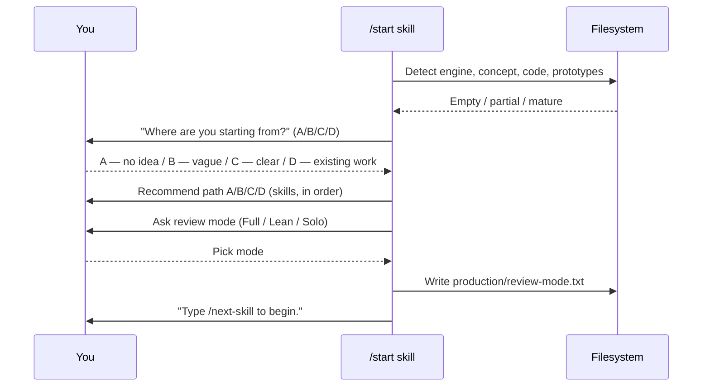

# First Session Walkthrough

What happens when you open this repo in Claude Code and run `/start`. No magic — just five phases of guided onboarding.

---

## Before you start

You need:

- Claude Code installed and working
- Git
- The repo cloned and opened in Claude Code

Then in Claude Code, type:

```
/start
```

Press Enter. The skill takes over.

---

## What `/start` does, step by step



That's it. `/start` does **not** auto-run anything — it hands you off to the next skill.

---

## The four entry paths

`/start` asks one question:

> *Where are you at with your game idea right now?*

| Pick | Means | First skill after `/start` |
|------|-------|----------------------------|
| **A) No idea yet** | Pure exploration mode | `/brainstorm open` |
| **B) Vague idea** | A theme or feeling, no mechanics | `/brainstorm <hint>` |
| **C) Clear concept** | Genre + core mechanic in your head | `/brainstorm <concept>` *or* `/setup-engine` |
| **D) Existing work** | Already have GDDs, code, or prototypes | `/project-stage-detect` then `/adopt` |

For paths A/B/C the recommended sequence is the same after the brainstorm: `/setup-engine` → `/art-bible` → `/map-systems` → enter [[03-Phases/Phase-2-Systems-Design|Phase 2]].

For path D, the system audits what you have and produces a migration plan to bring artifacts up to template format.

---

## The review mode question

After picking your path, `/start` asks:

> *How much design review do you want as you work?*

| Mode | Behavior | Best for |
|------|----------|----------|
| **Full** | Director specialists review at every key step | Teams; learning the workflow |
| **Lean** *(recommended)* | Directors only at gate-check transitions | Solo devs and small teams |
| **Solo** | No director reviews ever | Game jams; prototypes |

Your pick is written to `production/review-mode.txt` and persists across sessions.

---

## What happens next session

When you reopen Claude Code:

1. The **session-start hook** (`.claude/hooks/session-start.sh`) runs automatically.
2. It prints recent commits and detects whether `production/session-state/active.md` exists.
3. If it does, it shows you the last task summary.
4. You can resume immediately by reading the state file or running `/help`.

You won't lose context if a session crashes. The state file is the source of truth — see [[07-Project-Conventions/Context-Management]].

---

## A typical first hour

A reasonable first session for a brand-new project (path A):

| Time | Action |
|------|--------|
| 0:00 | `/start` → pick A (no idea) → pick Lean review mode |
| 0:05 | `/brainstorm open` — explore for ~30 minutes, end with a concept summary |
| 0:35 | `/setup-engine` — pick Godot/Unity/Unreal, pin version, configure conventions |
| 0:50 | `/art-bible` — define visual identity (you'll iterate on this) |
| ~ | (Stop here for the session — `/start` got you to the end of Phase 1's first 3 steps) |

The next session begins with `/help` to see what's left in Phase 1.

---

## When to re-run `/start`

You don't usually re-run it. But it's safe to:

- After deleting `production/review-mode.txt` to change your review mode
- After joining a project mid-stream (`/start` will detect existing artifacts and route you to path D)
- If you're confused about where you are (better: just run `/help`)

---

## See also

- [[05-Skills/Onboarding-Skills]] — the four onboarding skills (`/start`, `/help`, `/project-stage-detect`, `/adopt`)
- [[02-Core-Concepts/The-7-Phase-Pipeline]] — what comes after `/start`
- [[02-Core-Concepts/Gates-and-Reviews]] — what review mode actually controls
- [[01-Start-Here/Glossary]] — terms you'll see in `/start`'s output
