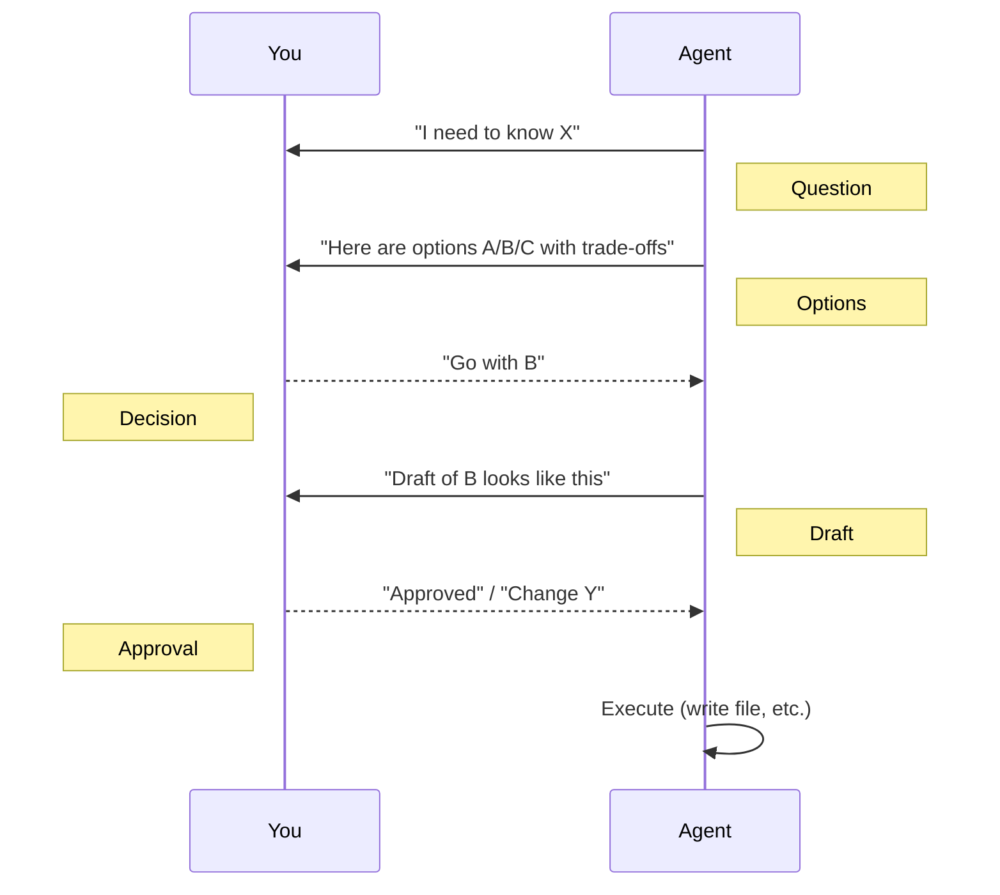

# Collaboration Protocol

How agents talk to you and each other. The single rule that makes the whole template safe to use:

> **Question → Options → Decision → Draft → Approval.**

User-driven. Never autonomous.

---

## The five-step ritual

Every significant agent action follows this ritual:



Step-by-step:

1. **Question** — Agent surfaces what it needs to know.
2. **Options** — Agent presents real alternatives with trade-offs (not "here's what I'll do").
3. **Decision** — User picks one (or proposes another).
4. **Draft** — Agent shows the draft *before* writing.
5. **Approval** — User says yes (or asks for changes). Then the agent writes.

This protocol is enforced in every collaborative-protocol template under `.claude/docs/templates/collaborative-protocols/`.

---

## Why all five steps?

Each step prevents a specific failure:

| Step | Without it | The failure |
|------|------------|-------------|
| **Question** | Agent assumes intent | Wastes time on the wrong problem |
| **Options** | Agent picks one approach silently | User can't course-correct early |
| **Decision** | Agent decides for the user | User loses authority |
| **Draft** | Agent writes immediately | User must review *and* undo |
| **Approval** | Agent self-approves | No quality checkpoint |

Skipping any of them moves authority from the user to the agent. The template is built so this never happens unintentionally.

---

## What "Draft" looks like in practice

Drafts must be *reviewable*, not previews of action:

**❌ Bad draft:**
> "I'll create movement.md with sections for overview, mechanics, and edge cases."

**✅ Good draft:**
```
# Movement System (draft)

## Overview
Players move via a 4-directional grid system…

## Detailed Rules
1. Tile entry costs 1 stamina per direction
2. Diagonal movement disabled
3. Sprinting allows 2-tile bursts at 3-stamina cost
…
```

Show the **content**, not the **plan to write content**.

---

## Approval scope

A user approval applies to **exactly the scope shown**, no more.

- "Approve section 1" → write only section 1, return for next section.
- "Approve the GDD" → write the full file as drafted.
- "Approve creating the file" ≠ "approve modifying it later."

Agents must re-ask for any expansion of scope.

---

## Multi-file changes

When a single decision affects multiple files (e.g. a refactor, a design change that propagates):

1. **List all files** that will change with a one-line summary per file
2. **Show the most-impactful diff** in full
3. **Ask for approval of the changeset** as a unit
4. Only then make the edits

This is what `/propagate-design-change` does explicitly — read it for the canonical pattern.

---

## "May I write this to [filepath]?"

The literal phrase pattern that the protocol uses. Examples:

> "May I write this to `design/gdd/movement.md`?"
>
> "May I update `production/sprints/sprint-3.md` with the new story IDs?"
>
> "I'd like to create three files. May I create:
> - `docs/architecture/adr-008-input-system.md`
> - `docs/architecture/adr-009-input-mappings.md`
> - `assets/data/input-mappings.json`?"

Always with the **path**. Always before the **first** write.

---

## What the user does

You don't have to be polite or verbose. Decisions can be terse:

- "Yes" / "OK" / "Approved"
- "Change A to B"
- "Skip this section"
- "Stop here, switch to topic X"

The protocol's value is the *opportunity* to intervene, not a requirement to elaborate.

---

## When the agent is autonomous

Autonomous mode (no Question → Options pattern) is appropriate for:

- **Read-only operations** (no file writes) — `/sprint-status`, `/help`
- **Lookups** (Glob, Grep, Read with no side effects)
- **Pure analysis** (`/scope-check`, `/perf-profile` data collection)
- **Tool calls the user already approved** (e.g. running an agreed test suite)

If a skill is read-only, it can act without asking. The "no autonomous writes" rule applies only to the file system.

---

## Conflict resolution

When two agents disagree (e.g. `game-designer` and `lead-programmer` argue about a system's complexity):

1. The skill orchestrating them surfaces the disagreement
2. The user is shown both positions
3. Either the user resolves it, or the conflict escalates to the shared parent (typically a director)

See [[04-Agents/Tier-1-Directors#Escalation paths]] for the escalation table.

---

## Hooks and protocol

Hooks (like `pre-commit-design-check`) run **without** the protocol — they're automated checks. If a hook fails, it surfaces the failure and the user decides how to proceed. Hooks never write files (except logs and audit trails).

See [[08-Reference/Hooks-Reference]].

---

## See also

- [[02-Core-Concepts/The-Studio-Metaphor]] — agents and their boundaries
- [[02-Core-Concepts/Skills-vs-Agents-vs-Docs]] — where this protocol applies
- [[02-Core-Concepts/Gates-and-Reviews]] — the formal review surfaces
- The original protocol doc: `docs/COLLABORATIVE-DESIGN-PRINCIPLE.md`
