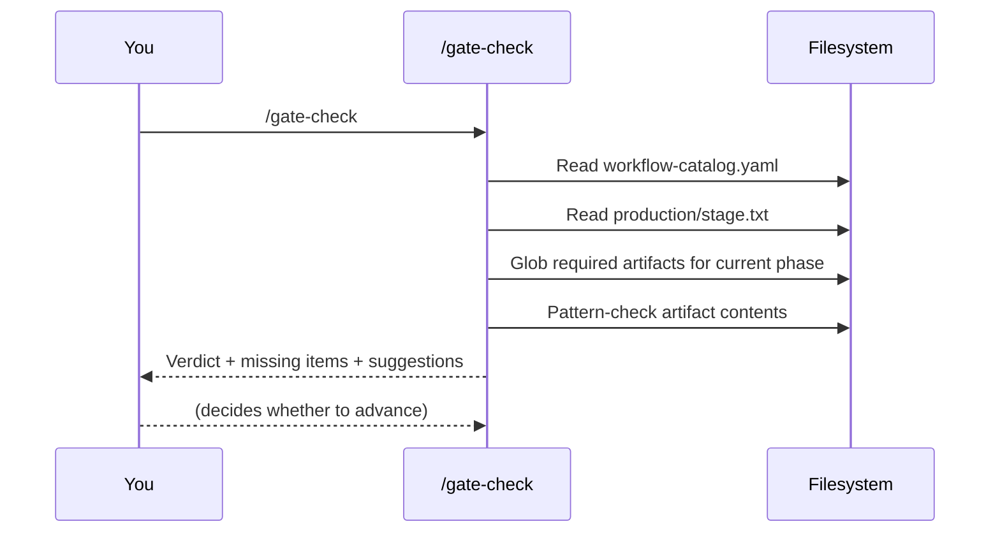

# Gates and Reviews

How quality is enforced — at three different scales — without ever hard-blocking the user.

---

## The three review surfaces

| Surface | Scope | Skill | When |
|---------|-------|-------|------|
| **Per-document review** | One document | `/design-review`, `/code-review`, `/ux-review` | After authoring |
| **Per-phase review** | All artifacts in a phase | `/review-all-gdds`, `/architecture-review` | End of phase |
| **Phase-transition gate** | Phase boundary | `/gate-check` | Between phases |

All three are **advisory**. None hard-block. The user always decides.

---

## Per-document reviews

After authoring an artifact, run the matching review skill:

| Authored | Reviewer | Skill |
|----------|----------|-------|
| GDD | `game-designer` | `/design-review` |
| ADR | `technical-director` | `/architecture-review` (covers all ADRs) |
| UX spec | `ux-designer` + `accessibility-specialist` | `/ux-review` |
| Code | `lead-programmer` | `/code-review` |
| Story | (built into `/story-readiness`) | `/story-readiness` |
| Test files | `qa-lead` | `/test-evidence-review` |

**Verdicts** typically:
- ✅ **APPROVED** — ship it
- ⚠️ **NEEDS REVISION** — minor changes
- ❌ **MAJOR REVISION** — substantial gaps

Per-document reviews are fast and surgical. Run them every time you finish a doc.

---

## Per-phase reviews

After completing all docs in a phase, the phase-wide review checks **cross-document coherence**:

- **`/review-all-gdds`** — Are systems' formulas compatible? Do entities have consistent stats? Do ownership boundaries align?
- **`/architecture-review`** — Do ADRs cover all GDD requirements? Are dependencies ordered correctly? Are TR-IDs registered?
- **`/consistency-check`** — Cross-GDD entity checks (lighter than `/review-all-gdds`)

These spawn multiple agents in parallel for cross-checking. Run them at end-of-phase, before `/gate-check`.

---

## Phase-transition gates: `/gate-check`

The last word before advancing to the next phase. Run when you think you're done with a phase.

**Verdict** is one of:
- ✅ **PASS** — all required artifacts present and well-formed
- ⚠️ **CONCERNS** — gaps exist; listed with suggestions
- ❌ **FAIL** — required artifacts missing; advancing risks rework

The verdict is **never** binding. You can advance regardless.

---

## Review modes (the dial)

The first time you run `/start`, it asks you to pick a review mode. This controls how aggressive the review skills are throughout the pipeline.

| Mode | Behavior | Use when |
|------|----------|----------|
| **Full** | Director specialists review at *every* key step | Teams; learning the workflow |
| **Lean** *(default)* | Directors only at gate-check transitions; per-doc reviews stay | Solo devs and small teams |
| **Solo** | No director reviews at all | Game jams; throwaway prototypes |

Stored in `production/review-mode.txt`. Change by editing the file or deleting it (then re-run `/start`).

---

## What's behind each gate

| Gate | What it checks |
|------|----------------|
| Concept → Systems Design | game-concept.md, art-bible.md, systems-index.md exist; engine configured |
| Systems Design → Technical Setup | All MVP system GDDs `Status: Approved`; cross-GDD review done |
| Technical Setup → Pre-Production | architecture.md, ≥3 ADRs, `/architecture-review` done, control-manifest.md, accessibility-requirements.md |
| Pre-Production → Production | UX specs reviewed, ≥1 prototype, epics + stories created, ≥1 sprint planned, ≥1 vertical-slice playtest |
| Production → Polish | Stories closed (per sprint-status.yaml); minimum content count met |
| Polish → Release | ≥3 playtest sessions, `/team-polish` complete, `/perf-profile` clean |
| Release → ship | `/release-checklist` PASS, `/launch-checklist` PASS |

See each phase note for the full list ([[03-Phases/Phase-1-Concept]] through [[03-Phases/Phase-7-Release]]).

---

## Why advisory and not blocking

Real teams hit edge cases. Three reasons gates don't hard-block:

1. **Context the catalog can't know.** Maybe you skipped a GDD because the system was cut. Maybe you're advancing without an ADR because you'll author it inline. The user has context the skill doesn't.
2. **Discovery learning.** Sometimes you have to advance a little to know what the previous phase missed. Hard blocks would force perfectionism.
3. **Time constraints.** Jam projects must ship. Solo mode acknowledges that.

The cost of a wrong advance is **future rework**, surfaced by the next gate or by `/help`. The system doesn't punish you; it tells you what's missing whenever you ask.

---

## Director sign-offs (Full mode)

In Full mode, directors review at these points:

| Director | When they review |
|----------|------------------|
| `creative-director` | After `/brainstorm`, after `/map-systems`, before each `/gate-check` for vision-related concerns |
| `technical-director` | After `/map-systems` for system boundaries; after each ADR; before tech-setup→pre-prod gate |
| `producer` | At sprint plans, milestones, scope checks |

Lean mode skips per-step director reviews — directors only re-engage at `/gate-check`. Solo mode skips them entirely.

---

## See also

- [[02-Core-Concepts/The-7-Phase-Pipeline]] — what each phase contains
- [[02-Core-Concepts/Collaboration-Protocol]] — how reviews surface to you
- [[05-Skills/Skills-by-Phase#Reviews and analysis]] — review skills by phase
- [[08-Reference/Workflow-Catalog-Explained]] — the gate definitions
