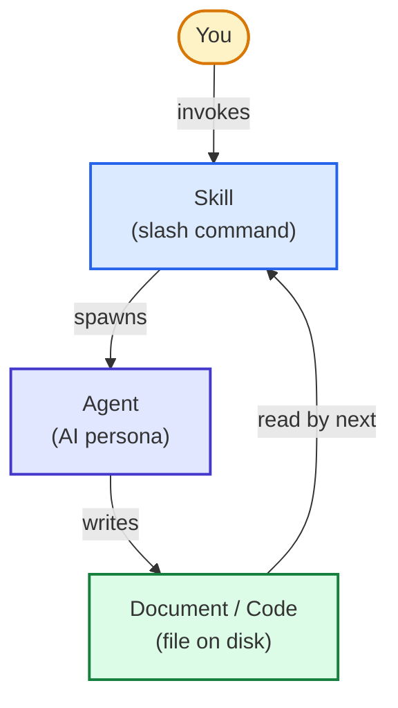
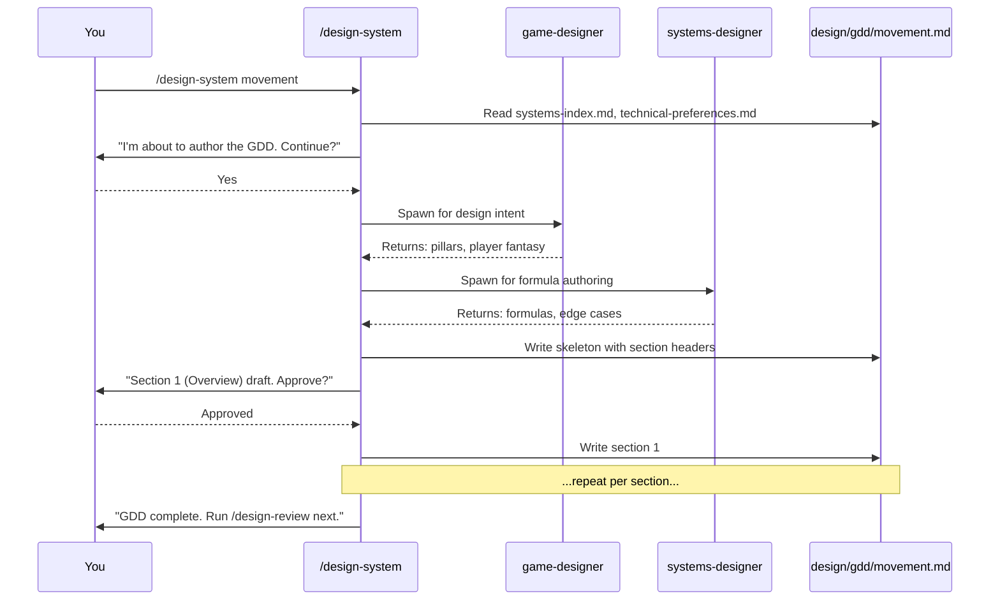

# Skills vs Agents vs Docs

The three layers that compose this entire system. Once you see this, you can predict where any new feature fits.

---

## The three layers

| Layer | What it is | Example | Where it lives |
|-------|-----------|---------|----------------|
| **Skill** | A slash command — the user-facing verb | `/design-system` | `.claude/skills/<name>/SKILL.md` |
| **Agent** | An AI persona — the noun that does the work | `game-designer` | `.claude/agents/<name>.md` |
| **Document** | A file on disk — the artifact produced | `design/gdd/movement.md` | Anywhere under `design/`, `docs/`, `production/`, `src/`, `assets/` |

---

## How they connect

**Skills are the API.** You only ever interact with the skill layer. Type `/brainstorm`, the skill knows everything else.

**Agents are the implementation.** A skill spawns whatever agents it needs in whatever order, sequentially or in parallel. You never spawn agents directly (well, you can via the `Task` tool, but that's a power-user move).

**Documents are the persistent state.** Every skill writes files to known locations. The next skill in the pipeline reads those files. This is why **the file is the memory, not the conversation** — see [[07-Project-Conventions/Context-Management]].

---

## Concrete example: `/design-system`

When you run `/design-system movement`, here's what happens:

The user sees a single `/design-system` command. The skill orchestrates `game-designer` and `systems-designer`, manages incremental file writes, and asks for approval at section boundaries.

---

## Why three layers and not one

You could imagine a flat system: just agents, no skills, no documents. Why this structure?

| Reason | Without 3 layers | With 3 layers |
|--------|------------------|---------------|
| **Discoverability** | "Which agent do I talk to?" | `/<tab>` — autocompletes |
| **Composition** | Manually orchestrate agents every time | Skills bundle the orchestration |
| **Persistence** | Lose context to compaction | Files survive sessions |
| **Cost control** | Always Opus | Skills assign right tier per agent |
| **Versionability** | Hard to track | Files in git, ADRs explain decisions |

Each layer earns its place by giving you something the others can't.

---

## The data flow shape

The pipeline is a chain of read → think → write → next-skill-reads:

Each blue box reads the green boxes before it and writes the green box after it. **No state is held in conversation memory** — everything important goes to disk.

---

## How this affects you

When you're stuck on "what do I do?", ask:

1. *What document am I trying to produce?* → Check [[06-Documents-Produced/Document-Map]]
2. *Which skill produces that document?* → Check [[05-Skills/Skills-Index]]
3. *What does that skill need as input?* → Read its SKILL.md
4. *Do those inputs exist?* → If not, work backwards

The pipeline is just a topological sort over (input doc → skill → output doc) edges.

---

## See also

- [[02-Core-Concepts/The-7-Phase-Pipeline]] — the macro-shape of skill chains
- [[02-Core-Concepts/The-Studio-Metaphor]] — the agent layer, deeper
- [[06-Documents-Produced/Document-Map]] — the document layer, mapped
- [[05-Skills/Skills-Index]] — every skill, indexed
