# The 7-Phase Pipeline

The full lifecycle of any project, in order. Read this once and you'll know roughly where any task lives.

> Authoritative source: `.claude/docs/workflow-catalog.yaml`. Visual: [[_Maps/Pipeline-Map]].

---

## At a glance

| # | Phase | Duration (rough) | What you produce | Phase note |
|---|-------|------------------|------------------|------------|
| 1 | **Concept** | Days | game-concept.md, art-bible.md, systems-index.md | [[03-Phases/Phase-1-Concept]] |
| 2 | **Systems Design** | Days–weeks | One GDD per system | [[03-Phases/Phase-2-Systems-Design]] |
| 3 | **Technical Setup** | Days | architecture.md, ADRs, control-manifest.md | [[03-Phases/Phase-3-Technical-Setup]] |
| 4 | **Pre-Production** | Weeks | UX specs, prototype, epics, stories, sprint plan, vertical slice | [[03-Phases/Phase-4-Pre-Production]] |
| 5 | **Production** | Months | Implemented code, playtest reports | [[03-Phases/Phase-5-Production]] |
| 6 | **Polish** | Weeks–months | Optimized + balanced build | [[03-Phases/Phase-6-Polish]] |
| 7 | **Release** | Days–weeks | Release artifacts, patch notes, ship | [[03-Phases/Phase-7-Release]] |

Between every two phases sits a **`/gate-check`**. See [[02-Core-Concepts/Gates-and-Reviews]].

---

## The shape of the pipeline

```mermaid
flowchart LR
    P1[Concept] --> G1{{Gate}}
    G1 --> P2[Systems<br/>Design]
    P2 --> G2{{Gate}}
    G2 --> P3[Technical<br/>Setup]
    P3 --> G3{{Gate}}
    G3 --> P4[Pre-<br/>Production]
    P4 --> G4{{Gate}}
    G4 --> P5[Production]
    P5 --> G5{{Gate}}
    G5 --> P6[Polish]
    P6 --> G6{{Gate}}
    G6 --> P7[Release]

    classDef phase fill:#e8f4fd,stroke:#2563eb,stroke-width:2px;
    classDef gate fill:#fef3c7,stroke:#d97706,stroke-width:2px;
    class P1,P2,P3,P4,P5,P6,P7 phase;
    class G1,G2,G3,G4,G5,G6 gate;
```



---

## What changes phase to phase

| Aspect | Concept | Systems | Tech | Pre-Prod | Prod | Polish | Release |
|--------|---------|---------|------|----------|------|--------|---------|
| **Output** | Vision | Design | Architecture | Plan | Code | Quality | Ship |
| **Risk type** | Wrong game | Conflicting design | Bad architecture | Plan vs reality gap | Bugs | Performance | Process |
| **Top agent tier** | Directors | Designers | Tech leads | Designers + leads | Specialists | Specialists | Release manager |
| **Dominant skill** | `/brainstorm` | `/design-system` | `/architecture-decision` | `/create-stories` | `/dev-story` | `/team-polish` | `/launch-checklist` |

---

## What you actually do per phase

**Phase 1 — Concept** ([[03-Phases/Phase-1-Concept|details]])
Brainstorm → write the concept doc → set up the engine → write the art bible → break the concept into systems.

**Phase 2 — Systems Design** ([[03-Phases/Phase-2-Systems-Design|details]])
For each system in the systems index, run `/design-system` to author its GDD. Then `/review-all-gdds` checks consistency across all of them.

**Phase 3 — Technical Setup** ([[03-Phases/Phase-3-Technical-Setup|details]])
Author the master architecture document. Record key decisions as ADRs. Compile them into a control manifest (programmer rules sheet). Define accessibility tier.

**Phase 4 — Pre-Production** ([[03-Phases/Phase-4-Pre-Production|details]])
Author UX specs for key screens. Build a throwaway prototype. Translate GDDs+ADRs into epics, then stories. Plan the first sprint. Run a vertical slice playtest.

**Phase 5 — Production** ([[03-Phases/Phase-5-Production|details]])
Sprint loop: pick story → `/dev-story` → `/code-review` → `/story-done` → repeat. Bug reports and retrospectives along the way.

**Phase 6 — Polish** ([[03-Phases/Phase-6-Polish|details]])
Performance profiling, balance check, asset audit, three playtest sessions, coordinated polish pass via `/team-polish`.

**Phase 7 — Release** ([[03-Phases/Phase-7-Release|details]])
Release checklist, patch notes, changelog, launch checklist, ship.

---

## The catalog format

Every phase in `workflow-catalog.yaml` looks like this:

```yaml
concept:
  label: "Concept"
  description: "Develop your game idea into a documented concept"
  next_phase: systems-design
  steps:
    - id: brainstorm
      command: /brainstorm
      required: false
    - id: engine-setup
      command: /setup-engine
      required: true
      artifact:
        glob: ".claude/docs/technical-preferences.md"
        pattern: "Engine: [^[]"
    # ...
```

Steps are `required` (block phase advance) or `optional` (enhance, but don't block). The `artifact` field tells `/help` and `/gate-check` how to detect completion.

See [[08-Reference/Workflow-Catalog-Explained]] for the full schema.

---

## Phase ≠ schedule

The pipeline is sequential by design but **not chronological**. You can:

- Iterate within a phase (e.g. add a system in Phase 2 mid-Phase-5)
- Skip optional steps
- Backtrack (re-run `/design-system` if a GDD goes stale)

The pipeline shows the *minimum order of dependencies*, not a timesheet. Phase boundaries are about **artifact maturity**, not calendar weeks.

---

## When to use which gate

A `/gate-check` between two phases should run when:

1. All required artifacts in the current phase exist
2. You feel ready to commit to the next phase's premise

Most teams run `/gate-check` once per phase. Some run it earlier as a "diagnostic" — that's fine; the verdict is informational.

See [[02-Core-Concepts/Gates-and-Reviews]] for what each gate checks.

---

## See also

- [[_Maps/Pipeline-Map]] — visual flowchart of all 7 phases
- [[03-Phases/Phase-1-Concept]] — start of the journey
- [[02-Core-Concepts/Gates-and-Reviews]] — the gate-check skill
- [[08-Reference/Workflow-Catalog-Explained]] — the YAML schema
