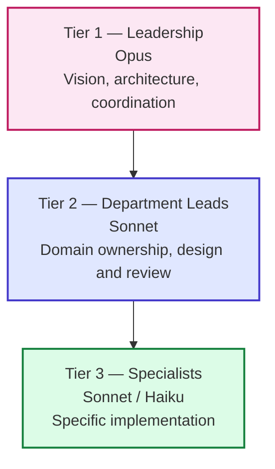

# The Studio Metaphor

The single biggest design decision in this template: **agents are organized as a real game studio**. Once you see it, the rest of the system makes sense.

---

## The mental model

A real studio has:

- **A creative director** who owns the vision
- **A technical director** who owns the architecture
- **A producer** who keeps both alive on schedule
- **Department leads** under each director (game design, art, audio, narrative, code, QA…)
- **Specialists** under each lead (level designer, sound designer, AI programmer, network programmer…)

This template encodes that structure as 48 agents, each defined as a Markdown file in `.claude/agents/`. The hierarchy isn't decorative — it shapes:

- **Who can decide what** (delegation rules)
- **Who reviews whom** (escalation paths)
- **Cost** (Opus for directors, Sonnet for leads, Haiku for read-only specialists)
- **Quality** (specialists can't accidentally make cross-domain decisions)

See [[_Maps/Agent-Org-Chart]] for the visual.

---

## Three tiers, three jobs

**Tier 1 — Directors and Producer (Opus model)**
Set the vision, resolve cross-domain conflicts, sign off at gates. There are 3: `creative-director`, `technical-director`, `producer`. Used for high-stakes synthesis (e.g. `/review-all-gdds`, `/architecture-review`, `/gate-check`).

**Tier 2 — Department Leads (Sonnet model)**
Own a domain end-to-end. Examples: `game-designer` owns mechanics, `lead-programmer` owns code architecture, `qa-lead` owns test strategy. Used for design authoring and per-domain review.

**Tier 3 — Specialists (Sonnet/Haiku model)**
Do the work. Examples: `gameplay-programmer` writes feature code, `qa-tester` writes test cases, `sound-designer` specs SFX. Haiku-tier for read-only/lightweight work; Sonnet for authoring.

See [[04-Agents/Tier-1-Directors|Tier 1]], [[04-Agents/Tier-2-Department-Leads|Tier 2]], [[04-Agents/Tier-3-Specialists|Tier 3]].

---

## Why this matters: separation of concerns

A `gameplay-programmer` cannot decide a UI pattern. A `level-designer` cannot decide an economy rule. A `sound-designer` cannot decide a narrative beat.

This isn't bureaucracy — it's **error prevention at the model level**. When an agent's prompt says "you own combat code, escalate UI questions to `ui-programmer`," it physically can't drift into UI territory and produce bad UI code. The boundaries are encoded in the agent definitions.

The same trick reduces hallucination: the `godot-gdscript-specialist` knows it's writing GDScript, so it doesn't slip into C# syntax mid-file.

---

## The producer is special

The producer **coordinates** the directors but does not delegate to them. They're peers. The producer owns:

- Sprint planning
- Risk management
- Cross-department schedule conflicts
- Communication between leads who don't share a parent

If two directors disagree, the producer facilitates — they don't decide. Only the directors can override each other's decisions, and only via escalation.

---

## Engine specialists are a separate sub-org

Engine specialists (Godot, Unity, Unreal sets) sit alongside the standard hierarchy, reporting to `lead-programmer`. They guard engine-specific patterns:

- "Use signals, not direct calls, at the GDScript/C# boundary" — `godot-specialist`
- "Use Addressables, not Resources.Load" — `unity-addressables-specialist`
- "Use GAS for ability systems, not bespoke code" — `ue-gas-specialist`

You only use the set matching your engine. See [[04-Agents/Engine-Specialists-Godot-Unity-Unreal]].

---

## Cost implications

Tier assignment is also a cost dial:

| Tier | Model | Approx cost vs Opus |
|------|-------|---------------------|
| 1 (directors) | Opus | 1× |
| 2 (leads) | Sonnet | ~1/5× |
| 3 (specialists) | Sonnet or Haiku | ~1/5× to ~1/15× |

A skill that runs `qa-tester` (Haiku) for read-only checks before escalating to `qa-lead` (Sonnet) costs roughly 10% of running everything as Opus. Multiply across hundreds of invocations and the savings dominate.

---

## When the metaphor breaks

The studio metaphor isn't perfect:

- **Some agents wear two hats.** `prototyper` reports to "everyone" — it's a workflow utility more than a department.
- **Live-ops doesn't fit cleanly** under a director — it's its own thing.
- **The user IS the studio**. You're not a director — you're the *whole studio* using the directors as advisors.

Don't get hung up on perfect mapping. The metaphor exists to make boundaries clear, not to be reverent.

---

## See also

- [[04-Agents/Agents-Index]] — full table of agents
- [[_Maps/Agent-Org-Chart]] — visual org chart
- [[02-Core-Concepts/Skills-vs-Agents-vs-Docs]] — how agents fit in the bigger picture
- [[02-Core-Concepts/Collaboration-Protocol]] — how agents talk to you and each other
