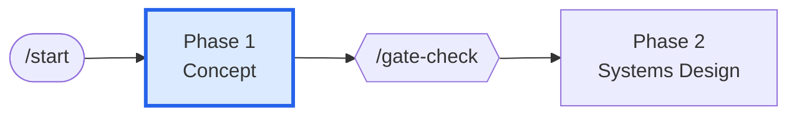
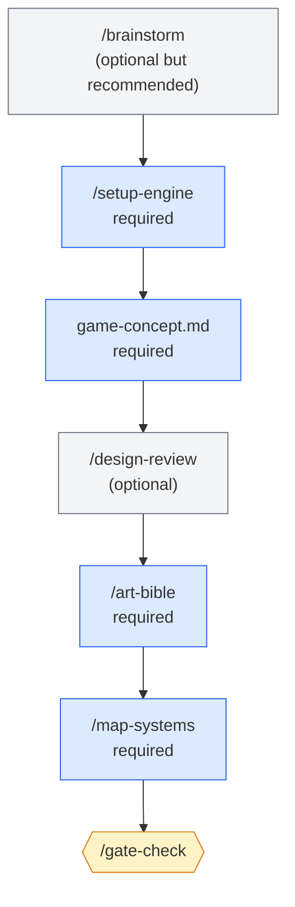

# Phase 1 — Concept

> **Goal:** turn a vague idea into a documented game concept with pillars, scope tiers, and a systems map.

This is where the project starts. Most projects spend less time here than they should.

---

## Where this phase fits

---

## Phase flow

---

## Skills used in this phase

| Skill | Purpose | Required? |
|-------|---------|-----------|
| `/brainstorm` | Guided ideation (MDA, verb-first, player psychology) | Optional |
| `/setup-engine` | Configure engine + version + naming conventions + budgets | **Required** |
| `/design-review` | Validate the game concept doc | Optional |
| `/art-bible` | Author the visual identity spec | **Required** |
| `/map-systems` | Decompose the concept into systems | **Required** |

See [[05-Skills/Onboarding-Skills]] and [[05-Skills/Design-Skills]].

---

## Agents involved

- `creative-director` — owns vision, signs off on the concept (Full mode)
- `game-designer` — drives `/brainstorm`, authors the concept doc
- `art-director` — authors the art bible
- `narrative-director` — contributes to the story pillars
- `audio-director` — contributes the sonic identity sketch
- `technical-director` — confirms engine choice is realistic for the concept

See [[04-Agents/Agents-Index]].

---

## Documents produced

| Document | Path | Skill |
|----------|------|-------|
| Game concept | `design/gdd/game-concept.md` | `/brainstorm` |
| Engine + tech preferences | `.claude/docs/technical-preferences.md` | `/setup-engine` |
| Art bible | `design/art/art-bible.md` | `/art-bible` |
| Systems index | `design/gdd/systems-index.md` | `/map-systems` |

See [[06-Documents-Produced/Game-Concept-Doc]], [[06-Documents-Produced/Systems-Index]].

---

## Entry criteria

- Repo cloned and Claude Code working
- (That's it — Phase 1 starts from scratch)

## Exit criteria (for `/gate-check`)

- ✅ `.claude/docs/technical-preferences.md` has Engine field set (no `[TO BE CONFIGURED]`)
- ✅ `design/gdd/game-concept.md` exists with required sections
- ✅ `design/art/art-bible.md` exists (9 sections)
- ✅ `design/gdd/systems-index.md` exists with priority tiers and dependencies

## Phase gate

Run `/gate-check` after `/map-systems` produces a director-reviewed systems index. Verdict will be one of PASS / CONCERNS / FAIL — see [[02-Core-Concepts/Gates-and-Reviews]].

---

## Common pitfalls

- **Skipping `/brainstorm` when you have a "clear" idea.** The brainstorm skill surfaces hidden assumptions. Even with a clear concept, run it briefly to verify your pillars hold.
- **Picking an engine before the concept is firm.** A puzzle game needs different tooling than a roguelike. Configure the engine *after* the concept is documented enough to defend it.
- **Skipping the art bible.** Without it, asset production has no compass. The bible is small (9 sections); don't dread it.
- **45 systems vs 12.** Some teams over-decompose. The systems index should fit the project — `/map-systems` will recommend a target count for your scope tier.

---

## Tips

- The systems index has **priority tiers**: MVP / Vertical Slice / Alpha / Full Vision. Use them to defer scope, not to plan everything at once.
- Director reviews in Full mode catch genre/tone mismatches you'd otherwise debug in Production. Consider Full mode for Phase 1 even if you go Lean afterwards.
- The art bible references the **Visual Identity Anchor** that `/brainstorm` produces. Run them in order.

---

## See also

- [[03-Phases/Phase-2-Systems-Design]] — what comes next
- [[06-Documents-Produced/Game-Concept-Doc]] — anatomy of the concept doc
- [[06-Documents-Produced/Systems-Index]] — anatomy of the systems index
- [[05-Skills/Design-Skills]] — concept-phase skills in detail
