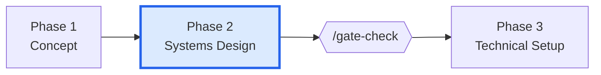
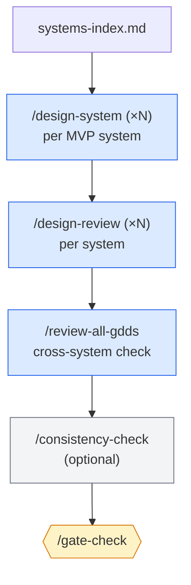

# Phase 2 — Systems Design

> **Goal:** for each system in the systems index, author a complete GDD that downstream skills can implement.

This is the longest design phase. Quality here saves weeks in Production.

---

## Where this phase fits

---

## Phase flow

---

## Skills used in this phase

| Skill | Purpose | Required? | Repeatable? |
|-------|---------|-----------|-------------|
| `/design-system` | Section-by-section GDD authoring for one system | **Required** | Yes (once per system) |
| `/design-review` | Validate one GDD (8 required sections) | **Required** | Yes (once per system) |
| `/review-all-gdds` | Cross-GDD consistency + design theory | **Required** | No |
| `/consistency-check` | Entity-level cross-checks (lighter) | Optional | Yes |
| `/quick-design` | Lightweight spec for tiny systems | Optional | Yes |
| `/propagate-design-change` | When a GDD revision affects others | Optional | Yes |

See [[05-Skills/Design-Skills]].

---

## Agents involved

- `game-designer` — owns each GDD's design intent
- `systems-designer` — authors formulas, edge cases, mechanic interactions
- `economy-designer` — for systems involving currencies, loot, progression
- `level-designer` — for spatial / encounter systems
- `narrative-director` — for narrative-driven systems
- `creative-director` — gate review (Full mode) or final consistency review
- `technical-director` — flags systems whose design will be hard to implement

---

## Documents produced

| Document | Path | Skill |
|----------|------|-------|
| Per-system GDD | `design/gdd/<system-name>.md` | `/design-system` |
| Cross-GDD review report | `design/gdd/gdd-cross-review-<date>.md` | `/review-all-gdds` |
| Consistency check report | (in-conversation, optionally saved) | `/consistency-check` |

GDD anatomy: [[06-Documents-Produced/GDD-Game-Design-Document]].

---

## The 8 required GDD sections

Every GDD must include:

1. **Overview** — one-paragraph summary
2. **Player Fantasy** — intended feeling
3. **Detailed Rules** — unambiguous mechanics
4. **Formulas** — all math defined with variables
5. **Edge Cases** — unusual situations handled
6. **Dependencies** — other systems listed
7. **Tuning Knobs** — configurable values identified
8. **Acceptance Criteria** — testable success conditions

`/design-review` checks all eight. Missing any → MAJOR REVISION verdict.

---

## Entry criteria

- ✅ Phase 1 gate PASS
- ✅ `design/gdd/systems-index.md` with at least one MVP system

## Exit criteria (for `/gate-check`)

- ✅ Every MVP-tier system has a GDD with `Status: Approved`
- ✅ All GDDs have the 8 required sections
- ✅ `/review-all-gdds` produced a cross-review document with no MAJOR REVISION verdict
- ✅ `/consistency-check` (if run) shows no contradictions

---

## Common pitfalls

- **Authoring all GDDs in parallel.** Tempting, but they have dependencies. Follow the design order in the systems index — Foundation systems first, then Core, then Feature.
- **Skipping the formula section.** "We'll figure it out in code" is how a damage system ships with imbalanced numbers. Write the math before the code.
- **Skipping `/review-all-gdds`.** Each GDD passes review individually but contradicts another. The cross-review catches "system A says ammo is consumable, system B treats it as rechargeable."
- **Over-detailing optional systems.** GDDs for VS-tier or Alpha-tier systems should be lighter. Save effort for MVP.

---

## Tips

- Use **`/quick-design`** for trivial systems (< 200 lines of design intent). Full `/design-system` is overkill for a "main menu volume slider."
- When a GDD revises an earlier GDD's assumption, run **`/propagate-design-change`** to find affected ADRs.
- The systems index has bottleneck-mitigation suggestions (paper prototypes, early ADRs). Heed them.

---

## See also

- [[03-Phases/Phase-1-Concept]] — previous phase
- [[03-Phases/Phase-3-Technical-Setup]] — next phase
- [[06-Documents-Produced/GDD-Game-Design-Document]] — anatomy
- [[05-Skills/Design-Skills]] — full design skills overview
