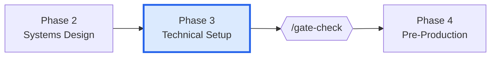
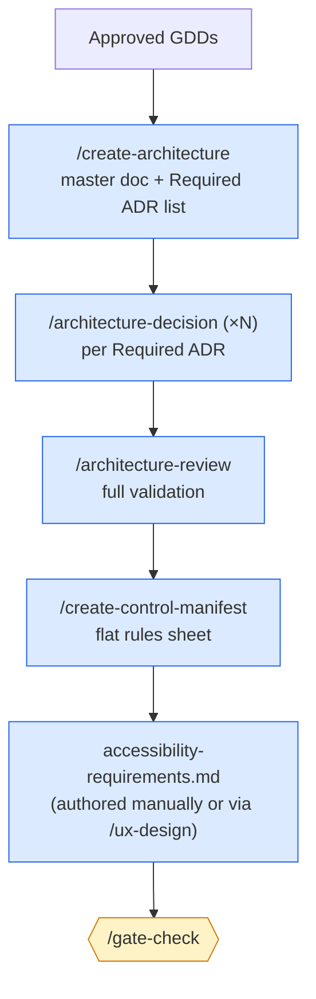

# Phase 3 — Technical Setup

> **Goal:** turn approved GDDs into a buildable architecture — master document, decision records, control manifest, accessibility tier.

This is the bridge between *design* and *implementation*. Skipping it makes Production a refactor festival.

---

## Where this phase fits



---

## Phase flow



---

## Skills used in this phase

| Skill | Purpose | Required? |
|-------|---------|-----------|
| `/create-architecture` | Author the master architecture document and identify Required ADRs | **Required** |
| `/architecture-decision` | Create one ADR (decision, options, consequences, dependencies) | **Required** (≥3, repeatable) |
| `/architecture-review` | Validate ADR completeness, dependencies, GDD coverage | **Required** |
| `/create-control-manifest` | Generate flat programmer rules sheet | **Required** |

See [[05-Skills/Architecture-Skills]].

---

## Agents involved

- `technical-director` — owns the architecture; signs off on ADRs (Full mode)
- `lead-programmer` — authors most ADRs; reviews architecture for code-level realism
- `[engine]-specialist` — Godot/Unity/Unreal lead — validates engine-specific decisions
- Engine sub-specialists — for narrow ADRs (e.g. Addressables vs Resources, GAS vs bespoke)
- `accessibility-specialist` — authors the accessibility tier doc
- `performance-analyst` — flags performance budget concerns

---

## Documents produced

| Document | Path | Skill |
|----------|------|-------|
| Architecture | `docs/architecture/architecture.md` | `/create-architecture` |
| ADRs | `docs/architecture/adr-NNN-*.md` | `/architecture-decision` |
| Architecture review | `docs/architecture/architecture-review-<date>.md` | `/architecture-review` |
| Control manifest | `docs/architecture/control-manifest.md` | `/create-control-manifest` |
| TR registry | `docs/architecture/tr-registry.yaml` | `/architecture-review` (auto-maintained) |
| Accessibility requirements | `design/accessibility-requirements.md` | manual / `/ux-design` |

See [[06-Documents-Produced/ADR-Architecture-Decision-Record]], [[06-Documents-Produced/Control-Manifest]].

---

## Entry criteria

- ✅ Phase 2 gate PASS
- ✅ All MVP system GDDs `Status: Approved`
- ✅ `/review-all-gdds` clean

## Exit criteria (for `/gate-check`)

- ✅ `docs/architecture/architecture.md` exists
- ✅ `docs/architecture/adr-*.md` ≥ 3 (Foundation-layer minimum)
- ✅ All Required ADRs from `/create-architecture` are `Status: Accepted`
- ✅ `/architecture-review` produced a review doc with no FAIL verdict
- ✅ `docs/architecture/control-manifest.md` exists with current Manifest Version
- ✅ `design/accessibility-requirements.md` exists with chosen tier (Basic / Standard / Comprehensive / Exemplary)

---

## ADR layer ordering

ADRs have dependencies. The architecture review enforces this order:

1. **Foundation layer** — input, save/load, scene management, networking transport
2. **Core layer** — engine subsystems, language routing (e.g. C# vs GDScript), asset pipeline
3. **Feature layer** — combat architecture, UI framework, AI patterns
4. **Presentation layer** — rendering pipeline choices, post-processing

A Feature-layer ADR cannot be `Accepted` until its Foundation dependencies are `Accepted`. `/architecture-review` blocks if violated.

See [[06-Documents-Produced/ADR-Architecture-Decision-Record]] for ADR anatomy.

---

## What the control manifest is

`control-manifest.md` is a **flat list of rules** extracted from all `Accepted` ADRs:

```markdown
## Required
- All gameplay code must use signals, not direct method calls, at the GDScript/C# boundary.
- All save data must be versioned with `save_version` field.

## Forbidden
- Never use `Resources.Load()` for gameplay assets — use Addressables.
- Never block the main thread with file I/O.

## Guardrails
- Stories referencing this manifest must include the `Manifest Version` from the header.
```

Stories embed the manifest version. `/story-done` checks for staleness — if the manifest revs, affected stories must be re-validated.

See [[06-Documents-Produced/Control-Manifest]].

---

## Common pitfalls

- **Writing too few ADRs.** "We'll record decisions later" → never. Record every decision with non-trivial consequences. The minimum is 3 Foundation ADRs but most projects need 5–10.
- **`Proposed` ADRs blocking stories.** Stories cannot reference `Proposed` ADRs — only `Accepted`. If you mark an ADR `Proposed` and walk away, you've created a phantom block.
- **Skipping `/architecture-review`.** The review is the only thing that catches dependency cycles and orphan ADRs.
- **Treating accessibility as optional.** The accessibility tier you pick gates UX specs in Phase 4. Pick early.

---

## Tips

- ADRs are **2-page docs**, not theses. Capture decision + options + consequences. Don't re-explain the GDD.
- Use the **engine specialist** as the second author of any engine-touching ADR. They catch "this would work but Godot makes it painful" early.
- Run **`/create-control-manifest`** *after* every batch of new ADRs. It's cheap and keeps stories' references fresh.
- The **TR registry** (`tr-registry.yaml`) is auto-maintained by `/architecture-review`. Don't edit it by hand; only add via the review skill.

---

## See also

- [[03-Phases/Phase-2-Systems-Design]] — previous phase (GDDs feed ADRs)
- [[03-Phases/Phase-4-Pre-Production]] — next phase (ADRs feed stories)
- [[06-Documents-Produced/ADR-Architecture-Decision-Record]] — ADR anatomy
- [[06-Documents-Produced/Control-Manifest]] — manifest anatomy
- [[05-Skills/Architecture-Skills]] — skills overview
