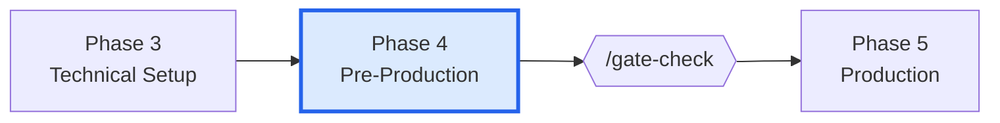
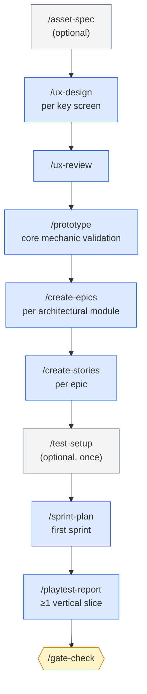

# Phase 4 — Pre-Production

> **Goal:** translate approved design + architecture into an executable plan — UX specs, a working prototype, epics, stories, the first sprint, and a vertical-slice playtest.

This is where "we're going to build it" becomes "we're starting Sprint 1 on Monday."

---

## Where this phase fits

---

## Phase flow

---

## Skills used in this phase

| Skill | Purpose | Required? |
|-------|---------|-----------|
| `/asset-spec` | Generate per-asset visual specs and AI gen prompts | Optional |
| `/ux-design` | Section-by-section UX spec authoring per screen | **Required** (≥1) |
| `/ux-review` | Validate UX specs for GDD alignment + accessibility tier | **Required** |
| `/prototype` | Build a throwaway prototype in isolated worktree | **Required** (≥1) |
| `/create-epics` | Translate GDDs + ADRs into epics | **Required** |
| `/create-stories` | Break each epic into implementable stories | **Required** |
| `/test-setup` | Scaffold the test framework + CI pipeline | Optional (once) |
| `/sprint-plan` | Plan the first sprint | **Required** |
| `/playtest-report` | Document vertical slice playtest | **Required** (≥1 here; ≥3 by Polish) |

See [[05-Skills/Production-Skills]].

---

## Agents involved

- `producer` — owns sprint planning and risk
- `ux-designer` — authors UX specs
- `accessibility-specialist` — reviews UX specs against the chosen accessibility tier
- `prototyper` — builds the throwaway prototype
- `lead-programmer` — reviews epic structure for architectural realism
- `qa-lead` — sets up test framework, defines QA plan
- `[engine]-specialist` — engine-specific test setup

---

## Documents produced

| Document | Path | Skill |
|----------|------|-------|
| Asset specs | `design/assets/asset-manifest.md` | `/asset-spec` |
| UX specs | `design/ux/<screen-or-flow>.md` | `/ux-design` |
| Prototype | `prototypes/<name>/` (with README.md) | `/prototype` |
| Epics | `production/epics/<epic-slug>/EPIC.md` | `/create-epics` |
| Stories | `production/epics/<epic-slug>/<story>.md` | `/create-stories` |
| Test framework scaffold | `tests/` directory + CI config | `/test-setup` |
| First sprint plan | `production/sprints/sprint-1.md` | `/sprint-plan` |
| Sprint status | `production/sprint-status.yaml` | `/sprint-plan` (initialized) |
| Vertical slice playtest | `production/playtests/<date>.md` | `/playtest-report` |

See [[06-Documents-Produced/UX-Spec]], [[06-Documents-Produced/Epic-and-Story]], [[06-Documents-Produced/Sprint-Plan]].

---

## Entry criteria

- ✅ Phase 3 gate PASS
- ✅ Architecture + ≥3 ADRs `Accepted`
- ✅ Control manifest exists
- ✅ Accessibility tier chosen

## Exit criteria (for `/gate-check`)

- ✅ At least 1 UX spec authored and reviewed
- ✅ At least 1 prototype with `prototypes/<name>/README.md`
- ✅ Epics created (`production/epics/*/EPIC.md`)
- ✅ Stories created (≥2 per first-sprint epic)
- ✅ `production/sprints/sprint-1.md` exists
- ✅ `production/playtests/*.md` ≥ 1 (vertical slice)

---

## The prototype matters more than the docs

The prototype is the **single most predictive artifact** in this phase. A docs-only Phase 4 is a paperwork phase. The prototype tells you whether the core loop is fun *before* you build it for real.

What the prototype must do:
- Demonstrate the **core gameplay verb** (move, fight, build, explore, decide)
- Run on the target engine + version
- Be playable end-to-end for the verb (no dead ends)
- Live in `prototypes/<name>/` (isolated from `src/`, lower coding standards)

What it doesn't need:
- Polish, UI, art, sound (placeholders are fine)
- Production code quality
- Tests (it's throwaway by design)

If the prototype reveals the loop isn't fun, **go back to Phase 1 or 2**. Better now than after Sprint 5.

---

## Stories embed everything

A story file is the implementation contract. It must contain:

- The **GDD requirement TR-ID** (e.g. `TR-MOV-001`)
- The **governing ADR(s)** (e.g. `ADR-003 Language Routing`)
- The **engine notes** (e.g. "Use signals at the C#/GDScript boundary")
- The **acceptance criteria** (testable)
- The **story type** (Logic / Integration / Visual / UI / Config) — drives required test evidence

`/story-readiness` validates this; `/dev-story` reads it; `/story-done` verifies completion.

See [[06-Documents-Produced/Epic-and-Story]].

---

## Common pitfalls

- **Skipping the prototype.** Tempting if you've made similar games before. Don't. Engines change between versions; assumptions fail.
- **Stories without TR-IDs.** Untraceable to design. `/story-done` will flag.
- **First sprint too big.** Solo devs typically over-pack Sprint 1. Aim for 3–5 stories at known velocity.
- **Skipping `/test-setup`.** Once you start Production, retrofitting tests is twice the work.
- **Skipping the vertical slice playtest.** A vertical slice that hasn't been played isn't validated.

---

## Tips

- Run `/asset-spec` if you'll use AI image generation — it produces structured prompts you can feed to a generator.
- The **accessibility tier** chosen in Phase 3 governs `/ux-review`. Don't downgrade casually; QA in Polish enforces it.
- Use `/team-ui` to coordinate ux-designer + ui-programmer + art-director + accessibility-specialist for the main menu / HUD set.

---

## See also

- [[03-Phases/Phase-3-Technical-Setup]] — previous phase
- [[03-Phases/Phase-5-Production]] — next phase
- [[06-Documents-Produced/UX-Spec]]
- [[06-Documents-Produced/Epic-and-Story]]
- [[06-Documents-Produced/Sprint-Plan]]
- [[05-Skills/Team-Orchestration-Skills]]
