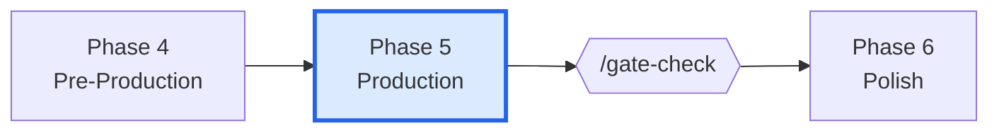
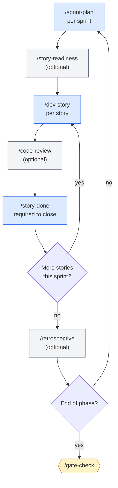
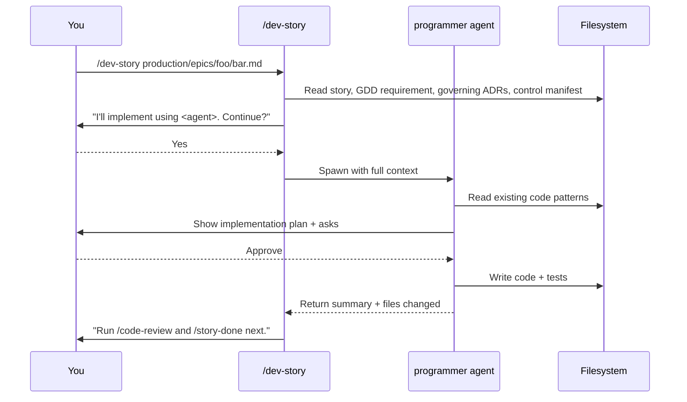

# Phase 5 — Production

> **Goal:** sprint-driven implementation. Pick stories, build them, review them, close them, repeat.

This is the longest phase by far. It's also the most **rhythmic** — once the sprint loop starts, every day looks similar.

---

## Where this phase fits

---

## The sprint loop

---

## Skills used in this phase

| Skill | Purpose | Required? | Repeatable? |
|-------|---------|-----------|-------------|
| `/sprint-plan` | Plan a sprint with prioritized ready stories | **Required** | Yes |
| `/story-readiness` | Validate a story is implementation-ready | Optional | Yes |
| `/dev-story` | Read a story and implement it (routes to right programmer) | **Required** | Yes |
| `/code-review` | Architectural code review after implementation | Optional | Yes |
| `/story-done` | 8-phase completion review; closes the story | **Required** | Yes |
| `/qa-plan` | Generate a QA plan per epic or sprint | Optional | Yes |
| `/bug-report` + `/bug-triage` | Log and prioritize bugs | Optional | Yes |
| `/retrospective` | Sprint retrospective | Optional | Yes |
| `/scope-check` | Detect scope creep | Optional | Yes |
| `/sprint-status` | Quick 30-line snapshot | Optional | Yes |
| `/team-*` | Coordinate multiple agents on complex features | Optional | Yes |

See [[05-Skills/Production-Skills]].

---

## Agents involved

- `producer` — sprint planning, risk, scope checks
- `lead-programmer` — code review, architecture enforcement
- `gameplay-programmer` / `engine-programmer` / `ai-programmer` / `network-programmer` / `tools-programmer` / `ui-programmer` — actually implement the stories
- `[engine]-specialist` + sub-specialists — engine-specific code patterns
- `qa-lead` + `qa-tester` — test plans, bug reports, QA gates
- `technical-artist` — shaders, VFX, optimization for visual stories

`/dev-story` automatically routes to the right programmer based on the story's domain.

---

## Documents produced

| Document | Path | Skill |
|----------|------|-------|
| Sprint plan | `production/sprints/sprint-N.md` | `/sprint-plan` |
| Sprint status | `production/sprint-status.yaml` | `/sprint-plan` + `/story-done` |
| Story status updates | (in-place in story files) | `/story-done` |
| Code | `src/**/*` | `/dev-story` |
| Tests | `tests/**/*` | `/dev-story` (logic stories) |
| Code review reports | (typically in-conversation) | `/code-review` |
| Bug reports | `production/qa/bugs/<id>.md` | `/bug-report` |
| Retrospective | `production/retros/sprint-N-retro.md` | `/retrospective` |

See [[06-Documents-Produced/Epic-and-Story]], [[06-Documents-Produced/Sprint-Plan]].

---

## Entry criteria

- ✅ Phase 4 gate PASS
- ✅ Sprint 1 plan exists
- ✅ Vertical slice playtest done

## Exit criteria (for `/gate-check`)

- ✅ All MVP-tier stories `Status: Done`
- ✅ Minimum content count met (per `/content-audit`)
- ✅ Critical-path bugs resolved
- ✅ Sprint retrospectives complete (recommended)

The exact content threshold depends on the project's MVP definition.

---

## Story types and test evidence

Stories have a **type** that determines required test evidence:

| Story type | Required evidence | Gate level |
|------------|-------------------|------------|
| **Logic** (formulas, AI, state machines) | Automated unit test (must pass) | BLOCKING |
| **Integration** (multi-system) | Integration test or playtest | BLOCKING |
| **Visual/Feel** (animation, VFX) | Screenshot + lead sign-off | ADVISORY |
| **UI** (menus, HUD, screens) | Manual walkthrough doc | ADVISORY |
| **Config/Data** (balance) | Smoke check pass | ADVISORY |

`/story-done` enforces this. Logic stories without passing tests cannot close.

See [[07-Project-Conventions/Testing-Standards]].

---

## The `/dev-story` flow in detail

The story file becomes the **single source of truth** for what the programmer agent reads.

---

## Common pitfalls

- **Stories without acceptance criteria.** `/story-done` cannot close them. Fix in Phase 4 by re-running `/create-stories` for the affected epic.
- **Skipping `/story-done`.** Stories that aren't formally closed pile up in "in-progress." Sprint status drifts.
- **Letting bugs accumulate without `/bug-triage`.** A 200-bug backlog is unmanageable. Triage at sprint boundaries.
- **Manifest drift.** When ADRs change, the control manifest revs. Stories pinned to old versions need re-validation. `/story-done` warns; pay attention.
- **Scope creep mid-sprint.** Use `/scope-check` when adding stories mid-sprint. The producer agent will surface the cost.

---

## Tips

- **`/sprint-status`** is cheap (Haiku tier). Run daily.
- **`/team-*` skills** are gold for cross-domain features. `/team-combat`, `/team-narrative`, `/team-ui` orchestrate the right specialists.
- **`/retrospective`** at every sprint end. Even 5 minutes of "what was slow" pays dividends.
- **Bugs found during a story** can be inline-fixed *only* if the fix doesn't expand scope. Otherwise file a bug, defer.

---

## See also

- [[03-Phases/Phase-4-Pre-Production]] — previous phase
- [[03-Phases/Phase-6-Polish]] — next phase
- [[06-Documents-Produced/Epic-and-Story]]
- [[06-Documents-Produced/Sprint-Plan]]
- [[05-Skills/Production-Skills]]
- [[05-Skills/Team-Orchestration-Skills]]
- [[07-Project-Conventions/Testing-Standards]]
