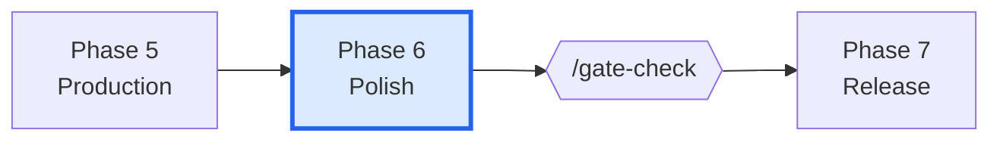
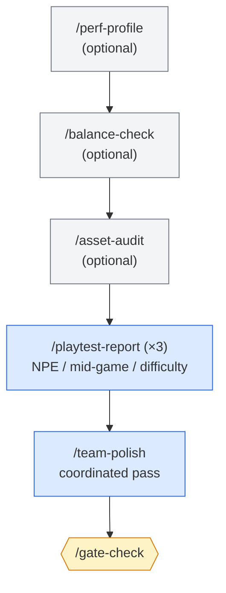
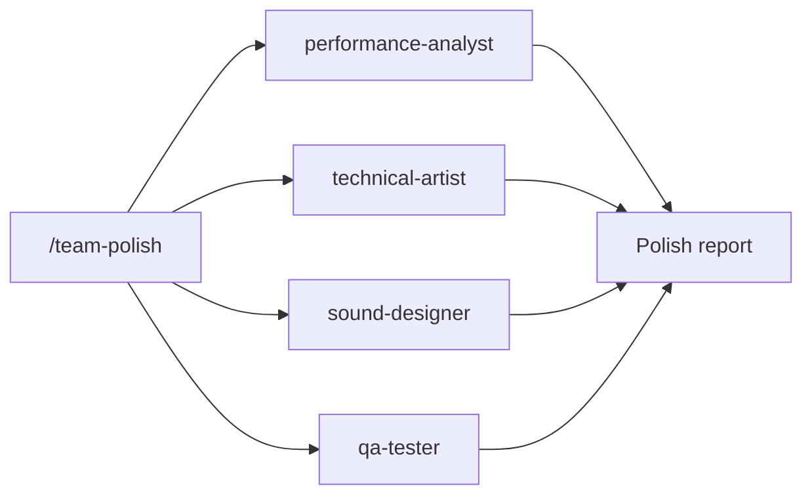

# Phase 6 — Polish

> **Goal:** take a feature-complete build and make it shippable — performance, balance, accessibility, three playtests, and a coordinated polish pass.

Polish is what separates "playable" from "good." It also catches the bugs you'd otherwise ship.

---

## Where this phase fits

---

## Phase flow

---

## Skills used in this phase

| Skill | Purpose | Required? |
|-------|---------|-----------|
| `/perf-profile` | Profile + bottleneck identification + optimization recs | Optional |
| `/balance-check` | Scan formulas/data for outliers, broken progressions | Optional |
| `/asset-audit` | Check naming, sizes, formats, orphan assets | Optional |
| `/playtest-report` | Structured playtest documentation | **Required** (×3) |
| `/team-polish` | Coordinated polish across performance, audio, visual, UX | **Required** |
| `/regression-suite` | Map test coverage to GDD critical paths | Optional |
| `/security-audit` | Audit save tampering, exploits, data exposure | Optional |
| `/soak-test` | Extended-session protocol for slow leaks / fatigue | Optional |
| `/test-flakiness` | Detect non-deterministic tests | Optional |

See [[05-Skills/Production-Skills]] and [[05-Skills/Team-Orchestration-Skills]].

---

## Agents involved

- `performance-analyst` — profiling, optimization recommendations
- `economy-designer` — balance pass on resources, progression, loot
- `technical-artist` — visual polish, shader tuning, optimization
- `audio-director` + `sound-designer` — audio polish, mix balance
- `qa-lead` + `qa-tester` — regression suite, test gap audit
- `security-engineer` — save data integrity, anti-cheat (if relevant)
- `accessibility-specialist` — final accessibility audit
- `live-ops-designer` — launch-week event setup (if live-service)

---

## Documents produced

| Document | Path | Skill |
|----------|------|-------|
| Performance profile reports | `production/perf/<date>.md` | `/perf-profile` |
| Balance reports | `production/balance/<date>.md` | `/balance-check` |
| Asset audit reports | `production/qa/asset-audit-<date>.md` | `/asset-audit` |
| Playtest reports (×3 minimum) | `production/playtests/*.md` | `/playtest-report` |
| Polish team report | `production/polish/team-polish-<date>.md` | `/team-polish` |
| Regression suite map | `tests/regression-suite.md` | `/regression-suite` |
| Security audit report | `production/security/<date>.md` | `/security-audit` |

---

## Entry criteria

- ✅ Phase 5 gate PASS
- ✅ All MVP stories `Status: Done`
- ✅ Critical-path bugs resolved

## Exit criteria (for `/gate-check`)

- ✅ ≥3 playtest reports in `production/playtests/`
- ✅ `/team-polish` report shows resolved findings
- ✅ Performance within budget (`/perf-profile`)
- ✅ Critical bugs at zero (or accepted as known issues)
- ✅ Regression suite covers all GDD critical paths

---

## The three required playtests

The catalog requires three distinct playtest types:

1. **New Player Experience (NPE)** — a player who has never seen the game
2. **Mid-game systems** — does the long tail of mechanics hold up?
3. **Difficulty curve** — does progression feel earned?

Use `/playtest-report` for each. Reports go to `production/playtests/`.

---

## What `/team-polish` does

`/team-polish` orchestrates four agents simultaneously:

Each agent does a single-concern sweep (perf, visual, audio, QA) and the skill consolidates findings into a single polish report with prioritized actions.

---

## Common pitfalls

- **Skipping `/perf-profile` "until later."** Performance regressions found in Polish are *much* cheaper than after release.
- **Balance based on one playtest.** One playtest reveals one player's experience. Three minimum (the catalog requirement) reveals patterns.
- **Polish never ending.** Set a date or content threshold for "done with polish." The exit criteria are advisory — *you* must commit.
- **Shipping flaky tests.** Run `/test-flakiness`. Quarantine flaky tests before release; intermittent failures undermine CI confidence.

---

## Tips

- **`/team-polish` first, then individual skills** for deep dives. The team pass surfaces the priorities.
- **`/regression-suite`** before any major refactor in Polish — protects against accidental regression.
- **Soak tests** are cheap to design (`/soak-test`) but expensive to run. Schedule one weekend and let it run.
- For live-service games, **start `/team-live-ops` planning** here so launch week has its first event ready.

---

## See also

- [[03-Phases/Phase-5-Production]] — previous phase
- [[03-Phases/Phase-7-Release]] — next phase
- [[05-Skills/Team-Orchestration-Skills]] — `/team-polish` deep dive
- [[07-Project-Conventions/Testing-Standards]]
