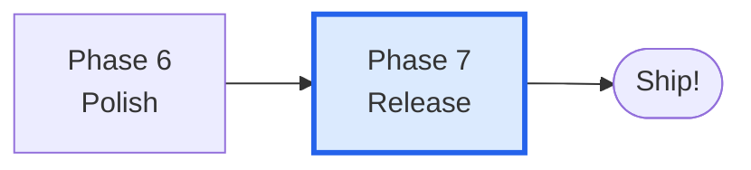
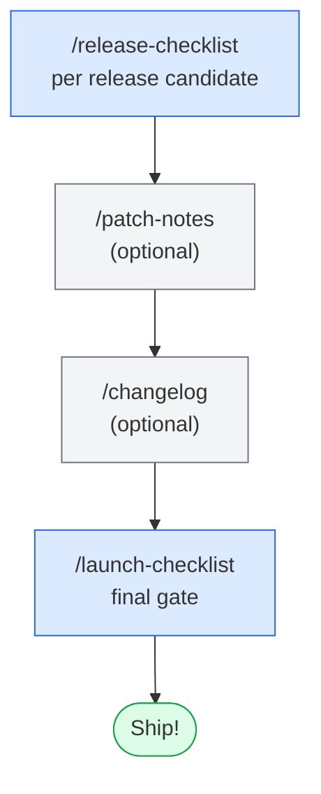
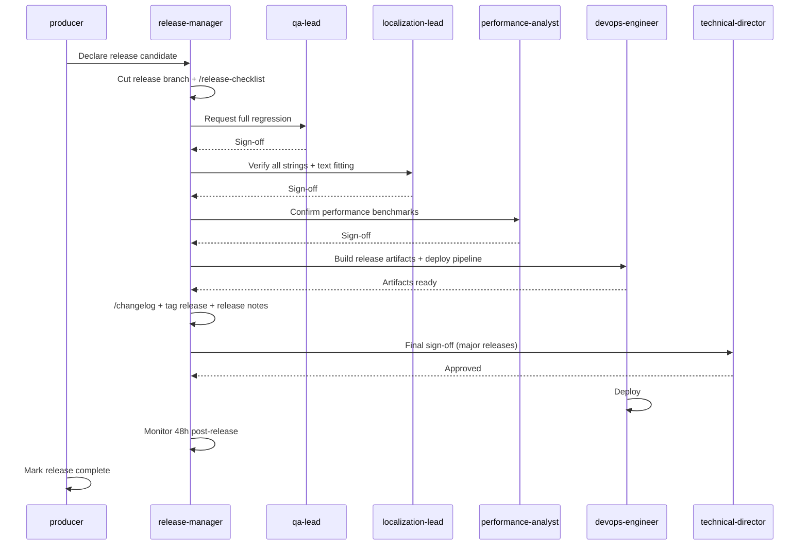

# Phase 7 — Release

> **Goal:** ship. Verify launch readiness, generate notes, run final checklists, deploy.

The shortest phase by elapsed time. Also the highest-stakes — mistakes are visible to players.

---

## Where this phase fits

---

## Phase flow

---

## Skills used in this phase

| Skill | Purpose | Required? |
|-------|---------|-----------|
| `/release-checklist` | Pre-release validation across all departments | **Required** |
| `/patch-notes` | Player-facing patch notes from git + sprint data | Optional |
| `/changelog` | Internal changelog from commits and design docs | Optional |
| `/launch-checklist` | Final launch readiness — last gate before shipping | **Required** |
| `/hotfix` | Emergency fix workflow with audit trail | Optional |
| `/day-one-patch` | Day-one patch scoping and gating | Optional |

See [[05-Skills/Production-Skills]].

---

## Agents involved

- `release-manager` — owns the release pipeline and final sign-off
- `producer` — declares release candidate, tracks blockers
- `qa-lead` — final regression sign-off
- `localization-lead` — verifies all strings translated and fitted
- `performance-analyst` — confirms performance budgets met
- `devops-engineer` — builds release artifacts, deploys
- `community-manager` — drafts player-facing comms
- `technical-director` — final sign-off on major releases

---

## Documents produced

| Document | Path | Skill |
|----------|------|-------|
| Release checklist | `production/releases/release-<version>-checklist.md` | `/release-checklist` |
| Patch notes | `production/releases/<version>-patch-notes.md` | `/patch-notes` |
| Changelog | `CHANGELOG.md` | `/changelog` |
| Launch checklist | `production/releases/launch-<version>-checklist.md` | `/launch-checklist` |
| Hotfix records | `production/hotfixes/<id>.md` | `/hotfix` |

---

## Entry criteria

- ✅ Phase 6 gate PASS
- ✅ ≥3 playtest reports complete
- ✅ `/team-polish` resolved
- ✅ Performance within budget

## Exit criteria (for shipping)

- ✅ `/release-checklist` PASS across all departments
- ✅ `/launch-checklist` PASS
- ✅ Build artifacts produced and tested
- ✅ Store metadata complete (if storefront release)
- ✅ Localization complete (if multi-language)

---

## The release pipeline (Pattern 7)

The standard release flow from `agent-coordination-map.md`:

---

## Patch notes vs changelog

| Doc | Audience | Tone | Source |
|-----|----------|------|--------|
| `/patch-notes` | Players | Plain, exciting, focused on what's *new* | Git log + sprint summaries, translated to player language |
| `/changelog` | Internal / contributors | Technical, complete, reverse-chronological | Git commits + ADRs + sprints |

You may want both for a public release. For internal-only releases, just the changelog.

---

## Hotfixes and emergency flow

If something breaks post-release:

1. `/hotfix` — creates a hotfix branch with audit trail and approval gates
2. Apply the minimal fix (no scope expansion)
3. Backport to main
4. New `/release-checklist` (lighter)
5. Deploy

The hotfix skill specifically bypasses sprint planning — it's the only safe way to get out of the normal pipeline. **Use it sparingly.**

---

## Day-one patch

For storefront releases (Steam, console), a day-one patch addresses issues found between gold master submission and release day. `/day-one-patch` scopes and gates the patch to ensure it's focused and well-tested under tight time pressure.

---

## Common pitfalls

- **Release-checklist after the build, not before.** Run `/release-checklist` *before* you build artifacts. Catching issues post-build means re-building.
- **Skipping `/launch-checklist`.** It's the last gate. Specifically catches store metadata, legal, and marketing items that aren't in `/release-checklist`.
- **Patch notes at the last minute.** Generate `/patch-notes` early in Phase 7 so the community manager has time to polish them.
- **No rollback plan.** Document what to do if the deploy fails. `/hotfix` covers code; have a separate plan for store rollbacks.

---

## Tips

- **`/changelog`** is auto-generated. Run early and often — it surfaces commits you forgot you made.
- **`/release-checklist`** is per-release-candidate. Multiple RCs may exist before one passes; that's normal.
- **48-hour monitoring** post-release is the unwritten norm — release-manager watches metrics for crashes, telemetry anomalies, store reviews.

---

## See also

- [[03-Phases/Phase-6-Polish]] — previous phase
- [[05-Skills/Production-Skills]] — release skills detail
- [[06-Documents-Produced/Sprint-Plan]] — feeds into changelog
- The original agent flow: `.claude/docs/agent-coordination-map.md` Pattern 7
