# Engine Specialists — Godot, Unity, Unreal

The 15 engine-specific agents — three sets of five. Use **only the set matching your engine.**

> This project is configured for **Godot 4.6.2** (see `docs/engine-reference/godot/VERSION.md`). The active set is the **Godot** specialists below.

---

## Three engine families

```mermaid
flowchart TD
    LP[lead-programmer]
    LP --> US[unreal-specialist]
    LP --> UnS[unity-specialist]
    LP --> GS[godot-specialist]

    GS --> GD[godot-gdscript-specialist]
    GS --> GC[godot-csharp-specialist]
    GS --> GSh[godot-shader-specialist]
    GS --> GE[godot-gdextension-specialist]

    UnS --> DOTS[unity-dots-specialist]
    UnS --> USh[unity-shader-specialist]
    UnS --> Add[unity-addressables-specialist]
    UnS --> UUI[unity-ui-specialist]

    US --> GAS[ue-gas-specialist]
    US --> BP[ue-blueprint-specialist]
    US --> UR[ue-replication-specialist]
    US --> UMG[ue-umg-specialist]

    classDef lead fill:#e0e7ff,stroke:#4338ca,stroke-width:2px;
    classDef godot fill:#dbeafe,stroke:#1d4ed8,stroke-width:1.5px;
    classDef unity fill:#fef3c7,stroke:#a16207,stroke-width:1.5px;
    classDef unreal fill:#fee2e2,stroke:#b91c1c,stroke-width:1.5px;

    class LP lead;
    class GS,GD,GC,GSh,GE godot;
    class UnS,DOTS,USh,Add,UUI unity;
    class US,GAS,BP,UR,UMG unreal;
```

---

## Godot 4 set (active here)

| Agent | File extensions / domain |
|-------|--------------------------|
| `godot-specialist` | Cross-language decisions, node/scene architecture, signals, Godot best practices |
| `godot-gdscript-specialist` | All `.gd` files — static typing, design patterns, signal architecture, GDScript performance |
| `godot-csharp-specialist` | All `.cs` files — .NET patterns, attribute-based exports, signal delegates, async patterns |
| `godot-shader-specialist` | `.gdshader` files, VisualShader resources, particle shaders, post-processing |
| `godot-gdextension-specialist` | `.gdextension`, C++/Rust bindings (godot-cpp, godot-rust), native performance |

### Godot routing rules (from this project's `technical-preferences.md`)

| File / type | Spawn |
|-------------|-------|
| `.gd` files | `godot-gdscript-specialist` |
| `.cs` files | `godot-csharp-specialist` |
| Cross-language boundary decisions | `godot-specialist` |
| `.gdshader`, VisualShader | `godot-shader-specialist` |
| UI / Control nodes | `godot-specialist` |
| `.tscn`, `.tres` | `godot-specialist` |
| `.csproj`, NuGet | `godot-csharp-specialist` |
| `.gdextension`, native C++ | `godot-gdextension-specialist` |
| General architecture review | `godot-specialist` |

The cross-language rule worth knowing: **prefer signals over direct method calls at the GDScript/C# boundary**.

---

## Unity set

| Agent | Domain |
|-------|--------|
| `unity-specialist` | MonoBehaviour vs DOTS decisions, Addressables vs Resources, URP/HDRP, Unity optimization |
| `unity-dots-specialist` | Entity Component System, Jobs system, Burst compiler, hybrid renderer, DOTS gameplay |
| `unity-shader-specialist` | Shader Graph, custom HLSL, VFX Graph, render pipeline customization, post-processing |
| `unity-addressables-specialist` | Addressable groups, async loading, content catalogs, remote content delivery, asset bundles |
| `unity-ui-specialist` | UI Toolkit (UXML/USS), UGUI (Canvas), data binding, runtime UI performance, cross-platform |

### Common Unity routing decisions

- **MonoBehaviour vs DOTS** — `unity-specialist` decides based on perf needs and team familiarity
- **Resources.Load vs Addressables** — Always Addressables (modern Unity)
- **UI Toolkit vs UGUI** — `unity-ui-specialist` decides per-screen

---

## Unreal Engine 5 set

| Agent | Domain |
|-------|--------|
| `unreal-specialist` | Blueprint vs C++ decisions, GAS overview, UE subsystems (Enhanced Input, Niagara, etc.), UE optimization |
| `ue-gas-specialist` | Gameplay Ability System — abilities, gameplay effects, attribute sets, gameplay tags, ability tasks, prediction |
| `ue-blueprint-specialist` | Blueprint architecture, BP/C++ boundary, graph standards, BP optimization, prevent BP spaghetti |
| `ue-replication-specialist` | Property replication, RPCs, client prediction, relevancy, net serialization, bandwidth |
| `ue-umg-specialist` | UMG, CommonUI, widget hierarchy, data binding, CommonUI input routing, UI performance |

### Common Unreal routing decisions

- **Blueprint vs C++** — `ue-blueprint-specialist` decides per-system; some shipping projects are 90/10 BP/C++
- **GAS or bespoke** — `ue-gas-specialist` for any ability-shaped system; massive complexity payoff
- **CommonUI** — `ue-umg-specialist` for any project with controller support

---

## Switching engines

If you switch engine mid-project (rare but possible):

1. Run `/setup-engine` and pick the new engine
2. The `.claude/docs/technical-preferences.md` updates with new naming conventions and routing rules
3. The active engine specialist set flips
4. Existing code in the old engine's idioms must be migrated (manual)

This is invasive — better to pick the engine carefully in Phase 1.

---

## Engine reference docs

Engine APIs change between versions. The repo includes **version-pinned reference docs** under `docs/engine-reference/<engine>/`:

- `VERSION.md` — pinned version + knowledge gap warnings
- `breaking-changes.md` — version-to-version migration notes
- `current-best-practices.md` — what to do
- `deprecated-apis.md` — what to avoid
- `modules/*.md` — per-subsystem reference (animation, audio, input, navigation, networking, physics, rendering, ui)

The engine specialists **must** consult these before suggesting APIs. Without them, the model defaults to its training cutoff (often 1+ years out of date).

See [[08-Reference/Engine-Reference-Index]].

---

## Anti-patterns to avoid

- **Using all three engine sets** — only the set matching your engine
- **Bypassing engine specialists for engine-specific code** — even if `gameplay-programmer` could write it, the specialist catches engine-idiom violations
- **Hardcoding engine APIs from training data** — versions 4.4, 4.5, 4.6 of Godot (and equivalents in Unity/Unreal) are post-cutoff and the model doesn't know them. Always check the engine reference

---

## See also

- [[04-Agents/Agents-Index]] — full agent table
- [[07-Project-Conventions/Coding-Standards-Godot]] — Godot-specific standards
- [[08-Reference/Engine-Reference-Index]] — version-pinned API docs
- This project's `.claude/docs/technical-preferences.md` — routing rules
