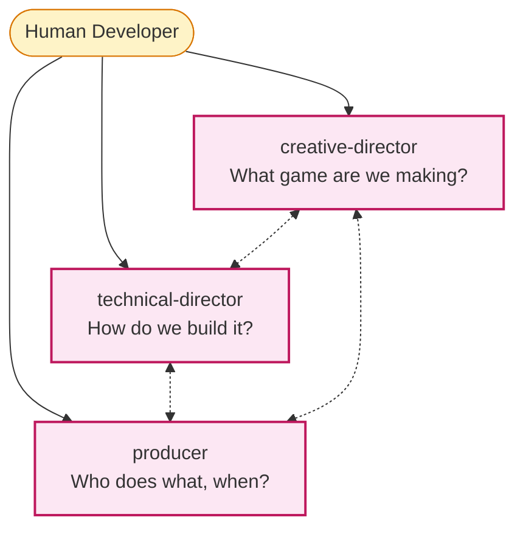

# Tier 1 — Directors and Producer

The three Opus-tier agents that own vision, architecture, and coordination.

---

## The three roles

The dotted lines show that directors **coordinate as peers**. The producer doesn't override directors — they facilitate decisions.

---

## `creative-director`

**Owns:** game vision, tone, aesthetic direction, pillar conflict resolution.

**Use when:**
- A decision affects the game's fundamental identity
- Department leads (`game-designer`, `art-director`, `audio-director`, `narrative-director`) cannot reach consensus
- Reviewing whether a feature serves the game's pillars
- Final sign-off on `game-concept.md` and `art-bible.md`

**Skills they appear in:**
- `/brainstorm` — guides the creative direction
- `/design-review` and `/review-all-gdds` (Full mode) — concept-level review
- `/architecture-review` — confirms architecture serves vision
- `/gate-check` — Concept → Systems gate sign-off
- `/milestone-review` — vision drift check

**They do not decide:**
- Implementation details (defer to `technical-director`)
- Schedule (defer to `producer`)
- Code patterns (defer to `lead-programmer`)

---

## `technical-director`

**Owns:** architecture decisions, technology choices, performance strategy, technical risk management.

**Use when:**
- Choosing a major technology (engine, language, framework)
- Reviewing architecture across systems
- Adjudicating cross-system technical conflicts
- Final sign-off on ADRs
- Setting performance budgets and risk priorities

**Skills they appear in:**
- `/setup-engine` — engine + version choice
- `/create-architecture` — primary author of the architecture document
- `/architecture-decision` — author or reviewer of every ADR
- `/architecture-review` — final review verdict
- `/perf-profile` — strategic interpretation of bottlenecks
- `/gate-check` — Systems → Tech and Tech → Pre-Prod sign-offs

**They do not decide:**
- Game mechanics (defer to `creative-director` and `game-designer`)
- Schedule (defer to `producer`)
- Specific code (defer to `lead-programmer` and specialists)

---

## `producer`

**Owns:** sprint planning, milestone tracking, risk management, cross-department coordination, scope.

**Use when:**
- Planning a sprint
- Tracking milestone progress
- Resolving schedule conflicts between departments
- Negotiating scope cuts
- Coordinating multi-department features
- Escalating blockers

**Skills they appear in:**
- `/sprint-plan` — primary author
- `/scope-check` — scope creep detection
- `/milestone-review` — progress + go/no-go
- `/retrospective` — facilitator
- `/gate-check` — process readiness for the next phase
- `/team-*` — orchestrator (`/team-release`, `/team-qa`)

**They do not decide:**
- Creative direction (facilitates discussion, escalates to `creative-director`)
- Architecture (defers to `technical-director`)
- Quality standards (defers to `qa-lead`)

---

## Escalation paths

When something can't be resolved at a lower tier, it escalates to one or more directors:

| Conflict | Escalates to |
|----------|--------------|
| Two designers disagree on a mechanic | `game-designer` |
| Game design vs narrative | `creative-director` |
| Game design vs technical feasibility | `producer` (facilitates) → both directors |
| Art vs audio tonal conflict | `creative-director` |
| Code architecture disagreement | `technical-director` |
| Cross-system code conflict | `lead-programmer` → `technical-director` |
| Schedule conflict between departments | `producer` |
| Scope exceeds capacity | `producer` → `creative-director` for cuts |
| Quality gate disagreement | `qa-lead` → `technical-director` |
| Performance budget violation | `performance-analyst` flags → `technical-director` decides |

Full table: `.claude/docs/agent-coordination-map.md`.

---

## Why Opus tier

These agents synthesize across many documents (5+ GDDs, all ADRs, multiple sprints) to produce verdicts that affect the project's direction. The cost of an Opus call is justified by the cost of a wrong verdict — a missed contradiction in `/review-all-gdds` becomes a refactor in Production. Sonnet would be cheaper but less reliable for that workload.

For lighter tasks (e.g. drafting a section of a GDD), Sonnet-tier leads handle the work.

---

## Director engagement by review mode

| Mode | Directors review at | Notes |
|------|---------------------|-------|
| **Full** | Every key step in every phase | Best for teams |
| **Lean** | Only at `/gate-check` transitions | Default for solo devs |
| **Solo** | Never | Game jams |

See [[02-Core-Concepts/Gates-and-Reviews]].

---

## See also

- [[04-Agents/Agents-Index]] — full table
- [[04-Agents/Tier-2-Department-Leads]] — who reports to the directors
- [[02-Core-Concepts/The-Studio-Metaphor]] — why directors exist
- [[02-Core-Concepts/Gates-and-Reviews]] — when directors engage
