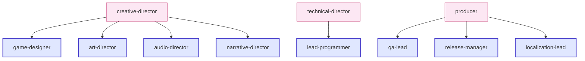

# Tier 2 — Department Leads

Eight Sonnet-tier agents that own a specific domain end-to-end. They translate director vision into concrete artifacts and review specialist output.

---

## The eight leads

---

## `game-designer`

**Owns:** mechanics, systems, progression, economy, balancing.

**Authors:** GDDs, formula tables, balance specs.
**Reviews:** specialist designs, balance changes, system interactions.

**Delegates to:** `systems-designer`, `level-designer`, `economy-designer`.

**Primary skills:** `/design-system`, `/quick-design`, `/balance-check`, `/team-combat`, `/team-level`.

---

## `lead-programmer`

**Owns:** code architecture, API design, code review, refactoring strategy, programmer task assignment.

**Authors:** architecture sections, ADRs, control manifest entries, code review reports.
**Reviews:** all code changes via `/code-review`; specialist programmer output.

**Delegates to:** all programmer specialists (`gameplay-programmer`, `engine-programmer`, `ai-programmer`, `network-programmer`, `tools-programmer`, `ui-programmer`) + engine specialists.

**Primary skills:** `/code-review`, `/architecture-decision` (technical co-author), `/dev-story` (router).

---

## `art-director`

**Owns:** visual identity, style guides, art bible, asset standards, color palettes, UI/UX visual direction.

**Authors:** `art-bible.md`, asset specs, visual review reports.
**Reviews:** asset compliance with art bible, UX visual direction.

**Delegates to:** `technical-artist`, `ux-designer` (visual aspects).

**Primary skills:** `/art-bible`, `/asset-spec`, `/asset-audit`.

---

## `audio-director`

**Owns:** music direction, sound design philosophy, audio implementation strategy, mix balance.

**Authors:** audio direction docs, sound palettes, music cue plans.
**Reviews:** SFX specs, music selections, mix output.

**Delegates to:** `sound-designer`.

**Primary skills:** `/team-audio`.

---

## `narrative-director`

**Owns:** story architecture, world-building, character design, dialogue strategy.

**Authors:** story arcs, world rule definitions, character sheets.
**Reviews:** dialogue, lore entries, level narrative beats.

**Delegates to:** `writer`, `world-builder`.

**Primary skills:** `/team-narrative`, `/team-level` (narrative beats).

---

## `qa-lead`

**Owns:** test strategy, bug triage, release quality gates, testing process design.

**Authors:** test plans, regression suites, bug triage reports.
**Reviews:** test cases written by `qa-tester`; release readiness.

**Delegates to:** `qa-tester`.

**Primary skills:** `/qa-plan`, `/bug-triage`, `/regression-suite`, `/test-evidence-review`, `/team-qa`.

---

## `release-manager`

**Owns:** release pipeline, build versioning, changelogs, deployment, rollbacks.

**Authors:** release checklists, launch checklists, release notes.
**Reviews:** release artifacts, store metadata, deploy plan.

**Delegates to:** `devops-engineer` (release builds), `qa-lead` (release testing).

**Primary skills:** `/release-checklist`, `/launch-checklist`, `/changelog`, `/patch-notes`, `/team-release`.

---

## `localization-lead`

**Owns:** internationalization architecture, string management, locale testing, translation pipeline.

**Authors:** localization plans, translator briefings, cultural review reports.
**Reviews:** all string externalization, locale rendering, text fitting.

**Delegates to:** `writer` (string review), `ui-programmer` (text fitting).

**Primary skills:** `/localize`.

---

## What leads do day-to-day

A lead's typical activities:

1. **Author** the next domain artifact (GDD, code architecture section, etc.)
2. **Spawn specialists** for narrow work (formula authoring, code implementation)
3. **Review** specialist output before signing off
4. **Coordinate horizontally** with peer leads (e.g. `game-designer` ↔ `narrative-director` for narrative-driven systems)
5. **Escalate** unresolvable conflicts to their director

This is why leads use Sonnet — they need general competence across authoring + delegation + review, not just narrow synthesis.

---

## When to spawn a lead directly

In normal use, you don't — skills handle it. But if you're using the `Task` tool by hand:

| Task | Spawn |
|------|-------|
| Author a GDD section | `game-designer` |
| Review code architecturally | `lead-programmer` |
| Lock down a visual style | `art-director` |
| Plan a sprint | `producer` (Tier 1) — leads coordinate but don't plan |
| Plan QA for a feature | `qa-lead` |

---

## See also

- [[04-Agents/Agents-Index]] — full agent table
- [[04-Agents/Tier-1-Directors]] — leadership tier above
- [[04-Agents/Tier-3-Specialists]] — specialists below
- [[02-Core-Concepts/The-Studio-Metaphor]] — why these roles exist
