# Tier 3 — Specialists

The 22 narrow-scope agents that do the actual work. Most use Sonnet; a handful use Haiku for read-only or lightweight authoring.

> Engine specialists are listed separately in [[04-Agents/Engine-Specialists-Godot-Unity-Unreal]].

---

## Specialist groups

```mermaid
flowchart TB
    Design[Design Specialists]
    Code[Programmer Specialists]
    Visual[Art + Audio + Tech Art]
    Quality[QA + Performance]
    Process[DevOps + Analytics]
    Special[UX + Prototyping + Security + a11y]
    Live[Live-Ops + Community]

    Design --> Sys[systems-designer]
    Design --> Lvl[level-designer]
    Design --> Eco[economy-designer]

    Code --> GP[gameplay-programmer]
    Code --> EP[engine-programmer]
    Code --> AIP[ai-programmer]
    Code --> NP[network-programmer]
    Code --> TP[tools-programmer]
    Code --> UP[ui-programmer]

    Visual --> TA[technical-artist]
    Visual --> SD[sound-designer]
    Visual --> Wr[writer]
    Visual --> WB[world-builder]

    Quality --> QT[qa-tester]
    Quality --> PA[performance-analyst]

    Process --> DO[devops-engineer]
    Process --> AnE[analytics-engineer]

    Special --> UX[ux-designer]
    Special --> Pro[prototyper]
    Special --> Sec[security-engineer]
    Special --> AC[accessibility-specialist]

    Live --> LO[live-ops-designer]
    Live --> CM[community-manager]
```

---

## Design specialists (Sonnet)

| Agent | Role |
|-------|------|
| `systems-designer` | Detailed mechanic specs — combat formulas, progression curves, crafting recipes, status effect interactions |
| `level-designer` | Spatial designs, encounter layouts, pacing plans, environmental storytelling guides |
| `economy-designer` | Resource economies, loot tables, progression curves, in-game market design |

---

## Programmer specialists (Sonnet)

| Agent | Owns |
|-------|------|
| `gameplay-programmer` | Game mechanics, player systems, combat, interactive features |
| `engine-programmer` | Core engine — rendering pipeline, physics, memory, resource loading, scene management |
| `ai-programmer` | Behavior trees, state machines, pathfinding, perception, NPC behavior |
| `network-programmer` | State replication, lag compensation, matchmaking, network protocols |
| `tools-programmer` | Editor extensions, content authoring tools, debug utilities, pipeline automation |
| `ui-programmer` | UI framework, screens, widgets, data binding, screen flow |

`/dev-story` routes to the right one based on the story's domain. Don't pick by hand.

---

## Visual + audio + content (mixed tiers)

| Agent | Tier | Owns |
|-------|------|------|
| `technical-artist` | Sonnet | Shaders, VFX systems, LOD pipelines, performance budgeting, art-to-engine pipeline |
| `sound-designer` | Haiku | Detailed SFX specs, audio event docs, mixing parameters |
| `writer` | Sonnet | Dialogue, lore entries, item descriptions, environmental text, all player-facing written content |
| `world-builder` | Sonnet | Detailed world lore — factions, cultures, history, geography, ecology, world rules |

---

## Quality + performance (mixed)

| Agent | Tier | Owns |
|-------|------|------|
| `qa-tester` | Haiku | Test cases, bug reports, test checklists |
| `performance-analyst` | Sonnet | Profiling, bottleneck identification, optimization recommendations, perf metrics tracking |

---

## Process specialists (mixed)

| Agent | Tier | Owns |
|-------|------|------|
| `devops-engineer` | Haiku | CI/CD configuration, build scripts, version control workflow, deployment pipelines |
| `analytics-engineer` | Sonnet | Telemetry systems, event tracking, A/B test frameworks, data pipelines |

---

## Cross-cutting specialists

| Agent | Tier | Owns |
|-------|------|------|
| `ux-designer` | Sonnet | User flows, interaction design, information architecture, input handling design |
| `prototyper` | Sonnet | Rapid throwaway prototypes for pre-production validation. Standards intentionally relaxed for speed |
| `security-engineer` | Sonnet | Anti-cheat, save data integrity, network security, exploit prevention, data privacy |
| `accessibility-specialist` | Haiku | WCAG, colorblind modes, remapping, text scaling, screen reader support |

---

## Live-ops specialists (mixed)

| Agent | Tier | Owns |
|-------|------|------|
| `live-ops-designer` | Sonnet | Seasonal events, battle passes, content cadence, retention mechanics, live-service economy |
| `community-manager` | Haiku | Patch notes, social posts, community updates, player feedback collection, crisis comms |

---

## Why some are Haiku

Haiku-tier specialists do **lightweight, structured, or read-only** work where Sonnet would be overkill:

- `qa-tester` — writes test cases from a template; doesn't need creative judgment
- `sound-designer` — produces structured SFX spec sheets; doesn't compose music
- `accessibility-specialist` — checks against WCAG; doesn't invent novel patterns
- `community-manager` — translates technical changelogs to player language; doesn't make creative calls
- `devops-engineer` — runs scripts and CI; structured operations

Cost: roughly **1/15× Opus**, **1/5× Sonnet**. Significant savings at scale.

---

## When to use which

The pipeline tells you. But for `Task` calls by hand:

| Need | Spawn |
|------|-------|
| Detailed combat formula | `systems-designer` |
| Level layout for area X | `level-designer` |
| Implement a feature | (use `/dev-story`) |
| Optimize a function | `performance-analyst` first to identify, then implement |
| Spec an SFX | `sound-designer` |
| Test plan for an epic | `qa-lead` (Tier 2) for plan, `qa-tester` for cases |
| Visual identity | `art-director` (Tier 2) for direction, `technical-artist` for implementation |

---

## Anti-patterns to avoid

- **Skipping leads** to spawn specialists directly — bypasses domain ownership
- **Making cross-domain decisions** — a `gameplay-programmer` must not decide UI patterns
- **Asking specialists to plan** — that's lead/director work; specialists implement plans

---

## See also

- [[04-Agents/Agents-Index]] — full agent table
- [[04-Agents/Tier-2-Department-Leads]] — leads above
- [[04-Agents/Engine-Specialists-Godot-Unity-Unreal]] — engine specialists
- [[02-Core-Concepts/The-Studio-Metaphor]] — why specialists are scoped narrowly
