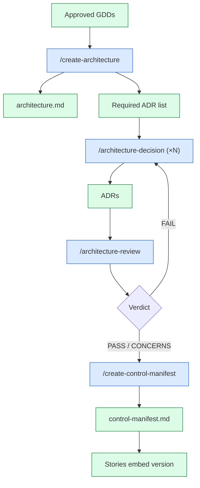

# Architecture Skills

The four skills that turn approved GDDs into a buildable architecture. All used in Phase 3.

---

## The four skills

| Skill | Order | Output |
|-------|-------|--------|
| `/create-architecture` | 1 | `docs/architecture/architecture.md` + Required ADR list |
| `/architecture-decision` | 2 (×N) | `docs/architecture/adr-NNN-*.md` |
| `/architecture-review` | 3 | `docs/architecture/architecture-review-<date>.md` |
| `/create-control-manifest` | 4 | `docs/architecture/control-manifest.md` |

---

## `/create-architecture`

**Purpose:** Author the master architecture document covering all systems.

**Reads:** All approved GDDs, the systems index, `technical-preferences.md`, the engine reference docs.

**Produces:**
- `docs/architecture/architecture.md` — high-level structure, component boundaries, data flows
- A **Required ADR list** — specific decisions that must be documented as ADRs before Phase 3 can complete
- A **performance watchlist** — systems that risk the performance budget

**Run once,** at the start of Phase 3.

---

## `/architecture-decision`

**Purpose:** Author one ADR (Architecture Decision Record).

**Required sections (per project's `docs/CLAUDE.md`):**
1. Title
2. Status — `Proposed` → `Accepted` → `Superseded`
3. Context
4. Decision
5. Consequences
6. ADR Dependencies (which ADRs must be `Accepted` first)
7. Engine Compatibility (Godot/Unity/Unreal version notes)
8. GDD Requirements Addressed (TR-IDs)

**Status lifecycle:**
- **`Proposed`** — drafted, under review. Stories cannot reference proposed ADRs.
- **`Accepted`** — locked in. Stories may reference.
- **`Superseded`** — replaced by a newer ADR. The newer ADR notes which it supersedes.

**Run once per significant decision.** Repeatable. Most projects need 5–10 ADRs by end of Phase 3.

---

## `/architecture-review`

**Purpose:** Validate all ADRs for completeness, dependency ordering, and GDD coverage. **Opus tier.**

**What it checks:**
1. Every Required ADR (from `/create-architecture`) exists
2. All ADRs have the 8 required sections
3. ADR dependencies form a DAG (no cycles)
4. Layer ordering: Foundation → Core → Feature → Presentation
5. Every GDD requirement TR-ID is covered by at least one ADR
6. The TR registry (`tr-registry.yaml`) is updated

**Verdicts:**
- ✅ PASS — proceed to control manifest
- ⚠️ CONCERNS — gaps with suggestions
- ❌ FAIL — missing Required ADRs or dependency cycles

**Output:** `docs/architecture/architecture-review-<date>.md`.

**Run after authoring all Required ADRs,** before `/create-control-manifest`.

---

## `/create-control-manifest`

**Purpose:** Generate a flat programmer rules sheet from all `Accepted` ADRs.

**Why it exists:** Programmers don't want to read 10 ADRs to know what to do. The manifest is the **operational distillation**:

```markdown
## Required
- All gameplay code must use signals at the GDScript/C# boundary.
- All save data must include `save_version: int`.

## Forbidden
- Never use Resources.Load() for gameplay assets.
- Never block the main thread with file I/O.

## Guardrails
- Combat damage must reference TR-CMB-001's formula.
```

**Output:** `docs/architecture/control-manifest.md` with:
- `Manifest Version: <date>` header
- Required / Forbidden / Guardrails sections
- Each rule traced to its source ADR

**Stories embed the manifest version they were created against.** When the manifest revs, `/story-done` warns about staleness.

**Run after `/architecture-review` PASSes,** and re-run any time new ADRs are accepted.

---

## How they flow



---

## ADR layer order

ADRs have a **dependency layer** that determines authoring order:

| Layer | Examples |
|-------|----------|
| **Foundation** | Input system, save/load format, scene management, networking transport |
| **Core** | Engine subsystems, language routing (e.g. C# vs GDScript), asset pipeline |
| **Feature** | Combat architecture, UI framework, AI patterns |
| **Presentation** | Rendering pipeline, post-processing |

Higher-layer ADRs cannot be `Accepted` until all their Foundation/Core dependencies are `Accepted`. `/architecture-review` blocks layer-jumping.

---

## When to author ADRs inline vs after

**Author the ADR before the implementation** when the decision is non-trivial and reversible:
- "Use Addressables vs Resources" — author first
- "Network authority model" — author first
- "Save format versioning scheme" — author first

**Author the ADR inline with the GDD** when it's narrow and tightly coupled to one system:
- "Champion ↔ Card modifier interface" — can live inside the Champion GDD as `ModifierTarget`
- Some narrow data structures

The systems-index from `/map-systems` will indicate which.

---

## Common patterns

- **Foundation-first sweep:** Author all Foundation-layer ADRs first (input, save, scenes, networking) — these unblock everything else.
- **Re-running `/architecture-review`:** After every batch of new ADRs. Cheaper than waiting until Phase 3 end and finding 5 issues at once.
- **Re-running `/create-control-manifest`:** After every batch. Stories pinned to old versions show staleness in `/story-done`.
- **`/propagate-design-change` after a GDD revision:** Surfaces ADRs whose TR-ID coverage is now stale.

---

## See also

- [[03-Phases/Phase-3-Technical-Setup]] — full phase context
- [[06-Documents-Produced/ADR-Architecture-Decision-Record]] — ADR anatomy
- [[06-Documents-Produced/Control-Manifest]] — manifest anatomy
- [[04-Agents/Tier-1-Directors#technical-director]] — owner of architecture
