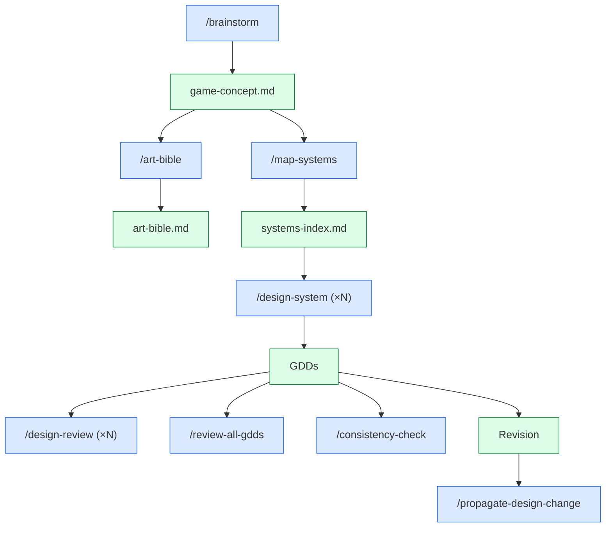

# Design Skills

The skills that turn an idea into formal design — concept doc, art bible, systems index, GDDs.

> Phases 1 and 2 are mostly design skills. Some carry into 5–6 for design changes.

---

## The design skills

| Skill | Phase | Produces |
|-------|-------|----------|
| `/brainstorm` | 1 | `design/gdd/game-concept.md` |
| `/art-bible` | 1 | `design/art/art-bible.md` |
| `/map-systems` | 1 | `design/gdd/systems-index.md` |
| `/design-system` | 2 | `design/gdd/<system>.md` |
| `/quick-design` | 2 / 5 | `design/gdd/<system>.md` (lighter) |
| `/design-review` | 1–2 | review report |
| `/review-all-gdds` | 2 | `design/gdd/gdd-cross-review-<date>.md` |
| `/consistency-check` | 2 / 5 | report |
| `/propagate-design-change` | Any | impact report |

---

## `/brainstorm`

**Purpose:** Guided ideation — turn a vague theme (or nothing) into a documented concept.

**Modes:**
- `/brainstorm open` — fully open exploration
- `/brainstorm <hint>` — seeded with a theme (e.g. "cozy", "horror", "space")
- `/brainstorm <full concept>` — formalize a clear idea

**Frameworks used:**
- **MDA** (Mechanics, Dynamics, Aesthetics) — ensures all three layers are coherent
- **Verb-first design** — what do players *do*?
- **Player psychology** — Bartle types, SDT (Self-Determination Theory)

**Output:** `game-concept.md` with pillars, scope tiers, target audience, MDA analysis, Visual Identity Anchor (consumed by `/art-bible`).

---

## `/art-bible`

**Purpose:** Author the visual identity specification — 9 sections.

**Sections include:** vision statement, color palette, lighting language, character silhouettes, environment beats, prop language, UI visual language, motion language, asset standards.

**Why it matters:** Without an art bible, asset production drifts. The bible is the **single point of truth** for "does this asset belong in this game?"

**Reads:** Visual Identity Anchor from `/brainstorm`.

---

## `/map-systems`

**Purpose:** Decompose the game concept into a list of systems with dependencies and priority tiers.

**Output sections:**
- All systems (numbered, named)
- Priority tier per system: MVP / Vertical Slice / Alpha / Full Vision
- Dependencies between systems (System X requires System Y)
- Design order (topological sort respecting dependencies)
- High-risk systems (with bottleneck-mitigation suggestions)
- Required ADRs before each GDD can author

**Why it matters:** This file is read by `/design-system` (which system next?), `/create-architecture` (Required ADRs), `/create-epics` (epic boundaries).

---

## `/design-system`

**Purpose:** Section-by-section GDD authoring for one system.

**Required sections (8):**
1. Overview
2. Player Fantasy
3. Detailed Rules
4. Formulas
5. Edge Cases
6. Dependencies
7. Tuning Knobs
8. Acceptance Criteria

**Flow:**
1. Skill spawns `game-designer` for design intent
2. May spawn `systems-designer` (formulas), `economy-designer` (currencies), `level-designer` (spatial)
3. Section-by-section authoring with user approval per section
4. Writes incrementally to file (so context compaction doesn't lose work)
5. Sets `Status: Draft` initially; `/design-review` can flip to `Approved`

**Run once per system in the systems-index.**

---

## `/quick-design`

**Purpose:** Lightweight design spec for tiny systems — main menu volume slider, a UI tweak, a balance change.

**When to use:** When `/design-system` is overkill (the spec would be < 200 lines).

**Output:** A condensed design doc — typically 4 sections instead of 8.

---

## `/design-review`

**Purpose:** Validate one GDD for completeness, internal consistency, design coherence.

**Verdicts:**
- ✅ **APPROVED** — flips `Status: Draft` to `Status: Approved`
- ⚠️ **NEEDS REVISION** — minor issues listed
- ❌ **MAJOR REVISION** — substantial gaps; cannot advance until fixed

**Spawns:** `game-designer` for review; `creative-director` in Full mode.

**Run once per GDD before `/review-all-gdds`.**

---

## `/review-all-gdds`

**Purpose:** Cross-GDD consistency + design theory review. **Opus tier** — synthesizes all GDDs simultaneously.

**Spawns multiple agents in parallel:**
- Consistency reviewer (entity stats, formula compatibility)
- Design theory reviewer (verb coherence, pillar adherence, MDA alignment)
- Both directors in Full mode

**Output:** `design/gdd/gdd-cross-review-<date>.md` with findings categorized by severity.

**Run once at the end of Phase 2** before the gate-check.

---

## `/consistency-check`

**Purpose:** Lighter cross-GDD entity-level check. Faster than `/review-all-gdds`.

**What it catches:** "System A says ammo is consumable, System B treats it as rechargeable." Stat mismatches, formula variable name conflicts, mechanic contradictions.

**Run any time GDDs change** — much cheaper than re-running the full cross-review.

---

## `/propagate-design-change`

**Purpose:** When a GDD revises, find which ADRs and stories may now be stale.

**Flow:**
1. User says "I revised GDD `movement.md`"
2. Skill scans all ADRs and stories for references to that GDD's TR-IDs
3. Produces a change-impact report listing affected artifacts
4. User decides which need re-review

**Run after any non-trivial GDD revision.**

---

## How they connect

---

## Common patterns

- **Concept-only project (jam):** `/brainstorm` → `/setup-engine` → skip art-bible → `/quick-design` for the one core mechanic → start prototype.
- **Standard greenfield:** Full Phase 1 + 2 sequence, Lean review mode.
- **Brownfield with existing GDDs:** `/adopt` first, then `/design-review` to audit each GDD, then `/propagate-design-change` if revisions are needed.

---

## See also

- [[03-Phases/Phase-1-Concept]]
- [[03-Phases/Phase-2-Systems-Design]]
- [[06-Documents-Produced/Game-Concept-Doc]]
- [[06-Documents-Produced/GDD-Game-Design-Document]]
- [[06-Documents-Produced/Systems-Index]]
