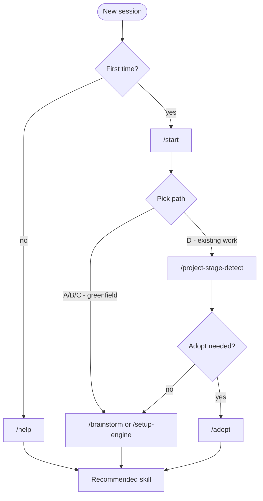

# Onboarding Skills

Five skills used for orientation and joining the workflow. Run these at session boundaries, when stuck, or when joining a brownfield project.

---

## `/start`

**Purpose:** First-time onboarding. Asks where you are, recommends the right path.

**When to run:**
- Fresh repo, first session
- Joining a project mid-stream and unsure where you fit
- Want to change review mode

**What it produces:** `production/review-mode.txt` (Full / Lean / Solo).

**What it asks:**
1. Where are you at? (A/B/C/D — see [[01-Start-Here/First-Session-Walkthrough]])
2. How much director review? (Full / Lean / Solo)

**Hands off to:** `/brainstorm`, `/setup-engine`, `/project-stage-detect`, or `/adopt` depending on path.

---

## `/help`

**Purpose:** "What do I do next?" Lightweight phase + readiness check.

**Model tier:** Haiku — read-only, fast, cheap.

**When to run:**
- Stuck or confused
- After completing a step and wondering what's next
- Daily orientation

**What it does:**
1. Reads `.claude/docs/workflow-catalog.yaml`
2. Determines current phase (from `production/stage.txt` or artifact glob)
3. Reads `production/session-state/active.md`
4. For each step in current phase, checks completion via artifact glob
5. Identifies the **first required incomplete step** as "next up"
6. Lists optional opportunities and upcoming required steps

**What it produces:** No files. Returns a structured summary.

**Output shape:**
```
## Where You Are: Systems Design

✓ Done: design-system (3 of 8 systems)
→ Next up: design-system (continue with system 4)
~ Optional: consistency-check
Coming up: review-all-gdds, /gate-check
```

---

## `/project-stage-detect`

**Purpose:** Full audit of project state. Heavier than `/help`.

**Model tier:** Haiku.

**When to run:**
- Joining an unfamiliar project
- Suspicion that something is missing
- Periodic health check
- Before a `/gate-check` to find existence gaps

**What it does:**
1. Reads the workflow catalog
2. Checks artifact existence across **all** phases (not just current)
3. Categorizes findings: existing, missing, outdated, partially-formed
4. Recommends next steps to close gaps

**What it produces:** `production/audit-<date>.md` (optional, by user request).

**Difference from `/help`:** `/help` is fast and focused on the current phase. `/project-stage-detect` is comprehensive across all phases.

---

## `/setup-engine`

**Purpose:** Configure engine, version, naming conventions, performance budgets.

**When to run:**
- Phase 1 (required step)
- When switching engines (rare)
- After a major engine version upgrade

**What it asks:**
1. Engine? (Godot / Unity / Unreal)
2. Version? (specific minor.patch — e.g. 4.6.2)
3. Primary language? (engine-dependent)
4. Target platforms? (PC / mobile / console)
5. Input methods? (keyboard / gamepad / touch)
6. Performance budget? (target fps, memory ceiling)

**What it produces:**
- Updates `.claude/docs/technical-preferences.md` with all answers
- Pins engine version in `docs/engine-reference/<engine>/VERSION.md`
- Triggers WebSearch to populate `docs/engine-reference/<engine>/` with version-aware reference docs (if not already present)
- Sets routing rules for which agent owns which file extension

**Critical:** Without this, downstream skills don't know which engine specialist to spawn.

---

## `/adopt`

**Purpose:** Brownfield format compliance audit. Checks whether existing artifacts match template format.

**When to run:**
- Joining a project that has GDDs/ADRs/stories from before this template was applied
- Migrating from another workflow
- After path D in `/start`

**What it does:**
1. Globs for known artifact paths (GDDs, ADRs, stories, etc.)
2. For each, checks **internal format**:
   - Does the GDD have the 8 required sections?
   - Does the ADR have Status / Context / Decision / Consequences?
   - Does the story have a TR-ID and acceptance criteria?
3. Classifies gaps by impact (cosmetic / structural / blocking)
4. Produces a numbered migration plan

**What it produces:** `production/adopt-migration-<date>.md`.

**Why it matters:** Existing GDDs may "look right" but fail `/design-review` because they're missing a required section. `/adopt` finds that before it surprises you.

---

## How they fit together



---

## Tips

- **Run `/help` daily.** It's cheap (Haiku) and grounds you.
- **Don't run `/start` more than once** unless you want to change review mode.
- **`/setup-engine` is idempotent** — safe to re-run if you want to update naming or budgets.
- **`/adopt` is read-only at first** — it produces a plan; you decide what to migrate.

---

## See also

- [[01-Start-Here/First-Session-Walkthrough]] — what `/start` does in detail
- [[02-Core-Concepts/The-7-Phase-Pipeline]] — what comes after onboarding
- [[05-Skills/Skills-Index]]
- [[08-Reference/Workflow-Catalog-Explained]] — what `/help` and `/project-stage-detect` read from
