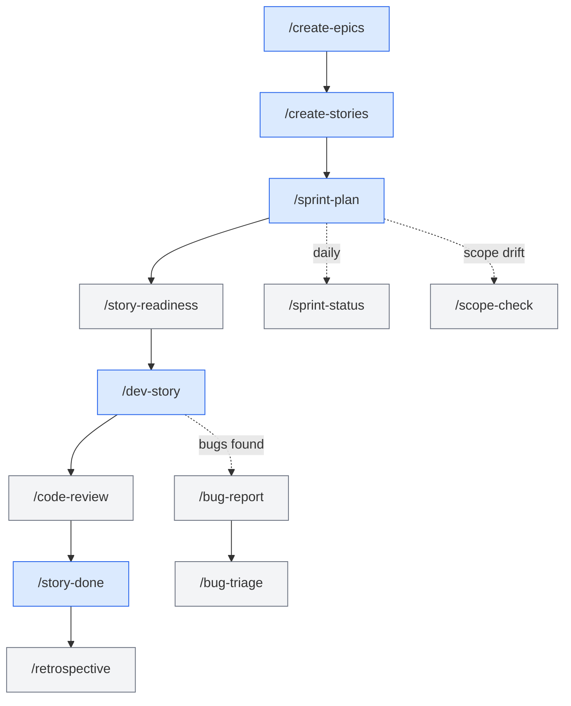

# Production Skills

Skills that drive the sprint loop — planning, implementation, review, closure, and the analyses that surround them.

> Phases 4 (planning) and 5 (sprint loop). Some carry into 6–7.

---

## The skill stack



---

## `/create-epics`

**Purpose:** Translate approved GDDs + ADRs into epics — one per architectural module.

**Reads:** All approved GDDs, the architecture document, ADRs, control manifest, systems-index.

**Produces:** `production/epics/<epic-slug>/EPIC.md` per epic.

**Each EPIC.md contains:**
- Scope (which systems, which TR-IDs)
- Governing ADRs
- Engine risk assessment
- Untraced requirements (TR-IDs from GDDs not yet covered)
- A high-level story plan (does **not** break into stories — that's `/create-stories`)

**Run per architectural layer.** Foundation epics first, then Core, then Feature.

---

## `/create-stories`

**Purpose:** Break one epic into implementable story files.

**Each story embeds:**
- The GDD requirement TR-ID
- The governing ADR(s)
- The control manifest version
- Engine notes (e.g. "use signals at boundary")
- Acceptance criteria (testable)
- Story type — Logic / Integration / Visual / UI / Config (drives required test evidence)

**Output:** Story files inside `production/epics/<epic-slug>/`.

**Run once per epic.**

---

## `/sprint-plan`

**Purpose:** Plan a sprint. Initializes (or updates) `sprint-status.yaml`.

**Reads:** Stories at `Status: Ready`, sprint history (velocity), `production/stage.txt`, milestones.

**Produces:**
- `production/sprints/sprint-N.md` — narrative plan
- `production/sprint-status.yaml` — structured per-story status (the canonical sprint tracker)

**Run once per sprint.** Repeatable.

---

## `/sprint-status`

**Purpose:** Quick 30-line snapshot of sprint progress. Reads `sprint-status.yaml`.

**Model tier:** Haiku. Fast. Cheap. Run daily.

**Output shape:**
```
Sprint 3 — Day 6 / 14
Stories: 8 total, 3 done, 2 in-progress, 3 ready
Blockers: 1 (sprint-3/combat-hitbox.md — waiting on ADR-008)
Burndown: tracking 12% behind plan
```

---

## `/story-readiness`

**Purpose:** Validate a story is implementation-ready before pickup.

**Verdicts:**
- ✅ READY — has TR-ID, ADRs, acceptance criteria, manifest version
- ⚠️ NEEDS WORK — fixable gaps (e.g. acceptance criteria too vague)
- ❌ BLOCKED — depends on a `Proposed` ADR (cannot proceed)

**Optional but valuable** — catches issues before `/dev-story` wastes effort.

---

## `/dev-story`

**Purpose:** Implement a story end-to-end.

**Flow:**
1. Reads story file, GDD requirement, governing ADRs, control manifest
2. **Routes** to the right programmer agent based on the story's domain
3. Programmer reads existing code patterns, drafts implementation plan
4. User approves
5. Programmer writes code + tests (per story type's required evidence)
6. Returns summary + files changed

**Routing examples:**
- Combat code → `gameplay-programmer` + `[engine]-specialist`
- AI behavior → `ai-programmer`
- HUD widget → `ui-programmer` + `unity-ui-specialist` (if Unity)
- Save format → `engine-programmer` + `security-engineer`

**Run once per story.** The most-invoked skill in Phase 5.

---

## `/code-review`

**Purpose:** Architectural code review. Spawns `lead-programmer` (and engine specialist if relevant).

**Checks:**
- Coding standards compliance
- Architectural pattern adherence (does it respect the control manifest?)
- SOLID principles
- Testability
- Performance hot paths

**Optional** but strongly recommended after every `/dev-story`. Run before `/story-done`.

---

## `/story-done`

**Purpose:** 8-phase completion review. The only skill that closes a story.

**Checks:**
1. All acceptance criteria met
2. Required test evidence present (per story type)
3. No GDD or ADR deviations
4. Control manifest version still current
5. Linked TR-IDs validated
6. Code review done (or noted as skipped)
7. Story file updated with completion notes
8. `sprint-status.yaml` updated to `done`

**Surfaces the next story** at end (so the user knows what to pick next).

**Run once per story** to close it.

---

## `/qa-plan`

**Purpose:** Generate a QA test plan per epic or sprint.

**Output:** A test plan with cases categorized by story type:
- Logic stories → unit tests required
- Integration stories → integration tests or playtest
- Visual/UI/Config stories → manual evidence

Feeds `/smoke-check`, `/regression-suite`, `/test-evidence-review`.

---

## `/bug-report` and `/bug-triage`

**`/bug-report`** — Creates a structured bug report (severity, repro steps, environment, owner).

**`/bug-triage`** — Reads all open bugs, re-evaluates priority vs severity, assigns owner, identifies systemic patterns.

Run `/bug-triage` at sprint boundaries.

---

## `/retrospective`

**Purpose:** Sprint or milestone retrospective. Analyzes velocity, blockers, patterns.

**Spawns:** `producer` (facilitator), often surfaces topics for the next planning session.

**Output:** `production/retros/sprint-N-retro.md`.

**Optional but recommended** — even 5 minutes of "what was slow" pays dividends.

---

## `/scope-check`

**Purpose:** Detect scope creep. Compares current sprint scope to original epic scope.

**When to run:**
- When stories are added mid-sprint
- Before sprint retrospectives
- When a story's acceptance criteria expand

**Verdict:** scope creep magnitude + recommended cuts.

---

## `/perf-profile`, `/balance-check`, `/asset-audit`

Heavier analyses for Phase 6 — covered in [[03-Phases/Phase-6-Polish]].

---

## `/release-checklist`, `/launch-checklist`, `/changelog`, `/patch-notes`, `/hotfix`, `/day-one-patch`

Release-specific skills — covered in [[03-Phases/Phase-7-Release]].

---

## Common patterns

- **Daily flow in Production:** `/sprint-status` → pick next ready story → `/dev-story` → `/code-review` → `/story-done` → repeat.
- **Sprint boundary:** `/retrospective` → `/sprint-plan` (next).
- **Mid-sprint scope ask:** `/scope-check` first.
- **Bug surge:** `/bug-triage` to re-prioritize.

---

## See also

- [[03-Phases/Phase-4-Pre-Production]] — planning skills
- [[03-Phases/Phase-5-Production]] — sprint loop
- [[06-Documents-Produced/Epic-and-Story]]
- [[06-Documents-Produced/Sprint-Plan]]
- [[05-Skills/Team-Orchestration-Skills]]
