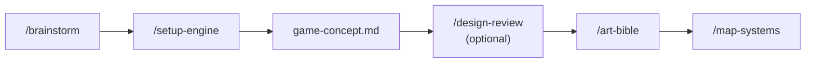
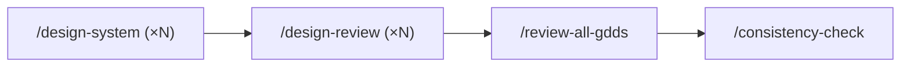
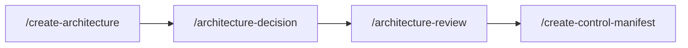
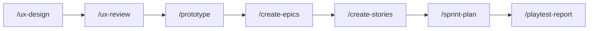
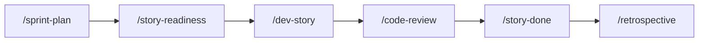
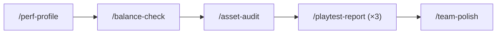
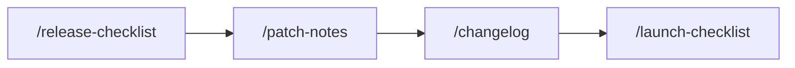

# Skills by Phase

The same skills as [[05-Skills/Skills-Index]], grouped by **when** you use them. Useful for "I'm in Phase X, what's available?"

---

## Pre-Phase 1 (orientation)

| Skill | Purpose |
|-------|---------|
| `/start` | First-time onboarding |
| `/help` | What's next? |
| `/project-stage-detect` | Full project audit |
| `/adopt` | Brownfield migration plan |

---

## Phase 1 — Concept

| Skill | Required? |
|-------|-----------|
| `/brainstorm` | Optional but recommended |
| `/setup-engine` | **Required** |
| `/design-review` | Optional (concept-level) |
| `/art-bible` | **Required** |
| `/map-systems` | **Required** |
| `/gate-check` | At end of phase |

See [[03-Phases/Phase-1-Concept]].

---

## Phase 2 — Systems Design

| Skill | Required? | Notes |
|-------|-----------|-------|
| `/design-system` | **Required** | Once per system |
| `/design-review` | **Required** | Once per GDD |
| `/review-all-gdds` | **Required** | Once at end of phase |
| `/consistency-check` | Optional | Run any time GDDs change |
| `/quick-design` | Optional | For trivial systems |
| `/propagate-design-change` | Optional | When a GDD revises |
| `/gate-check` | At end of phase | |

See [[03-Phases/Phase-2-Systems-Design]].

---

## Phase 3 — Technical Setup

| Skill | Required? |
|-------|-----------|
| `/create-architecture` | **Required** |
| `/architecture-decision` | **Required** (≥3) |
| `/architecture-review` | **Required** |
| `/create-control-manifest` | **Required** |
| `/gate-check` | At end of phase |

See [[03-Phases/Phase-3-Technical-Setup]].

---

## Phase 4 — Pre-Production

| Skill | Required? |
|-------|-----------|
| `/asset-spec` | Optional |
| `/ux-design` | **Required** (≥1) |
| `/ux-review` | **Required** |
| `/prototype` | **Required** (≥1) |
| `/create-epics` | **Required** |
| `/create-stories` | **Required** |
| `/test-setup` | Optional |
| `/test-helpers` | Optional |
| `/sprint-plan` | **Required** (first sprint) |
| `/playtest-report` | **Required** (≥1 vertical slice) |
| `/team-ui` | Optional |
| `/gate-check` | At end of phase |

See [[03-Phases/Phase-4-Pre-Production]].

---

## Phase 5 — Production

The sprint loop. Most skills here repeat per sprint or per story.

| Skill | Required? | Note |
|-------|-----------|------|
| `/sprint-plan` | **Required** | Per sprint |
| `/story-readiness` | Optional | Before story pickup |
| `/dev-story` | **Required** | Per story |
| `/code-review` | Optional but strongly recommended | After implementation |
| `/story-done` | **Required** | Per story to close it |
| `/sprint-status` | Optional | Daily snapshot (Haiku tier — cheap) |
| `/qa-plan` | Optional | Per epic |
| `/smoke-check` | Optional | Pre-handoff |
| `/bug-report` + `/bug-triage` | Optional | As bugs are found |
| `/retrospective` | Optional | End of sprint |
| `/scope-check` | Optional | When stories added mid-sprint |
| `/team-*` | Optional | For multi-domain features |
| `/gate-check` | At end of phase | |

See [[03-Phases/Phase-5-Production]].

---

## Phase 6 — Polish

| Skill | Required? |
|-------|-----------|
| `/perf-profile` | Optional |
| `/balance-check` | Optional |
| `/asset-audit` | Optional |
| `/playtest-report` | **Required** (×3 distinct types) |
| `/team-polish` | **Required** |
| `/regression-suite` | Optional |
| `/security-audit` | Optional |
| `/soak-test` | Optional |
| `/test-flakiness` | Optional |
| `/gate-check` | At end of phase |

See [[03-Phases/Phase-6-Polish]].

---

## Phase 7 — Release

| Skill | Required? |
|-------|-----------|
| `/release-checklist` | **Required** |
| `/launch-checklist` | **Required** |
| `/patch-notes` | Optional |
| `/changelog` | Optional |
| `/hotfix` | As needed (post-release) |
| `/day-one-patch` | Optional |
| `/team-release` | Optional |

See [[03-Phases/Phase-7-Release]].

---

## Cross-cutting (any phase)

| Skill | When |
|-------|------|
| `/help` | Anytime "what's next?" |
| `/sprint-status` | Quick check |
| `/scope-check` | Before adding work |
| `/tech-debt` | Periodic |
| `/onboard` | New contributor joins |
| `/localize` | Throughout |

---

## See also

- [[05-Skills/Skills-Index]] — alphabetical, full table
- [[02-Core-Concepts/The-7-Phase-Pipeline]] — phase definitions
- [[_Maps/Pipeline-Map]] — full visual flow
