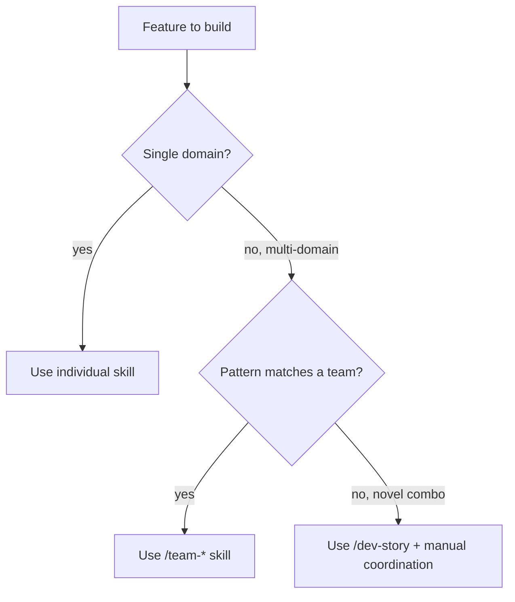
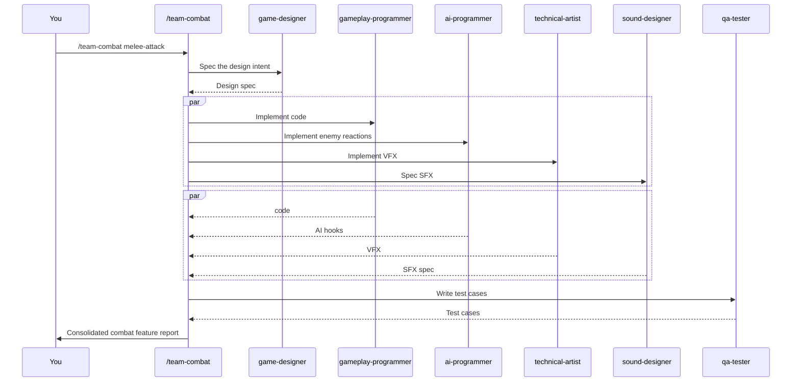

# Team Orchestration Skills

Nine skills that coordinate multiple agents on a single feature area. Use these when a feature spans multiple agent domains.

---

## The nine teams

| Skill | Coordinates | Use for |
|-------|-------------|---------|
| `/team-combat` | game-designer + gameplay-programmer + ai-programmer + technical-artist + sound-designer + qa-tester | Combat features end-to-end |
| `/team-narrative` | narrative-director + writer + world-builder + level-designer | Story content + world lore |
| `/team-ui` | ux-designer + ui-programmer + art-director + accessibility-specialist | Screen / HUD / interaction patterns |
| `/team-release` | release-manager + qa-lead + devops-engineer + producer | Release execution |
| `/team-polish` | performance-analyst + technical-artist + sound-designer + qa-tester | Coordinated polish pass |
| `/team-audio` | audio-director + sound-designer + technical-artist + gameplay-programmer | Audio pipeline + integration |
| `/team-level` | level-designer + narrative-director + world-builder + art-director + systems-designer + qa-tester | Complete area / level creation |
| `/team-live-ops` | live-ops-designer + economy-designer + analytics-engineer + community-manager + writer + narrative-director | Live event / season launch |
| `/team-qa` | qa-lead + qa-tester + gameplay-programmer + producer | Full QA cycle |

---

## When to use a team skill

The team skills capture **canonical multi-agent patterns**. If your feature is one of these patterns, the team skill saves orchestration overhead.

---

## How team skills work

Team skills:

1. **Spawn multiple agents in parallel** (when their inputs are independent)
2. **Sequence them** (when one's output is the next's input)
3. **Consolidate** results into a single report or PR
4. **Maintain context** for the user — you see the team's findings, not each agent's individual output

Example flow for `/team-combat`:

The user sees one skill invocation; the skill orchestrates six agents.

---

## `/team-combat`

**For:** Any combat feature — melee, ranged, magic, status effects, combos.

**Pattern:**
1. `game-designer` → design intent
2. `gameplay-programmer` → core mechanics
3. `ai-programmer` → enemy reactions
4. `technical-artist` → impact VFX
5. `sound-designer` → impact SFX spec
6. `qa-tester` → test cases

**Output:** Combat feature spec + implementation + tests.

---

## `/team-narrative`

**For:** Story content — quest lines, character arcs, world lore expansions.

**Pattern:**
1. `narrative-director` → story arc design
2. `world-builder` → world rules + faction context
3. `writer` → dialogue + lore entries
4. `level-designer` → environmental storytelling beats

---

## `/team-ui`

**For:** New screen, HUD, or interaction pattern.

**Pattern:**
1. `ux-designer` → flow + wireframe + interaction spec (`/ux-design`)
2. `art-director` → visual direction
3. `accessibility-specialist` → a11y review against the chosen tier (`/ux-review`)
4. `ui-programmer` → implementation (often via `/dev-story`)

**Output:** UX spec → visual mock → implemented widget.

---

## `/team-release`

**For:** Executing a release.

**Pattern:** Follows the release pipeline (Pattern 7 in agent-coordination-map):

1. `producer` → declares release candidate
2. `release-manager` → cuts branch + `/release-checklist`
3. `qa-lead` → full regression sign-off
4. `devops-engineer` → builds + deploys

---

## `/team-polish`

**For:** Phase 6 coordinated polish pass.

**Pattern:** All four agents do single-concern sweeps in parallel:
- `performance-analyst` → bottlenecks
- `technical-artist` → visual polish
- `sound-designer` → audio polish
- `qa-tester` → bug surface scan

**Output:** Consolidated polish report with prioritized actions.

---

## `/team-audio`

**For:** Audio system integration — adaptive music, spatial audio, mix tuning.

**Pattern:**
1. `audio-director` → direction
2. `sound-designer` → SFX specs
3. `technical-artist` → engine integration (FMOD, Wwise, Godot AudioStream)
4. `gameplay-programmer` → trigger hooks

---

## `/team-level`

**For:** Building a complete area or level.

**Pattern:** Combines the level-designer + narrative + art + systems + QA into a single coordinated pass — the most cross-domain of the team skills.

---

## `/team-live-ops`

**For:** Planning a season or live event launch (post-release).

**Pattern:** Uses the live-ops-designer as the central orchestrator, with economy + analytics + community + writer + narrative coordinating around the event design.

---

## `/team-qa`

**For:** Full QA cycle on a sprint or feature.

**Pattern:**
1. `qa-lead` → strategy + test plan
2. `qa-tester` → test case authoring
3. `gameplay-programmer` → implementing testability hooks if needed
4. `producer` → schedule + risk

**Output:** Complete QA package ready for execution.

---

## When NOT to use a team skill

- **Single-agent task** — just use the underlying skill (e.g. `/dev-story`, `/design-system`).
- **Novel domain combination** not matching any team — orchestrate manually with `/dev-story` + per-agent `Task` calls.
- **You're learning** — running team skills before understanding individual skills makes the output opaque. Get comfortable with `/dev-story`, `/design-system`, etc., first.

---

## Cost note

Team skills spawn multiple agents — they cost more than individual skill calls. The math is favorable when:

- The agents would have been needed anyway (the team skill saves orchestration time)
- Parallel spawning reduces wall-clock time

The math is unfavorable when:

- One agent's output would inform whether others are needed (sequential skills better)
- The feature is small enough that one agent could handle it

---

## See also

- [[05-Skills/Skills-Index]]
- [[04-Agents/Agents-Index]] — what each agent does
- [[02-Core-Concepts/The-Studio-Metaphor]] — why these specific groupings
- `.claude/docs/agent-coordination-map.md` — original coordination patterns
