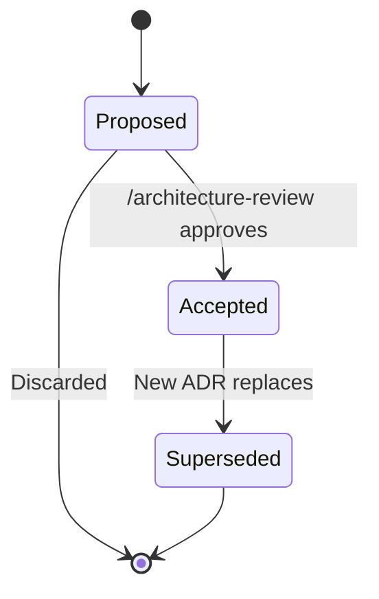
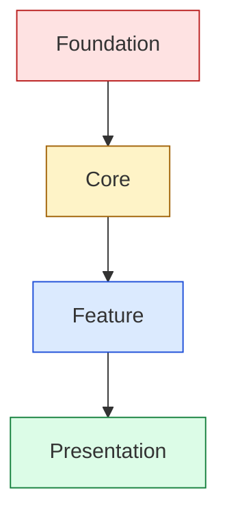

# ADR — Architecture Decision Record

A 2-page Markdown document capturing one significant technical decision: what was decided, why, and what the trade-offs are.

**Path:** `docs/architecture/adr-NNN-<slug>.md` (NNN is zero-padded)
**Created by:** `/architecture-decision`
**Read by:** `/architecture-review`, `/create-control-manifest`, `/create-stories`, `/dev-story`, `/story-done`

---

## What an ADR is

An ADR is **a record of a decision**, not a debate. It captures:

- **What** was decided
- **Why** that option was chosen over alternatives
- **What** the consequences are
- **Which other ADRs** must exist first

An ADR is **immutable once Accepted**. Decisions don't change retroactively — they get *superseded* by new ADRs.

---

## Required sections

This project's `docs/CLAUDE.md` requires:

1. Title
2. Status — `Proposed` / `Accepted` / `Superseded`
3. Context
4. Decision
5. Consequences
6. ADR Dependencies
7. Engine Compatibility
8. GDD Requirements Addressed (TR-IDs)

### Title
Format: `ADR-NNN: <Decision Topic>`. Example: `ADR-003: Language Routing Between GDScript and C#`.

### Status
- **`Proposed`** — drafted, under review. Stories cannot reference it.
- **`Accepted`** — locked in. Stories may reference.
- **`Superseded by ADR-NNN`** — replaced. Old ADR remains for history.

### Context
What's the situation? Why is a decision needed *now*? What are the forces at play?

### Decision
What was chosen. Be specific:

> "We will use signals at all GDScript ↔ C# boundaries for cross-language communication. Direct method calls across the boundary are forbidden."

### Consequences
What follows from this decision:
- **Positive:** Loose coupling; easier to refactor either side independently.
- **Negative:** Slight runtime overhead vs direct calls; type safety lost across boundary.
- **Neutral:** Programmers must remember the rule.

### ADR Dependencies
Which other ADRs must be `Accepted` before this one can be? Format: `ADR-001 (Required)`.

The dependency layers:
- **Foundation** — input, save/load, scene management, networking transport
- **Core** — engine subsystems, language routing, asset pipeline
- **Feature** — combat, UI framework, AI patterns
- **Presentation** — rendering pipeline, post-processing

A Feature-layer ADR can't be Accepted until all Foundation/Core dependencies are.

### Engine Compatibility
Engine + version notes. *"Compatible with Godot 4.4+. Earlier versions lack the Variadic argument changes required for our signal helper."*

### GDD Requirements Addressed
TR-IDs from GDDs that this ADR satisfies. *"TR-CMB-002, TR-CMB-003, TR-MOV-001."* `/architecture-review` checks every TR-ID is covered by ≥ 1 ADR.

---

## Frontmatter (recommended)

```yaml
---
adr: 003
title: Language Routing Between GDScript and C#
status: Accepted
date: 2026-04-18
layer: Core
supersedes: null
superseded_by: null
related_adrs: [ADR-001, ADR-002]
tr_ids: [TR-MOV-001, TR-CMB-001, TR-CMB-002]
---
```

---

## Status lifecycle



Critical: **never skip Accepted**. Stories referencing a `Proposed` ADR are auto-blocked by `/story-readiness`.

---

## Layer ordering

Visualized:



Higher layers depend on lower; lower layers must be `Accepted` first.

---

## Anatomy in practice

```markdown
# ADR-003: Language Routing Between GDScript and C#

**Status:** Accepted
**Date:** 2026-04-18
**Layer:** Core

## Context
This project uses both GDScript (gameplay/UI) and C# (performance-critical
systems like Crowd Pathfinding and deterministic damage formulas). Without a
clear rule, programmers will inconsistently call across the boundary.

## Decision
All cross-language communication MUST use signals. Direct method calls from
GDScript to C# (or vice versa) are forbidden.

## Consequences
**Positive:**
- Loose coupling at language boundary; either side can refactor independently.
- Aligns with Godot 4 idioms (signals are the dominant pattern).
- Easier to mock in tests.

**Negative:**
- Slight runtime overhead vs direct calls (negligible for our budgets).
- No compile-time type safety across the boundary; signal payload bugs caught
  at runtime.

**Neutral:**
- Programmers must adhere to the rule. Enforced via /code-review and
  /story-done's manifest version check.

## ADR Dependencies
- ADR-001 (Run State / Game Flow) — Required
- ADR-002 (Crowd Pathfinding Architecture) — Required

## Engine Compatibility
Godot 4.4+. We rely on the variadic-args signal changes introduced in 4.5.

## GDD Requirements Addressed
- TR-MOV-001 (movement signal hooks)
- TR-CMB-001 (damage signal flow)
- TR-CMB-002 (status effect application)
```

---

## How ADRs are authored

`/architecture-decision` runs guided authoring:

1. Reads existing ADRs (for dependency context), GDDs, `technical-preferences.md`, engine reference
2. Spawns `technical-director` for the decision frame
3. Spawns `lead-programmer` and the relevant `[engine]-specialist` for technical realism
4. Section-by-section with approval per section
5. Writes the ADR file with `Status: Proposed`
6. `/architecture-review` flips it to `Accepted` after validation

---

## How ADRs are revised

ADRs are **immutable** once `Accepted`. To change a decision:

1. Author a new ADR (`/architecture-decision`)
2. Set `Supersedes: ADR-NNN` in the new ADR's frontmatter
3. Update the old ADR's `Status` to `Superseded by ADR-MMM`
4. Run `/propagate-design-change` to flag affected stories
5. Re-run `/create-control-manifest` (rev the manifest version)

---

## Common pitfalls

- **Skipping Engine Compatibility.** Engine version matters; this section catches "this only works on 4.6+" issues before stories pick up the ADR.
- **Skipping TR-IDs.** Without these, `/architecture-review` flags the ADR as orphaned.
- **Authoring at the wrong layer.** A Feature ADR depending on no Foundation/Core ADRs is suspicious — usually means a Foundation ADR is missing.
- **Walking away with an ADR `Proposed`.** Stories silently can't pick up. Either advance to `Accepted` or discard.

---

## See also

- [[06-Documents-Produced/Control-Manifest]] — the operational distillation of all ADRs
- [[06-Documents-Produced/GDD-Game-Design-Document]] — provides the TR-IDs
- [[03-Phases/Phase-3-Technical-Setup]] — phase context
- [[05-Skills/Architecture-Skills]]
- Template: `.claude/docs/templates/architecture-decision-record.md`
