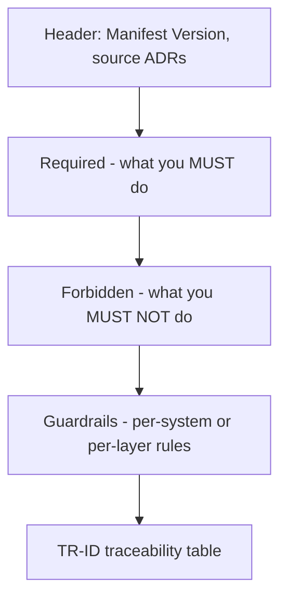

# Control Manifest

The flat operational rules sheet for programmers. Generated from all `Accepted` ADRs. The single document a programmer reads before implementing a story.

**Path:** `docs/architecture/control-manifest.md`
**Created by:** `/create-control-manifest`
**Read by:** `/dev-story`, `/story-done`, every programmer agent

---

## Why the manifest exists

ADRs explain **why**. The manifest tells programmers **what to do**.

A programmer about to implement a feature wants:
- "Use signals at the GDScript/C# boundary"
- "Save data must include `save_version: int`"
- "Never use Resources.Load() for gameplay assets"

Not the 8-section ADRs explaining each rule's context. The manifest is the **distillation** for execution.

---

## Sections



### Required
Things programmers must always do:
- "All gameplay code uses signals at the GDScript/C# boundary."
- "All save data includes `save_version: int`."
- "Combat damage references TR-CMB-001's formula, not a local copy."

### Forbidden
Things programmers must never do:
- "Never use `Resources.Load()` for gameplay assets — use Addressables."
- "Never block the main thread with file I/O."
- "Never store player input directly — route through Input Map."

### Guardrails
Per-system or per-layer rules that aren't strict required/forbidden but must be respected:
- "Combat: damage formula calls go through `DamageService` for testability."
- "UI: do not access `_process` for animation; use `Tween` or `AnimationPlayer`."
- "Networking: server-authoritative; client never sets ground-truth state."

### TR-ID traceability
A table mapping each rule back to its source ADR and TR-IDs:

| Rule | Source ADR | TR-IDs |
|------|------------|--------|
| Use signals at GDScript/C# boundary | ADR-003 | TR-MOV-001, TR-CMB-001 |
| Save data includes version | ADR-005 | TR-SAV-001 |
| ... | | |

---

## Frontmatter

```yaml
---
manifest_version: 2026-04-25
source_adrs: [ADR-001, ADR-002, ADR-003, ADR-005]
status: Active
last_updated: 2026-04-25
---
```

The **`manifest_version`** is the contract. Stories embed this when created. When the manifest revs, `/story-done` flags stories with stale versions.

---

## How it's generated

`/create-control-manifest`:

1. Reads all ADRs in `docs/architecture/`
2. Filters to `Status: Accepted`
3. Extracts each ADR's "Decision" and "Consequences" sections
4. Categorizes the implications as Required / Forbidden / Guardrails
5. Builds the TR-ID traceability table from each ADR's "GDD Requirements Addressed"
6. Stamps the new `Manifest Version`
7. Writes the file

**Run after every batch of new ADRs.** The manifest must always reflect the current set of `Accepted` ADRs.

---

## How stories use it

When `/create-stories` writes a story file, it embeds:

```yaml
---
story: combat-damage-formula
manifest_version: 2026-04-25
governing_adrs: [ADR-001, ADR-003]
tr_ids: [TR-CMB-001]
---
```

`/dev-story` reads the manifest version when picking up the story. If the manifest has revved since story creation, `/dev-story` warns:

> "⚠️ Manifest has revved. Story was created against 2026-04-18; current is 2026-04-25. Run /story-readiness to check if updates are needed."

`/story-done` performs a stricter check — stories with stale manifest versions cannot close until re-validated.

---

## Common pitfalls

- **Editing the manifest by hand.** Don't. Re-run `/create-control-manifest`. Hand-edits get overwritten.
- **Letting `Proposed` ADRs influence the manifest.** Only `Accepted` ADRs are sources. The skill enforces this.
- **Stale manifest references in stories.** Re-run `/create-control-manifest` after new ADRs, then check `/sprint-status` for stale stories.
- **Skipping the TR-ID table.** Programmers need the trace to find the source-of-truth GDD when in doubt.

---

## Anatomy in practice

```markdown
---
manifest_version: 2026-04-25
source_adrs: [ADR-001, ADR-002, ADR-003, ADR-005, ADR-007]
status: Active
---

# Control Manifest

## Required
- All gameplay code uses signals at the GDScript/C# boundary. (ADR-003)
- All save data includes `save_version: int`. (ADR-005)
- Combat damage uses the formula in TR-CMB-001 unchanged. (ADR-007)

## Forbidden
- Never use `Resources.Load()` for gameplay assets. Use Addressables. (ADR-002)
- Never block the main thread with file I/O. (ADR-002)
- Never modify `actor.armor` directly. Use the StatusEffect service. (ADR-007)

## Guardrails

### Combat
- Damage formula calls go through `DamageService` for testability.
- On-hit effects fire even when damage is 0.

### Save / Load
- Save format is JSON. Binary serialization is forbidden until ADR-008
  authorizes it.
- Save files are versioned; migrators required for any format change.

### Networking
(no rules yet — Networking ADRs deferred to Alpha tier.)

## TR-ID Traceability
| Rule | Source ADR | TR-IDs |
|------|------------|--------|
| Use signals at boundary | ADR-003 | TR-MOV-001, TR-CMB-001 |
| Save versioning | ADR-005 | TR-SAV-001 |
| Damage formula | ADR-007 | TR-CMB-001 |
| Addressables | ADR-002 | TR-AST-001 |
```

---

## See also

- [[06-Documents-Produced/ADR-Architecture-Decision-Record]] — the source ADRs
- [[06-Documents-Produced/Epic-and-Story]] — embeds manifest version
- [[05-Skills/Architecture-Skills#create-control-manifest]] — the generator
- [[03-Phases/Phase-3-Technical-Setup]]
