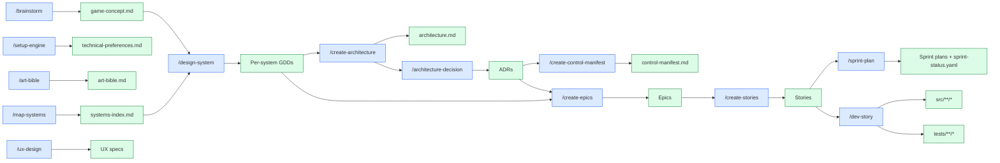

# Document Map

Every artifact the pipeline produces, with **where it lives**, **which skill makes it**, and **who reads it**.

> Use this as a key when reading files in the repo.

---

## The full map



---

## All documents, alphabetical

| Document | Path | Created by | Read by | Note in vault |
|----------|------|------------|---------|---------------|
| ADRs | `docs/architecture/adr-*.md` | `/architecture-decision` | `/create-stories`, `/dev-story`, `/architecture-review` | [[06-Documents-Produced/ADR-Architecture-Decision-Record]] |
| Architecture document | `docs/architecture/architecture.md` | `/create-architecture` | `/architecture-decision`, `/create-epics` | — |
| Architecture review | `docs/architecture/architecture-review-*.md` | `/architecture-review` | `/gate-check` | — |
| Art bible | `design/art/art-bible.md` | `/art-bible` | `/asset-spec`, `/asset-audit` | — |
| Asset manifest | `design/assets/asset-manifest.md` | `/asset-spec` | `/asset-audit` | — |
| Bug reports | `production/qa/bugs/*.md` | `/bug-report` | `/bug-triage` | — |
| Changelog | `CHANGELOG.md` | `/changelog` | release | — |
| Control manifest | `docs/architecture/control-manifest.md` | `/create-control-manifest` | `/create-stories`, `/dev-story`, `/story-done` | [[06-Documents-Produced/Control-Manifest]] |
| Cross-GDD review | `design/gdd/gdd-cross-review-*.md` | `/review-all-gdds` | `/gate-check` | — |
| Epics | `production/epics/*/EPIC.md` | `/create-epics` | `/create-stories` | [[06-Documents-Produced/Epic-and-Story]] |
| Game concept | `design/gdd/game-concept.md` | `/brainstorm` | `/map-systems`, `/art-bible` | [[06-Documents-Produced/Game-Concept-Doc]] |
| GDDs (per system) | `design/gdd/<system>.md` | `/design-system` | `/create-epics`, `/create-architecture` | [[06-Documents-Produced/GDD-Game-Design-Document]] |
| Hotfix records | `production/hotfixes/*.md` | `/hotfix` | release-manager | — |
| Launch checklist | `production/releases/launch-*.md` | `/launch-checklist` | release | — |
| Patch notes | `production/releases/*-patch-notes.md` | `/patch-notes` | players | — |
| Performance reports | `production/perf/*.md` | `/perf-profile` | `/team-polish` | — |
| Playtest reports | `production/playtests/*.md` | `/playtest-report` | `/gate-check`, retro | — |
| Polish team report | `production/polish/team-polish-*.md` | `/team-polish` | `/gate-check` | — |
| Release checklist | `production/releases/release-*-checklist.md` | `/release-checklist` | release | — |
| Retrospective | `production/retros/sprint-N-retro.md` | `/retrospective` | next sprint plan | — |
| Review mode | `production/review-mode.txt` | `/start` | every review skill | — |
| Sprint plan | `production/sprints/sprint-N.md` | `/sprint-plan` | `/dev-story`, `/sprint-status` | [[06-Documents-Produced/Sprint-Plan]] |
| Sprint status | `production/sprint-status.yaml` | `/sprint-plan` + `/story-done` | `/sprint-status`, `/help` | — |
| Stage | `production/stage.txt` | `/gate-check` (or manual) | `/help`, `/project-stage-detect` | — |
| Stories | `production/epics/*/<story>.md` | `/create-stories` | `/dev-story`, `/story-done` | [[06-Documents-Produced/Epic-and-Story]] |
| Systems index | `design/gdd/systems-index.md` | `/map-systems` | `/design-system`, `/create-architecture`, `/create-epics` | [[06-Documents-Produced/Systems-Index]] |
| Technical preferences | `.claude/docs/technical-preferences.md` | `/setup-engine` | every engine-aware skill | — |
| TR registry | `docs/architecture/tr-registry.yaml` | `/architecture-review` | `/create-stories`, `/story-done` | — |
| UX specs | `design/ux/*.md` | `/ux-design` | `/ux-review`, `/dev-story` | [[06-Documents-Produced/UX-Spec]] |

---

## Documents grouped by phase

### Phase 1
- Game concept ([[06-Documents-Produced/Game-Concept-Doc]])
- Technical preferences
- Art bible
- Systems index ([[06-Documents-Produced/Systems-Index]])

### Phase 2
- Per-system GDDs ([[06-Documents-Produced/GDD-Game-Design-Document]])
- Cross-GDD review

### Phase 3
- Architecture document
- ADRs ([[06-Documents-Produced/ADR-Architecture-Decision-Record]])
- Architecture review
- Control manifest ([[06-Documents-Produced/Control-Manifest]])
- TR registry
- Accessibility requirements

### Phase 4
- UX specs ([[06-Documents-Produced/UX-Spec]])
- Asset manifest
- Prototype README
- Epics ([[06-Documents-Produced/Epic-and-Story]])
- Stories
- Sprint plan ([[06-Documents-Produced/Sprint-Plan]])
- Sprint status YAML
- Vertical-slice playtest

### Phase 5
- Code (src/)
- Tests
- Bug reports
- Retrospectives
- Per-sprint sprint plans

### Phase 6
- Performance reports
- Balance reports
- Asset audit reports
- Playtest reports (×3)
- Polish team report

### Phase 7
- Release checklist
- Patch notes
- Changelog
- Launch checklist
- Hotfix records

---

## Doc traceability

Every code change should be traceable backwards through this chain:

```
Code (src/)  ←  Story  ←  Epic  ←  ADR + GDD  ←  Systems index  ←  Game concept
```

If any link is missing, the project has drifted. `/architecture-review` and `/story-done` enforce this in production.

---

## See also

- Each linked sub-note for anatomy
- [[02-Core-Concepts/Skills-vs-Agents-vs-Docs]] — the document layer in context
- [[_Maps/Pipeline-Map]] — the visual flow
