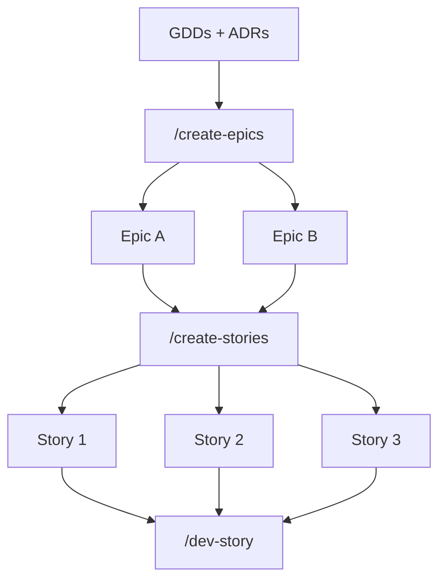
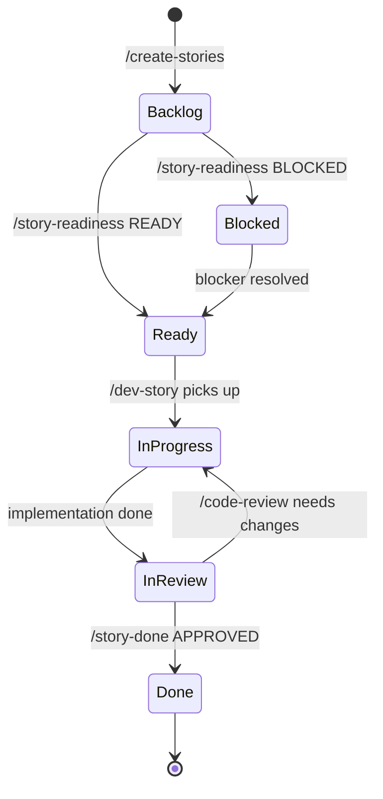

# Epic and Story

The two-level work breakdown structure used in Phases 4–5. Epics group stories; stories are the implementable units.

---

## The hierarchy



| Level | Granularity | Skill | Path |
|-------|-------------|-------|------|
| **Epic** | One architectural module / one big feature | `/create-epics` | `production/epics/<slug>/EPIC.md` |
| **Story** | One implementable unit (~1–3 days) | `/create-stories` | `production/epics/<slug>/<story>.md` |

---

## Epic anatomy

**Path:** `production/epics/<epic-slug>/EPIC.md`
**Created by:** `/create-epics`
**Read by:** `/create-stories`, `/sprint-plan`, `/scope-check`

### Required sections

1. **Scope** — which systems this epic covers, which TR-IDs
2. **Governing ADRs** — the ADRs that must be respected
3. **Engine risk** — engine-specific gotchas
4. **Untraced requirements** — TR-IDs from GDDs not yet covered (gap report)
5. **High-level story plan** — paragraph descriptions of expected stories (does NOT break into stories yet)

### Frontmatter

```yaml
---
epic: combat-foundation
status: Planning | Active | Complete
layer: Foundation | Core | Feature | Presentation
governing_adrs: [ADR-001, ADR-003, ADR-007]
tr_ids: [TR-CMB-001, TR-CMB-002, TR-CMB-003]
---
```

### Why epics exist

Epics are the **handoff contract** between design and execution:
- One per architectural module → one team / one programmer can own it
- TR-ID coverage means design intent isn't lost
- The "untraced requirements" section forces gap acknowledgment before sprint start

---

## Story anatomy

**Path:** `production/epics/<epic-slug>/<story-slug>.md`
**Created by:** `/create-stories`
**Read by:** `/story-readiness`, `/dev-story`, `/code-review`, `/story-done`

### Required sections

1. **Story type** — Logic / Integration / Visual / UI / Config (drives required test evidence)
2. **GDD requirement** — TR-ID + GDD link
3. **Governing ADRs** — ADR list
4. **Manifest version** — control manifest version embedded
5. **Engine notes** — engine-specific guidance
6. **Acceptance criteria** — testable conditions
7. **Implementation hints** — optional, programmer-friendly notes

### Frontmatter

```yaml
---
story: combat-damage-formula
status: Backlog | Ready | In Progress | In Review | Done | Blocked
type: Logic | Integration | Visual | UI | Config
manifest_version: 2026-04-25
governing_adrs: [ADR-001, ADR-003, ADR-007]
tr_ids: [TR-CMB-001]
estimate: 2d
assignee: gameplay-programmer
---
```

### Story types and required test evidence

| Story type | Required evidence | Gate |
|------------|-------------------|------|
| **Logic** | Automated unit test (must pass) | BLOCKING |
| **Integration** | Integration test or playtest | BLOCKING |
| **Visual** | Screenshot + lead sign-off | ADVISORY |
| **UI** | Manual walkthrough doc | ADVISORY |
| **Config** | Smoke check pass | ADVISORY |

`/story-done` enforces this — Logic stories without passing tests cannot close.

---

## Status lifecycle



The status is duplicated in `production/sprint-status.yaml` for fast access.

---

## Anatomy in practice

### Example epic

```markdown
---
epic: combat-foundation
status: Planning
layer: Feature
governing_adrs: [ADR-001, ADR-003, ADR-007]
tr_ids: [TR-CMB-001, TR-CMB-002, TR-CMB-003]
---

# Epic: Combat Foundation

## Scope
Implements the core damage exchange between actors. Covers attack registration,
damage calculation, on-hit effects, and damage display. Explicitly NOT:
- Status effects (separate epic)
- AI behavior (separate epic)

## Governing ADRs
- ADR-001 (Run State)
- ADR-003 (Language Routing)
- ADR-007 (Damage Formula Service)

## Engine Risk
- Crit calculation must run within frame budget; profile early.
- Damage display must not allocate per-hit (Godot tween pooling).

## Untraced Requirements
- TR-CMB-004 (knockback) — not yet covered; defer to Status Effects epic.

## High-level Story Plan
1. Damage formula service (Logic story)
2. Attack registration + hitbox detection (Integration story)
3. On-hit effect dispatcher (Integration story)
4. Damage number display (UI story)
5. Crit screen flash (Visual story)
```

### Example story

```markdown
---
story: combat-damage-formula
type: Logic
manifest_version: 2026-04-25
governing_adrs: [ADR-001, ADR-003, ADR-007]
tr_ids: [TR-CMB-001]
estimate: 1d
assignee: gameplay-programmer
status: Ready
---

# Story: Combat Damage Formula

## Description
Implement the damage formula service per TR-CMB-001 of `design/gdd/combat.md`.

## Acceptance Criteria
- Given attacker, defender, weapon, and crit flag, returns damage as int.
- Damage is deterministic given seeded variance.
- 0-damage hits return 0 (caller handles on-hit effects).
- Negative results are clamped to 1.

## Engine Notes
- Pure C# (no Godot Node dependency) for deterministic test.
- Expose to GDScript via signal `damage_calculated(amount: int)`.
- Reference: ADR-003 (signals at boundary), ADR-007 (formula source).

## Implementation Hints
- Service class in `src/gameplay/combat/DamageService.cs`.
- Test harness in `tests/unit/combat/damage_service_test.cs`.
- Variance seed comes from RunState (per ADR-001).
```

---

## How they're created

`/create-epics`:
1. Reads approved GDDs, ADRs, control manifest, systems-index
2. Identifies architectural modules (typically one per top-level system)
3. Authors EPIC.md per module with TR-ID coverage map
4. Flags untraced TR-IDs as risk

`/create-stories <epic-slug>`:
1. Reads the epic, its governing ADRs, the GDDs it covers, the control manifest
2. Breaks the high-level plan into specific story files
3. Embeds manifest version, ADR list, TR-IDs in each story
4. Sets initial story status

---

## Common pitfalls

- **Stories without TR-IDs.** Untraceable to design. `/story-done` flags.
- **Stories crossing epic boundaries.** A story spanning two epics is a sign one epic is mis-scoped.
- **Skipping `/story-readiness`.** Stories embed multiple cross-references; broken ones reveal at pickup.
- **Manifest version drift.** When ADRs change, the manifest revs. Update stale stories before pickup.

---

## See also

- [[06-Documents-Produced/Sprint-Plan]] — schedules stories into sprints
- [[06-Documents-Produced/GDD-Game-Design-Document]] — TR-ID source
- [[06-Documents-Produced/ADR-Architecture-Decision-Record]] — governs each story
- [[06-Documents-Produced/Control-Manifest]] — embedded version
- [[03-Phases/Phase-4-Pre-Production]] — when epics + stories are created
- [[03-Phases/Phase-5-Production]] — when stories are implemented
- [[05-Skills/Production-Skills]]
