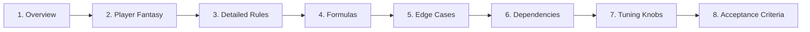

# GDD — Game Design Document

A per-system design document. One GDD per system in the systems-index. The unit of design granularity.

**Path:** `design/gdd/<system-name>.md`
**Created by:** `/design-system`
**Read by:** `/design-review`, `/review-all-gdds`, `/create-architecture`, `/create-epics`, `/create-stories`, `/dev-story`

---

## What a GDD is for

A GDD answers, for one system:
- **What** the system is and what verbs it offers
- **How** it works mechanically (formulas, edge cases)
- **Why** it exists (player fantasy, pillar alignment)
- **What** it depends on
- **How** to know if it's working (acceptance criteria)

It is **not** a code spec. It's the design contract that downstream architecture and stories implement.

---

## The 8 required sections

This project enforces the same 8 sections in every GDD (per `coding-standards.md`):



### 1. Overview
One paragraph describing what the system does and why it exists.

### 2. Player Fantasy
The intended **feeling** the system creates. *"Combat should feel weighty — players should hesitate before committing."* This is what every formula serves.

### 3. Detailed Rules
The unambiguous mechanics. Numbered, declarative. *"1. Stamina regenerates at 5/sec when not attacking. 2. Each attack costs 12 stamina."*

### 4. Formulas
All math defined with variables. *"damage = base × (1 + crit_multi × is_crit) × random(0.9, 1.1)"*. Every variable named and bounded.

### 5. Edge Cases
Unusual situations and how the system handles them. *"What if stamina is exactly 0 when attack queued? Attack queues but does not fire until stamina ≥ cost."*

### 6. Dependencies
Other systems this one needs. Lists by system name. Triggers `/architecture-review`'s coverage check.

### 7. Tuning Knobs
Configurable values flagged for designer access. Linked to balance data. *"`stamina_max` (config), `regen_rate` (config), `attack_cost` (per-weapon)"*.

### 8. Acceptance Criteria
Testable success conditions. Drives test plans. *"Player can land 5 consecutive attacks if stamina ≥ 60. Stamina display updates within 100ms of consumption."*

---

## Frontmatter

```yaml
---
system: <system-name>
status: Draft | Approved | Locked
version: 0.2
last_updated: 2026-04-25
related_systems: [movement, inventory]
tr_ids: [TR-CMB-001, TR-CMB-002, TR-CMB-003]
---
```

**Status lifecycle:**
- `Draft` — authored, not yet reviewed
- `Approved` — passed `/design-review`; downstream skills can consume it
- `Locked` — `/architecture-decision` ADRs reference it; cannot revise without `/propagate-design-change`

---

## Anatomy in practice

A typical Combat GDD might look like:

```markdown
---
system: combat
status: Approved
version: 1.0
related_systems: [movement, status-effects, inventory]
tr_ids: [TR-CMB-001, TR-CMB-002, TR-CMB-003, TR-CMB-004]
---

# Combat System

## 1. Overview
The combat system handles all damage exchange between actors…

## 2. Player Fantasy
Combat should feel weighty. The player should hesitate before each…

## 3. Detailed Rules
1. Damage is calculated when an attack lands, not when it begins.
2. Defender's armor reduces incoming damage before crit multipliers.
3. …

## 4. Formulas
final_damage = max(1, (base − armor) × crit_mult × variance)
where:
  base = weapon.base_damage
  armor = max(0, defender.armor − attacker.armor_pen)
  crit_mult = is_crit ? 2.0 : 1.0
  variance ∈ [0.9, 1.1]

## 5. Edge Cases
- Damage of 0 still applies on-hit effects (poison, stun).
- Negative damage is clamped to 1.

## 6. Dependencies
- Movement (range checks)
- Status Effects (on-hit application)
- Inventory (weapon stats)

## 7. Tuning Knobs
- `weapon.base_damage` (per-weapon)
- `weapon.crit_chance` (per-weapon)
- `actor.armor` (per-actor)
- `global_damage_variance` (config)

## 8. Acceptance Criteria
- Damage formula is deterministic given seeded variance.
- Crit chance triggers a screen flash within 50ms.
- Damage numbers display within 100ms of impact.
- 0-damage hits still trigger on-hit effects.
```

---

## How it's authored

`/design-system <system-name>` runs section-by-section:

1. Reads systems-index, prior GDDs (for dependency context), `technical-preferences.md`
2. Spawns `game-designer` for design intent
3. May spawn `systems-designer` (formulas), `economy-designer` (currency systems), `level-designer` (spatial)
4. Authors each section with user approval before writing
5. Sets `Status: Draft` initially

Run **once per system in the systems-index**, in the order the index recommends.

---

## How it's reviewed

- **`/design-review <system>.md`** — single-GDD review. Checks all 8 sections present, internal consistency. Flips Status from Draft → Approved (if APPROVED verdict).
- **`/review-all-gdds`** — cross-system review. Compares formulas, entity stats, mechanic interactions across all GDDs.
- **`/consistency-check`** — lighter cross-check. Run any time GDDs change.

---

## How it's consumed downstream

- **`/create-architecture`** — uses Dependencies + Formulas to identify Required ADRs.
- **`/architecture-decision`** — references TR-IDs to tie ADRs back to design.
- **`/create-stories`** — embeds the TR-ID and acceptance criteria in each story.
- **`/dev-story`** — programmer agent reads the GDD as the implementation contract.
- **`/balance-check`** — analyzes Formulas + Tuning Knobs for outliers.
- **`/story-done`** — validates story acceptance criteria match the GDD's.

---

## Common pitfalls

- **Skipping Formulas.** Most common GDD failure. "We'll figure it out in code" creates a non-deterministic shipping product.
- **Vague Acceptance Criteria.** "Combat should feel good" is unfalsifiable. Use measurable conditions.
- **Listing every related system in Dependencies.** Lists only direct dependencies — those that block authoring.
- **Inconsistent variable names across GDDs.** `damage` here, `dmg` there. Cross-GDD review will flag.

---

## See also

- [[06-Documents-Produced/Systems-Index]] — defines which GDDs exist
- [[06-Documents-Produced/Game-Concept-Doc]] — the parent doc
- [[06-Documents-Produced/ADR-Architecture-Decision-Record]] — translates GDDs to architecture
- [[03-Phases/Phase-2-Systems-Design]] — the phase context
- [[05-Skills/Design-Skills]] — authoring + review skills
- Template: `.claude/docs/templates/game-design-document.md`
