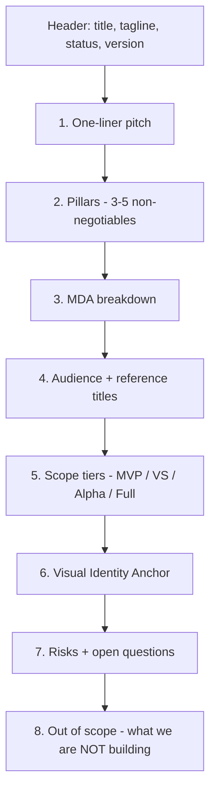

# Game Concept Doc

The single highest-leverage document in the project. Everything downstream cites it.

**Path:** `design/gdd/game-concept.md`
**Created by:** `/brainstorm`
**Read by:** `/map-systems`, `/art-bible`, `/create-architecture`, every review skill

---

## What it is

A 5–15 page Markdown document capturing what game you're making, who it's for, and why it should exist. Authored once in Phase 1, revised rarely.

The template is `.claude/docs/templates/game-concept.md`.

---

## Required sections



### 1. One-liner pitch
A single sentence: genre + core verb + hook. Example: *"A turn-based roguelike where you rewind death to learn the maze."*

### 2. Pillars (3–5)
Non-negotiables that define the game. Every feature must serve at least one. Example:
- *Permadeath is the price of mastery*
- *Every run teaches something new*
- *Run length ≤ 60 minutes*

Pillars are how `/review-all-gdds` and the directors detect feature drift.

### 3. MDA breakdown
- **Mechanics:** what verbs the game offers
- **Dynamics:** the patterns that emerge from those verbs interacting
- **Aesthetics:** the *feeling* the dynamics create

### 4. Audience + reference titles
- Who plays this? Be specific (genre fans, platform, time-per-session preference).
- 3–5 reference titles. Format: "Closer to *Hades* than *Dark Souls* for difficulty pacing."

### 5. Scope tiers
Tiers let you defer features without losing them:

| Tier | What it means |
|------|--------------|
| **MVP** | Must ship for the game to exist |
| **Vertical Slice** | Required to validate the core loop |
| **Alpha** | Required for a feature-complete build |
| **Full Vision** | Stretch goals; cut without regret |

These tiers cascade: a feature in `Vertical Slice` will appear in the systems index at the same tier.

### 6. Visual Identity Anchor
A 2–3 sentence visual brief: *"Pixel art, 4-color palettes per area, harsh chiaroscuro lighting, 60fps deliberate animation. Closer to Iconoclasts than Hyper Light Drifter."*

This is what `/art-bible` consumes as its starting point.

### 7. Risks + open questions
Honest list of what could derail the project. Open questions trigger the bottleneck-mitigation suggestions in `/map-systems`.

### 8. Out of scope
**Explicitly** what you are *not* building. Prevents scope creep and is referenced by `/scope-check`.

---

## Frontmatter

```yaml
---
title: <Game Title>
status: Draft | Approved | Locked
version: 0.1
last_updated: 2026-04-25
review_mode: lean
---
```

`Status: Approved` is set by `/design-review` after the concept review. The downstream skills check this status.

---

## How it gets authored

`/brainstorm` runs section-by-section, asking guided questions. The skill:

1. Spawns `game-designer` for design intent
2. Spawns `creative-director` (Full mode) for pillar review
3. Optionally spawns `narrative-director` for tone work
4. Optionally spawns `audio-director` and `art-director` for sensory pillars
5. Writes incrementally per section, asking for approval

Don't try to author this file by hand. The skill captures workflow nuance — pillars must be testable, MDA must be coherent, scope tiers must align with reference titles.

---

## How it's revised

The concept is **mostly stable** — revising it has wide blast radius. If you must:

1. Make the change in `game-concept.md`
2. Run `/propagate-design-change game-concept.md`
3. The skill identifies affected GDDs, ADRs, and stories
4. Decide which to re-review

If your concept needs a major revision (a different genre, different audience), you're effectively in **Phase 1 again**. Cut your losses early.

---

## Common pitfalls

- **Pillars that aren't testable.** "Fun" is not a pillar. "Run length ≤ 60 minutes" is.
- **MDA out of order.** Mechanics → Dynamics → Aesthetics. Don't start from "we want it to feel epic."
- **Scope tiers that all say MVP.** That defeats the purpose. Force yourself to tier ruthlessly.
- **No "out of scope" section.** Every successful project has one. Be explicit.

---

## Tips

- The concept doc is **first draft** quality after `/brainstorm`. Polish via `/design-review` and a second pass.
- Pin the **reference titles** early — they ground every later subjective decision.
- Use the Visual Identity Anchor literally; it's not flavor text — `/art-bible` parses it.

---

## Real example structure

From this project's `design/gdd/game-concept.md` (tower-defense game):

```markdown
# Sentinel Lanes — Game Concept

## Pitch
A 2-lane tower-defense roguelike where each champion brings a unique modifier deck.

## Pillars
1. Champion identity drives strategy (not just stats)
2. Lanes converge — defending one starves the other
3. Modifiers replace upgrades

## Scope tiers
- MVP: 2 champions, 2 lanes, 5 enemy types, 30 cards
- Vertical Slice: + tutorial, save/load, main menu, wave summary
- Alpha: + 2 champions, build mode, modifier crafting
- Full Vision: leaderboards, daily runs, mod tools

## Out of scope
No multiplayer. No procedural generation beyond enemy waves.
```

(Sketch — not the actual file content. The real concept doc has more depth in pillars and MDA.)

---

## See also

- [[06-Documents-Produced/Systems-Index]] — what comes next
- [[06-Documents-Produced/GDD-Game-Design-Document]] — per-system docs
- [[03-Phases/Phase-1-Concept]] — the phase context
- [[05-Skills/Design-Skills#brainstorm]] — the authoring skill
- Template: `.claude/docs/templates/game-concept.md`
