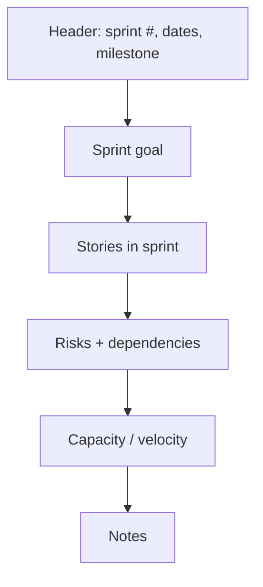

# Sprint Plan

The schedule and focus document for one sprint. Pairs with `sprint-status.yaml` for fast machine-readable status.

**Path:** `production/sprints/sprint-N.md`
**Created by:** `/sprint-plan`
**Read by:** `/dev-story`, `/sprint-status`, `/scope-check`, `/retrospective`, `/help`

---

## What's in a sprint plan

A sprint plan is the **narrative** view of a sprint:

- Which stories are in this sprint and why
- Which milestone the sprint targets
- The sprint's risks and dependencies
- The capacity assumptions (velocity)

It's paired with `sprint-status.yaml` (the structured per-story state). Both are kept in sync by `/sprint-plan` and `/story-done`.

---

## Required sections



### Sprint goal
One sentence. *"Land the combat damage formula and on-hit dispatch end-to-end."*

The goal is **not** a list of stories — it's the outcome the sprint is meant to produce.

### Stories in sprint
Table of stories, their epic, type, estimate, assignee:

| Story | Epic | Type | Estimate | Assignee | Status |
|-------|------|------|----------|----------|--------|
| combat-damage-formula | combat-foundation | Logic | 1d | gameplay-programmer | Done |
| combat-attack-registration | combat-foundation | Integration | 2d | gameplay-programmer | In Progress |
| ... | | | | | |

### Risks + dependencies
- *"Combat-attack-registration depends on Hitbox utility from engine-programmer; not yet implemented."*
- *"Damage display story is UI-tier; advisory test gate; will use manual walkthrough."*

### Capacity / velocity
- *"Sprint length: 14 days. Available capacity: 8d (1 dev). Stories sized: 7d. Buffer: 1d."*
- *"Last sprint velocity: 6.5d completed of 8d planned (81%)."*

### Notes
Decisions made during planning, scope cuts, deferred items.

---

## Frontmatter

```yaml
---
sprint: 3
start: 2026-04-22
end: 2026-05-06
milestone: vertical-slice
goal: "Land the combat damage formula and on-hit dispatch end-to-end."
capacity_days: 8
status: Active | Complete | Cut-short
---
```

---

## The sprint-status.yaml partner

Same data in YAML for fast machine reads:

```yaml
sprint: 3
start: 2026-04-22
end: 2026-05-06
status: Active

stories:
  - id: combat-damage-formula
    path: production/epics/combat-foundation/combat-damage-formula.md
    type: Logic
    estimate: 1d
    assignee: gameplay-programmer
    status: done

  - id: combat-attack-registration
    path: production/epics/combat-foundation/combat-attack-registration.md
    type: Integration
    estimate: 2d
    assignee: gameplay-programmer
    status: in-progress
    blocker: null

  - id: combat-on-hit-dispatch
    path: production/epics/combat-foundation/combat-on-hit-dispatch.md
    type: Integration
    estimate: 2d
    assignee: gameplay-programmer
    status: ready
    blocker: null

  - id: combat-damage-display
    path: production/epics/combat-foundation/combat-damage-display.md
    type: UI
    estimate: 1d
    assignee: ui-programmer
    status: ready
    blocker: null
```

`/sprint-status` reads this directly — no markdown parsing needed.

---

## How it's authored

`/sprint-plan`:

1. Reads previous sprint's retrospective (if any) for velocity + lessons
2. Reads stories at `Status: Ready` in `production/epics/`
3. Reads milestone targets, current `production/stage.txt`
4. Spawns `producer` to draft the plan
5. Asks user about capacity, priorities, scope concerns
6. Writes `sprint-N.md` and `sprint-status.yaml` in sync
7. Sets stories listed → `Status: Ready` (if not already) and adds them to `sprint-status.yaml`

**Run once per sprint.**

---

## How it's updated

- **`/dev-story`** picks up a story → updates `sprint-status.yaml` to `in-progress`
- **`/story-done`** closes a story → updates `sprint-status.yaml` to `done`
- **`/scope-check`** when stories added mid-sprint → flags capacity issue
- **`/retrospective`** at end of sprint → archives + feeds next plan

---

## Anti-patterns

- **Sprint plans without a goal.** A list-of-stories sprint plan is just a list. The goal is what gates "did the sprint succeed?"
- **Over-packing the first sprint.** Solo devs especially. Aim for 70–80% capacity in Sprint 1; you'll discover unknowns.
- **No buffer.** A sprint with 100% packed capacity has no slack for bugs found mid-sprint. Always 10–15% buffer.
- **Skipping `sprint-status.yaml`.** Without it, `/sprint-status` falls back to slow markdown scanning.

---

## Tips

- **Run `/sprint-status` daily** (Haiku tier — cheap). Catches drift early.
- **Run `/scope-check`** when adding stories mid-sprint. Quantifies the cost.
- **Run `/retrospective`** at end of each sprint, even if brief. Velocity tracking compounds.
- The **milestone** field links sprints to the bigger picture. `/milestone-review` aggregates across sprints.

---

## Real example shape

```markdown
---
sprint: 3
start: 2026-04-22
end: 2026-05-06
milestone: vertical-slice
goal: "Land the combat damage formula and on-hit dispatch end-to-end."
capacity_days: 8
status: Active
---

# Sprint 3 — Combat Foundation

## Goal
Land the damage formula service, attack registration, on-hit dispatch, and
damage display. By end of sprint, one melee attack should hit, register damage,
trigger an on-hit effect, and display a number — fully tested.

## Stories
| Story | Epic | Type | Est | Assignee | Status |
|-------|------|------|-----|----------|--------|
| combat-damage-formula | combat-foundation | Logic | 1d | gp | Done |
| combat-attack-registration | combat-foundation | Integration | 2d | gp | In Progress |
| combat-on-hit-dispatch | combat-foundation | Integration | 2d | gp | Ready |
| combat-damage-display | combat-foundation | UI | 1d | ui | Ready |
| combat-crit-flash | combat-foundation | Visual | 1d | ta | Ready |

Total: 7d planned / 8d capacity. 1d buffer.

## Risks
- combat-on-hit-dispatch depends on StatusEffect API not yet finalized.
  Mitigation: stub interface; full impl deferred to Sprint 4.

## Velocity
Sprint 2: 6.5d / 8d completed (81%).

## Notes
Cut combat-knockback from sprint scope (deferred to Sprint 4).
```

---

## See also

- [[06-Documents-Produced/Epic-and-Story]] — what fills the sprint
- [[03-Phases/Phase-4-Pre-Production]] — first sprint plan
- [[03-Phases/Phase-5-Production]] — sprint loop
- [[05-Skills/Production-Skills]]
