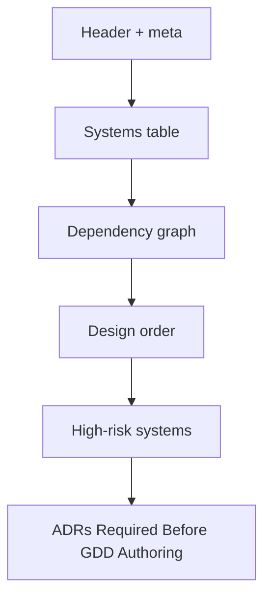

# Systems Index

The master list of systems in your game. The bridge from concept to design.

**Path:** `design/gdd/systems-index.md`
**Created by:** `/map-systems`
**Read by:** `/design-system`, `/create-architecture`, `/create-epics`

---

## What it is

A single Markdown document that:
- Lists every system in the game
- Tags each with a priority tier (MVP / VS / Alpha / Full Vision)
- Maps dependencies between systems
- Recommends a design order (topological sort)
- Flags high-risk systems with bottleneck mitigations
- Lists Required ADRs (for Phase 3)

---

## Required sections



### Systems table
| # | Name | Tier | Language | Dependencies | Risk | GDD Status |
|---|------|------|----------|--------------|------|------------|
| 1 | Movement | MVP | GDScript | (none) | Low | Approved |
| 2 | Combat | MVP | GDScript | Movement, Status Effects | Med | Approved |
| 3 | Crowd Pathfinding | MVP | C# | Movement | High | Draft |
| ... | | | | | | |

### Dependency graph
A Mermaid diagram showing system dependencies. Helps spot cycles (which must be resolved before design order).

### Design order
A flat ordered list — first system to design, last system to design. Respects dependencies; MVP-tier first within each layer.

### High-risk systems
For each high-risk system, the bottleneck-mitigation strategy:
- *"Champion System — prototype Champ 1+2 with 1-2 cards before GDD freeze"*
- *"Crowd Pathfinding — ADR required before GDD"*
- *"Lane / Map — paper-prototype 2-lane MVP layout before GDD"*

### ADRs Required Before GDD Authoring
A list of ADRs that must be `Accepted` before specific GDDs can author. Becomes part of the Required ADR list in `/create-architecture`.

---

## Tier system

| Tier | Meaning | When designed |
|------|---------|---------------|
| **MVP** | Must ship for the game to exist | Phase 2 |
| **Vertical Slice (VS)** | Required to validate core loop | Phase 2 (after MVP) |
| **Alpha** | Required for feature-complete | Phase 5 (deferred) |
| **Full Vision** | Stretch goals | Phase 6+ (or cut) |

A typical project has:
- 8–15 MVP systems
- 5–10 VS systems
- 5–10 Alpha systems
- 1–5 Full Vision systems

If your MVP count is > 20, consider cutting scope. If it's < 5, you may have over-decomposed (or your project is genuinely tiny).

---

## Language column (this project)

This project's systems-index includes a **Language** column showing whether each system is GDScript or C#. The routing rule is in `technical-preferences.md`:

- **GDScript** — default; gameplay scripts, UI, simple logic
- **C#** — performance-critical systems (e.g. Crowd Pathfinding, deterministic damage formulas)

The `technical-director` review during `/map-systems` populates this column based on system characteristics.

---

## Director reviews

`/map-systems` ends with a director review pass (Lean+ mode):

- **`creative-director`** — checks pillar adherence: do all systems serve a pillar? Anti-pillar systems flagged.
- **`technical-director`** — checks architectural sanity: tier ordering, language routing, missing systems (e.g. Test Harness).

The reviews surface **findings** that revise the index before it's locked. Common findings:
- "System X should be MVP, not VS" (or vice versa)
- "Add a Test Harness system; it's missing"
- "ADR plan needs expansion — add ADRs for X, Y, Z"

This project's systems-index has `45 systems, 28 MVP, 8 VS, 8 Alpha, 1 Full Vision` after director review.

---

## How it's authored

`/map-systems` follows this flow:

1. Read `game-concept.md` and `art-bible.md`
2. Brainstorm systems list
3. Tier each system (MVP / VS / Alpha / Full Vision)
4. Map dependencies
5. Identify high-risk systems
6. Order design phase (topological sort)
7. List Required ADRs
8. Director reviews (creative + technical)
9. Apply review findings
10. Write to `design/gdd/systems-index.md`

This is the longest concept-phase skill (apart from `/brainstorm`). Plan a focused 1–2 hour session.

---

## How it's revised

The systems-index changes as design evolves:

- **Adding a system** → re-run `/map-systems next` to insert and re-order
- **Cutting a system** → mark it `Cut` in the table; downstream skills won't author it
- **Re-tiering** → revise the tier column; affects design order

Major revisions trigger `/propagate-design-change` to flag affected GDDs and ADRs.

---

## Common pitfalls

- **Over-decomposing.** "Player → has → Health → has → MaxHealth" is not three systems. Each system should produce ≥ 1 GDD's worth of design.
- **Under-decomposing.** "Combat" can be one system, or it can be three (Damage, Status Effects, AI Behavior). The right grain depends on team size and review velocity.
- **Cycles in dependencies.** A → B → A. Must be resolved before design order is valid.
- **Skipping the director reviews.** They catch tier mistakes that cascade into wasted work.

---

## Real example shape

From this project (tower-defense, after director review):

```markdown
| # | Name | Tier | Language | Deps | Risk | GDD Status |
|---|------|------|----------|------|------|------------|
| 1 | Run State / Game Flow | MVP | GDScript | — | High (ADR-required) | Pending |
| 2 | Lane / Map | MVP | GDScript | Run State | High (paper-proto) | Pending |
| 3 | Wave / Enemy Spawning | MVP | GDScript | Lane | Med | Pending |
| ... | | | | | | |
| 45 | Test Harness | MVP | C# / GDScript | — | Low | Pending |
```

Plus dependency graph, design order, ADR plan (7 ADRs), high-risk list with mitigations.

---

## See also

- [[06-Documents-Produced/Game-Concept-Doc]] — the input
- [[06-Documents-Produced/GDD-Game-Design-Document]] — what each row produces
- [[03-Phases/Phase-1-Concept]] — phase context
- [[05-Skills/Design-Skills#map-systems]] — the authoring skill
