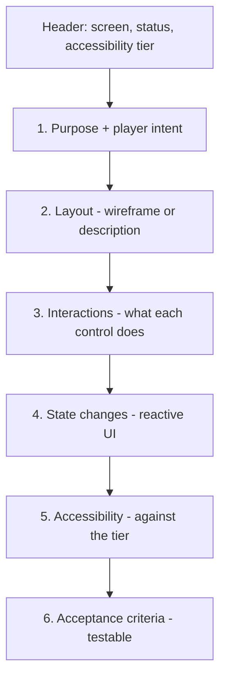

# UX Spec

A per-screen or per-flow design document. Captures interaction, layout, and accessibility for one user-facing surface.

**Path:** `design/ux/<screen-or-flow-slug>.md`
**Created by:** `/ux-design`
**Read by:** `/ux-review`, `/dev-story` (for UI stories), `/team-ui`

---

## What a UX spec covers

One of:
- A **screen** (main menu, pause menu, HUD, inventory)
- A **flow** (onboarding, quest acceptance, combat-to-loot transition)
- A **pattern library entry** (e.g. "modal dialog standard")

Each spec answers:
- What the player sees
- What the player can do
- How those actions feel (input, animation, sound cues)
- How accessible it is (against the chosen accessibility tier)

---

## Required sections



### 1. Purpose + player intent
What this screen exists for. *"The pause menu lets the player check stats, change settings, and quit. Players reach it during gameplay; they expect minimal disruption to flow."*

### 2. Layout
ASCII wireframe, Mermaid, or detailed description. The implementation will see this and know what to build.

```
+----------------------------+
|      PAUSED                |
|                            |
|  > Resume                  |
|    Settings                |
|    Quit to Main Menu       |
|                            |
|  Run time: 12:34            |
+----------------------------+
```

### 3. Interactions
What each control does. Per input method (keyboard, gamepad, mouse if relevant).

| Control | Input (kb/m) | Input (pad) | Effect |
|---------|--------------|-------------|--------|
| Resume | Esc / Enter / Click | A | Closes pause |
| Settings | Click / Down + Enter | Down + A | Opens settings |
| Quit | Click / Down × 2 + Enter | Down × 2 + A | Confirm modal, then quit |

### 4. State changes
How the UI reacts to state. *"Background dims by 50% when paused. Resume button has focus by default. Tab cycles focus."*

### 5. Accessibility (against the tier)
Per the chosen tier (Basic / Standard / Comprehensive / Exemplary):

- **Color contrast** ratios met
- **Text scale** support
- **Keyboard navigation** complete
- **Screen reader** labels (if Comprehensive+)
- **Colorblind safe** indicators (no red/green-only)
- **Remappable controls** (if Standard+)

### 6. Acceptance criteria
Testable conditions:
- Pause overlay renders within 100ms of input
- Background dims by exactly 50% via post-process
- Tab cycles focus through all interactive elements
- All buttons have aria-label equivalents (if Comprehensive+)

---

## Frontmatter

```yaml
---
screen: pause-menu
status: Draft | Approved
accessibility_tier: Standard
related_systems: [run-state, input]
tr_ids: [TR-UI-PAUSE-001]
---
```

---

## How it's authored

`/ux-design`:

1. Reads `design/accessibility-requirements.md` (chosen tier)
2. Reads `technical-preferences.md` (input methods, platform)
3. Reads relevant GDDs (e.g. for HUD, reads gameplay GDDs for what stats to show)
4. Spawns `ux-designer`
5. May spawn `accessibility-specialist` (especially for Comprehensive+ tier)
6. May spawn `art-director` for visual direction
7. Section-by-section authoring with approval

**Run once per key screen** in Phase 4: typically main menu, HUD, pause menu, settings, and key gameplay flows.

---

## How it's reviewed

`/ux-review`:

1. Reads the UX spec
2. Reads `design/accessibility-requirements.md`
3. Validates spec covers all 6 required sections
4. Spawns `ux-designer` for design coherence
5. Spawns `accessibility-specialist` for tier compliance
6. Returns APPROVED / NEEDS REVISION / MAJOR REVISION

---

## How it's consumed

`/dev-story`:
- For a UI-type story, the programmer agent reads the UX spec as the implementation contract
- Layout becomes widget hierarchy
- Interactions become signal handlers + input map entries
- Accessibility becomes labels, focus order, and contrast verification

`/team-ui`:
- Coordinates ux-designer + ui-programmer + art-director + accessibility-specialist
- The UX spec is the input

---

## Accessibility tiers

| Tier | What it means |
|------|---------------|
| **Basic** | Keyboard navigation works, no flashing > 3Hz |
| **Standard** | + remappable controls, colorblind-safe indicators, contrast ratios |
| **Comprehensive** | + screen reader, text scaling, reduced motion |
| **Exemplary** | + customizable difficulty, full UI scaling, alternate input modalities |

The chosen tier is committed in Phase 3 (`design/accessibility-requirements.md`) and gates UX specs in Phase 4.

---

## Common pitfalls

- **Layout via screenshot.** Screenshots become stale. Wireframes (ASCII or Mermaid) are precise and version-controllable.
- **Skipping per-input-method interactions.** Keyboard/mouse and gamepad behave differently; specify both.
- **Vague acceptance criteria.** "Looks good on all screen sizes" is unfalsifiable. "Layout uses min-width 1280; below that, scrollbar appears."
- **No accessibility section.** Even Basic tier has rules. Skipping this section blocks `/ux-review`.

---

## Tips

- **Use `/team-ui`** when you need full coverage (UX + visual + accessibility + implementation). Coordinates four agents.
- **Build pattern library entries** for repeated UI elements (modals, lists, tooltips). Then individual screen specs reference them.
- **Run `/ux-review`** *before* sending stories for implementation — catches issues earlier than `/dev-story` would.

---

## See also

- [[06-Documents-Produced/GDD-Game-Design-Document]] — drives some HUD content
- [[03-Phases/Phase-4-Pre-Production]] — phase context
- [[05-Skills/Skills-Index]] — `/ux-design`, `/ux-review`, `/team-ui`
- Template: `.claude/docs/templates/hud-design.md`, `interaction-pattern-library.md`
