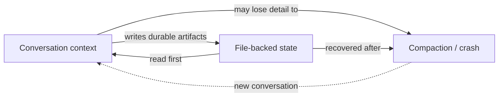

# Context Management

How to work efficiently inside Claude Code without losing work or burning context. Source: `.claude/docs/context-management.md`.

> **The file is the memory, not the conversation.** This is the single most important principle for long projects.

---

## The strategy in one diagram



Conversations are ephemeral. Files persist. Design every workflow around that asymmetry.

---

## The session state file

**Path:** `production/session-state/active.md` (gitignored)

Always update this after a milestone:
- Design section approved and written to file
- Architecture decision made
- Implementation milestone reached
- Test results obtained

**Required content:**
- Current task
- Progress checklist (what's done, what's pending)
- Key decisions made this session
- Files being worked on
- Open questions

After **any disruption** (compaction, crash, `/clear`), **read this file first.** Then read any partially-written design docs in progress.

---

## Status line block (Production+ only)

When the project is in Production, Polish, or Release stage, include a parsed status block in `active.md`:

```markdown
<!-- STATUS -->
Epic: Combat System
Feature: Melee Combat
Task: Implement hitbox detection
<!-- /STATUS -->
```

The status line script reads this and shows it as a breadcrumb (`Combat System > Melee Combat > Hitboxes`). Update when switching focus.

---

## Incremental file writing

When creating multi-section docs (GDDs, ADRs, lore entries):

1. Create the file **immediately** with a skeleton (all section headers, empty bodies)
2. Discuss and draft one section at a time in conversation
3. Write each approved section to the file as soon as approved
4. Update `active.md` after each section
5. Then it's safe to compact — the decisions are in the file

Result: the conversation holds only the *current* section's discussion (~3–5k tokens) instead of the entire document's history (~30–50k tokens).

---

## Proactive compaction

Compact **before** you hit limits, not when forced:

- **At ~60–70% context usage** — proactive
- **Between unrelated tasks** — `/clear`
- **After 2+ failed correction attempts** — `/clear` and start fresh
- **Natural compaction points** — after writing a section, after committing, before starting a new topic

### Focused compaction

```
/compact Focus on [current task]. Sections 1-3 are written to file.
Working on section 4 now.
```

---

## Context budgets by task type

Rough guidelines for what to expect:

| Task | Budget at start |
|------|-----------------|
| Light (read/review) | ~3k tokens |
| Medium (implement feature) | ~8k tokens |
| Heavy (multi-system refactor) | ~15k tokens |

Anything significantly over these → time to compact or split.

---

## Subagent delegation for context isolation

Use subagents (`Task` tool) when:

- Investigating across multiple files (>5k tokens of file reads)
- Exploring unfamiliar code
- Doing research that would crowd the main session

The subagent runs in its own context window. The main session sees only the summary.

**Use direct reads** when you know exactly which 1–2 files to check. Subagents have setup overhead.

---

## Compaction instructions

When compacting, the summary preserves:

- Reference to `production/session-state/active.md`
- List of files modified this session and their purpose
- Architectural decisions made and rationale
- Active sprint tasks and current status
- Agent invocations and outcomes (success/fail/blocked)
- Test results
- Unresolved blockers
- Current task and step
- Which sections of the current document are written vs in-progress

After compaction, **read `active.md`** and the partially-completed file(s) listed in it.

---

## Recovery after a session crash

If a session dies ("prompt too long") or you start fresh:

1. The `session-start.sh` hook detects `active.md` automatically and shows a preview
2. Read the full state file
3. Read the partially-completed file(s) listed
4. Continue from the next incomplete section or task

You won't lose more than the last conversation segment, *if* the file was being kept current.

---

## What lives where

| Lives in | What |
|----------|------|
| **Conversation** | Working memory, current draft section, immediate task discussion |
| **`active.md`** | Current task, progress checklist, decisions made, files in progress |
| **Design files** (GDDs, ADRs, etc.) | Approved content — the durable record |
| **`sprint-status.yaml`** | Per-story state — machine-readable canonical sprint truth |
| **Memory files** (`.claude/agent-memory/*`) | Long-term cross-session learnings about user preferences and patterns |

When in doubt about where something belongs: **if you'd want to find it after a crash, write it to a file**.

---

## The "is this in conversation only" smell

Red flags that mean "write this to a file now":

- Decisions made verbally that don't appear anywhere
- A complex multi-step task with no checklist saved
- "We agreed in the conversation that..."  → no, you didn't. Write it.
- Custom code patterns not in the control manifest

A 20-minute discussion that ends with "great, let's build it" must produce **at least one file write** (decisions to ADR, plan to active.md, or both).

---

## Common pitfalls

- **Trying to remember instead of writing.** Memory is ephemeral. Files are not.
- **Skipping `active.md` updates.** It looks pointless until your session crashes.
- **Reading a 200k-token file instead of subagent.** Use a subagent.
- **Compacting at 95%.** By then you may already be losing fidelity.

---

## See also

- [[02-Core-Concepts/Skills-vs-Agents-vs-Docs]] — why files are the durable layer
- [[02-Core-Concepts/Collaboration-Protocol]] — when agents write
- `.claude/docs/context-management.md` — full source
