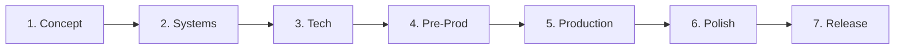

# Cheat Sheet

The 30-second reference card. Pin this in Obsidian.

---

## "What do I run?"

| Situation | Skill |
|-----------|-------|
| First time | `/start` |
| Stuck / what's next | `/help` |
| Audit project state | `/project-stage-detect` |
| Brand-new game idea | `/brainstorm open` |
| Configure engine | `/setup-engine` |
| Author the visual identity | `/art-bible` |
| Decompose into systems | `/map-systems` |
| Author a system GDD | `/design-system <system>` |
| Cross-check all GDDs | `/review-all-gdds` |
| Author the master architecture | `/create-architecture` |
| Record a decision | `/architecture-decision` |
| Validate ADRs | `/architecture-review` |
| Generate programmer rules | `/create-control-manifest` |
| Author a UX spec | `/ux-design <screen>` |
| Build a prototype | `/prototype <name>` |
| Make epics | `/create-epics` |
| Make stories | `/create-stories <epic>` |
| Plan a sprint | `/sprint-plan` |
| Pick a story | `/dev-story <path>` |
| Close a story | `/story-done <path>` |
| Quick status | `/sprint-status` |
| Phase ready? | `/gate-check` |

---

## "What phase am I in?"

Or run `/help`.

---

## Document quick map

| File | Lives in | Skill |
|------|----------|-------|
| game-concept.md | `design/gdd/` | `/brainstorm` |
| art-bible.md | `design/art/` | `/art-bible` |
| systems-index.md | `design/gdd/` | `/map-systems` |
| `<system>.md` | `design/gdd/` | `/design-system` |
| architecture.md | `docs/architecture/` | `/create-architecture` |
| adr-NNN-*.md | `docs/architecture/` | `/architecture-decision` |
| control-manifest.md | `docs/architecture/` | `/create-control-manifest` |
| `<screen>.md` | `design/ux/` | `/ux-design` |
| EPIC.md | `production/epics/<slug>/` | `/create-epics` |
| `<story>.md` | `production/epics/<slug>/` | `/create-stories` |
| sprint-N.md | `production/sprints/` | `/sprint-plan` |
| sprint-status.yaml | `production/` | `/sprint-plan` + `/story-done` |
| active.md | `production/session-state/` | every skill (incremental) |

---

## Agent tier map

| Tier | Examples | Use for |
|------|----------|---------|
| Tier 1 (Opus) | creative-director, technical-director, producer | Vision, architecture, sign-offs |
| Tier 2 (Sonnet) | game-designer, lead-programmer, qa-lead | Domain authoring, review |
| Tier 3 (Sonnet/Haiku) | gameplay-programmer, qa-tester, sound-designer | Implementation, narrow specs |
| Engine | godot-gdscript-specialist, etc. | Engine-specific patterns |

---

## Story types and required evidence

| Type | Evidence | Gate |
|------|----------|------|
| Logic | Unit test (must pass) | BLOCKING |
| Integration | Integration test or playtest | BLOCKING |
| Visual | Screenshot + sign-off | ADVISORY |
| UI | Manual walkthrough | ADVISORY |
| Config | Smoke check | ADVISORY |

---

## ADR status lifecycle

`Proposed` → `Accepted` → (later) `Superseded`

Stories cannot reference `Proposed` ADRs.

---

## Review modes

| Mode | Director reviews | Use when |
|------|------------------|----------|
| Full | Every key step | Teams; learning |
| Lean (default) | Only at /gate-check | Solo dev |
| Solo | Never | Game jams |

Set in `production/review-mode.txt` (via `/start`).

---

## Naming quick reference

| GDScript | C# |
|----------|-----|
| `class_name PascalCase` | `public partial class PascalCase` |
| `var snake_case: int` | `int _camelCase;` |
| `func snake_case() -> void` | `void PascalCase()` |
| `signal snake_case_past_tense` | `[Signal] delegate void PascalCaseEventHandler` |
| `const UPPER_SNAKE_CASE` | `const PascalCase` |

Files: `snake_case.gd` / `PascalCase.cs`.

---

## "Things I always forget"

- ADR status: **never skip Accepted**. Stories block on `Proposed`.
- Manifest version: stories embed it; `/story-done` checks for staleness.
- TR-IDs: every GDD requirement gets one; ADRs and stories reference them.
- Subagents: `/team-*` for canonical multi-agent patterns; `/dev-story` routes automatically; manual Task only for novel combos.
- Hooks: pre-commit-design-check blocks commits if a changed GDD is missing required sections. Fix the doc, don't `--no-verify`.
- Engine reference: check `docs/engine-reference/<engine>/` before any API call. The LLM doesn't know post-cutoff APIs.
- Session state: `production/session-state/active.md` survives crashes. Update it.

---

## Keyboard reference (Obsidian)

| Shortcut | Action |
|----------|--------|
| Ctrl+G / Cmd+G | Graph view |
| Ctrl+O / Cmd+O | Quick switcher (find note) |
| Ctrl+P / Cmd+P | Command palette |
| Ctrl+Click | Open link in new pane |
| Alt+← | Back |
| Alt+→ | Forward |
| Ctrl+E / Cmd+E | Toggle editor/preview |

---

## When in doubt

1. **Run `/help`** — it's cheap (Haiku tier) and grounds you
2. **Read `production/session-state/active.md`** — see where you left off
3. **Check the [[_Maps/Studio-Map]]** — every section linked
4. **Ask** — agents respond to "what would you suggest?" without breaking flow

---

## See also

- [[_Maps/Studio-Map]] — full vault navigation
- [[_Maps/Pipeline-Map]] — visual pipeline
- [[_Maps/Agent-Org-Chart]] — visual agent hierarchy
- [[01-Start-Here/FAQ]] — common questions
- [[01-Start-Here/Glossary]] — every term
