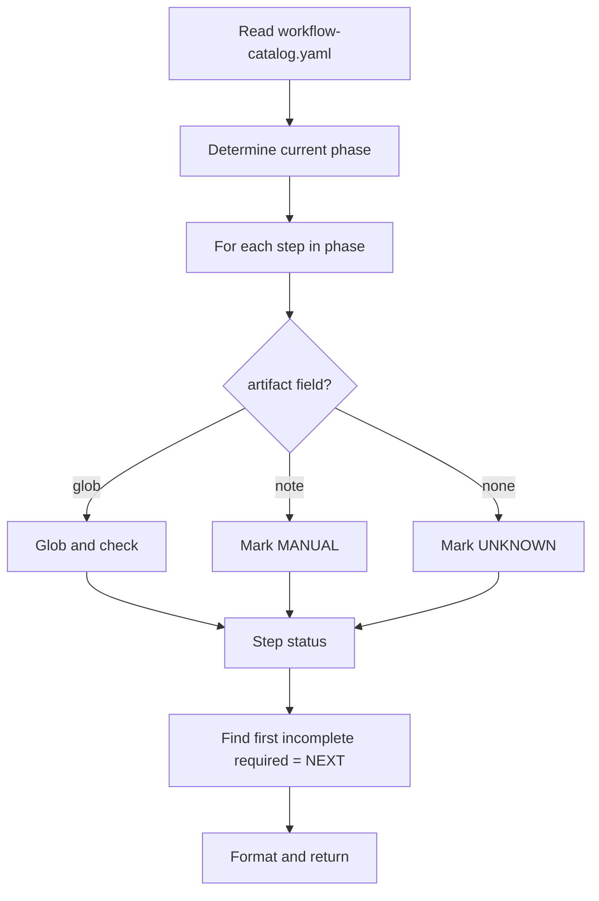
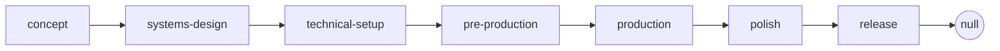

# Workflow Catalog Explained

The YAML schema behind `.claude/docs/workflow-catalog.yaml` — the file that drives `/help`, `/gate-check`, and `/project-stage-detect`.

---

## Why it exists

The catalog is the **single source of truth** for the pipeline. Without it:

- `/help` couldn't tell you what's next
- `/gate-check` couldn't determine completion
- `/project-stage-detect` couldn't find gaps
- Every skill would have its own idea of "what phase are we in"

Centralizing the pipeline definition lets all skills agree on what counts as progress.

---

## Top-level structure

```yaml
phases:
  concept:
    label: "Concept"
    description: "..."
    next_phase: systems-design
    steps: [...]

  systems-design:
    label: "Systems Design"
    description: "..."
    next_phase: technical-setup
    steps: [...]

  # ... 5 more phases ...
```

Phases are keyed by their slug (`concept`, `systems-design`, etc.). Each defines:
- **`label`** — display name
- **`description`** — one-line summary
- **`next_phase`** — the slug of the next phase, or `null` for terminal phases
- **`steps`** — ordered list of steps within the phase

---

## Step structure

Each step inside a phase:

```yaml
- id: brainstorm
  name: "Brainstorm"
  command: /brainstorm
  required: false
  description: "..."

- id: engine-setup
  name: "Engine Setup"
  command: /setup-engine
  required: true
  artifact:
    glob: ".claude/docs/technical-preferences.md"
    pattern: "Engine: [^[]"
  description: "..."

- id: design-system
  name: "System GDDs"
  command: /design-system
  required: true
  repeatable: true
  artifact:
    note: "Check design/gdd/systems-index.md — each MVP system needs Status: Approved"
  description: "..."
```

| Field | Meaning |
|-------|---------|
| `id` | Stable identifier (snake_case) |
| `name` | Display name |
| `command` | Slash command to run (or omitted for manual steps) |
| `required` | `true` blocks phase advance; `false` is enhancement |
| `repeatable` | `true` runs multiple times (per system, per story, etc.) |
| `artifact` | How to detect completion (see below) |
| `description` | Human description |

---

## Artifact detection

The `artifact` block tells `/help` how to check if a step is done:

```yaml
artifact:
  glob: "design/gdd/*.md"
  min_count: 5
  pattern: "Status: Approved"
```

| Sub-field | Meaning |
|-----------|---------|
| `glob` | File pattern that must match at least `min_count` files |
| `min_count` | Minimum matching files (default 1) |
| `pattern` | Regex/grep pattern that must appear in the matched file(s) |
| `note` | Human-readable fallback when auto-detection isn't possible (manual check) |

### Three artifact modes

**Pure glob:**
```yaml
artifact:
  glob: "design/gdd/game-concept.md"
```
Step is complete if the file exists.

**Glob + min_count:**
```yaml
artifact:
  glob: "docs/architecture/adr-*.md"
  min_count: 3
```
Step is complete if at least 3 ADR files exist.

**Glob + pattern:**
```yaml
artifact:
  glob: ".claude/docs/technical-preferences.md"
  pattern: "Engine: [^[]"
```
Step is complete if the file exists AND contains a non-bracketed Engine field (i.e., not `[TO BE CONFIGURED]`).

**Manual:**
```yaml
artifact:
  note: "Check design/gdd/systems-index.md — each MVP system needs Status: Approved"
```
`/help` can't auto-detect; will ask the user.

---

## How `/help` uses it



---

## How `/gate-check` uses it

`/gate-check`:
1. Reads the current phase
2. Iterates through all `required: true` steps
3. Checks artifact for each
4. Aggregates: PASS (all done), CONCERNS (some optional missing), FAIL (required missing)
5. Returns verdict + specific gaps

The verdict is **advisory** — the user always decides whether to advance.

---

## Example phase definition (Concept)

```yaml
concept:
  label: "Concept"
  description: "Develop your game idea into a documented concept"
  next_phase: systems-design
  steps:
    - id: brainstorm
      name: "Brainstorm"
      command: /brainstorm
      required: false
      description: "Explore the game concept using MDA, verb-first, and player psychology frameworks"

    - id: engine-setup
      name: "Engine Setup"
      command: /setup-engine
      required: true
      artifact:
        glob: ".claude/docs/technical-preferences.md"
        pattern: "Engine: [^[]"
      description: "Configure engine, pin version, set naming conventions and performance budgets"

    - id: game-concept
      name: "Game Concept Document"
      command: /brainstorm
      required: true
      artifact:
        glob: "design/gdd/game-concept.md"
      description: "Formalize concept with pillars, MDA analysis, and scope tiers"

    - id: design-review-concept
      name: "Concept Review"
      command: /design-review
      required: false
      description: "Validate the game concept (recommended before proceeding)"

    - id: art-bible
      name: "Art Bible"
      command: /art-bible
      required: true
      artifact:
        glob: "design/art/art-bible.md"
      description: "Author the visual identity specification"

    - id: map-systems
      name: "Systems Map"
      command: /map-systems
      required: true
      artifact:
        glob: "design/gdd/systems-index.md"
      description: "Decompose concept into systems with dependency ordering"
```

`/help` reads this, checks each artifact, and returns:
```
## Where You Are: Concept

✓ Done: engine-setup, game-concept, art-bible
→ Next up: map-systems
~ Optional: design-review-concept (skipped — recommended before proceeding)
```

---

## Editing the catalog

You shouldn't need to. But if you do:

1. **Don't break existing IDs** — other tools may reference them
2. **Pattern syntax is regex** (passed to grep) — escape special chars
3. **Globs are filesystem globs** — `*` matches one segment, `**` matches recursively
4. **Validate** by running `/help` — it's the fastest test
5. **Document the change** — add a comment in the YAML or update this note

---

## Phase dependency check

Phases must form a chain (no branching, no cycles):



If `next_phase` cycles or branches, `/gate-check` will fail at runtime.

---

## See also

- `.claude/docs/workflow-catalog.yaml` — the source file
- [[02-Core-Concepts/The-7-Phase-Pipeline]] — phases described
- [[02-Core-Concepts/Gates-and-Reviews]] — how `/gate-check` uses the catalog
- [[05-Skills/Onboarding-Skills#help]] — how `/help` uses it
