# Agent Org Chart

The 48 agents organized as a real studio. Same shape as `.claude/docs/agent-coordination-map.md`, drawn for the graph view.

---

## The hierarchy

```mermaid
flowchart TD
    User([Human Developer])

    User --> CD[creative-director<br/>Opus]
    User --> TD[technical-director<br/>Opus]
    User --> Pr[producer<br/>Opus]

    CD --> GD[game-designer]
    CD --> AD[art-director]
    CD --> ND[narrative-director]
    CD --> AuD[audio-director]

    TD --> LP[lead-programmer]
    TD --> DO[devops-engineer]
    TD --> PA[performance-analyst]
    TD --> TA[technical-artist]

    Pr -.coordinates.-> CD
    Pr -.coordinates.-> TD
    Pr --> QL[qa-lead]
    Pr --> RM[release-manager]
    Pr --> LL[localization-lead]

    GD --> Sys[systems-designer]
    GD --> Lvl[level-designer]
    GD --> Eco[economy-designer]

    LP --> GP[gameplay-programmer]
    LP --> EP[engine-programmer]
    LP --> AIP[ai-programmer]
    LP --> NP[network-programmer]
    LP --> TP[tools-programmer]
    LP --> UP[ui-programmer]

    AD --> UX[ux-designer]
    AuD --> SD[sound-designer]
    ND --> Wr[writer]
    ND --> WB[world-builder]

    QL --> QT[qa-tester]

    Pr --> Pro[prototyper]
    Pr --> Sec[security-engineer]
    Pr --> AC[accessibility-specialist]
    Pr --> LO[live-ops-designer]
    Pr --> CM[community-manager]
    Pr --> AnE[analytics-engineer]

    classDef opus fill:#fce7f3,stroke:#be185d,stroke-width:2px;
    classDef sonnet fill:#e0e7ff,stroke:#4338ca,stroke-width:1.5px;
    classDef haiku fill:#dcfce7,stroke:#15803d,stroke-width:1px;
    classDef user fill:#fef3c7,stroke:#d97706,stroke-width:2px;

    class User user;
    class CD,TD,Pr opus;
    class GD,AD,ND,AuD,LP,DO,PA,TA,QL,RM,LL,Sys,Lvl,Eco,GP,EP,AIP,NP,TP,UP,UX,Wr,WB,Pro,Sec,LO,AnE sonnet;
    class SD,QT,AC,CM haiku;
```

---

## Engine specialists

The engine specialists form a separate sub-org. Use the **set matching your engine** — not all three.

```mermaid
flowchart TD
    LP[lead-programmer<br/>delegates to]

    LP --> US[unreal-specialist]
    LP --> UnS[unity-specialist]
    LP --> GS[godot-specialist]

    US --> GAS[ue-gas-specialist]
    US --> BP[ue-blueprint-specialist]
    US --> UR[ue-replication-specialist]
    US --> UMG[ue-umg-specialist]

    UnS --> DOTS[unity-dots-specialist]
    UnS --> USh[unity-shader-specialist]
    UnS --> Add[unity-addressables-specialist]
    UnS --> UUI[unity-ui-specialist]

    GS --> GD[godot-gdscript-specialist]
    GS --> GC[godot-csharp-specialist]
    GS --> GSh[godot-shader-specialist]
    GS --> GE[godot-gdextension-specialist]

    classDef lead fill:#e0e7ff,stroke:#4338ca,stroke-width:2px;
    classDef ue fill:#fee2e2,stroke:#b91c1c,stroke-width:1.5px;
    classDef unity fill:#fef3c7,stroke:#a16207,stroke-width:1.5px;
    classDef godot fill:#dbeafe,stroke:#1d4ed8,stroke-width:1.5px;

    class LP lead;
    class US,GAS,BP,UR,UMG ue;
    class UnS,DOTS,USh,Add,UUI unity;
    class GS,GD,GC,GSh,GE godot;
```

This project is configured for **Godot 4.6.2** — the active set is the godot-* nodes.

---

## Reading the chart

- **Pink** — Tier 1 leadership (Opus model)
- **Indigo** — Tier 2/3 specialists (Sonnet model)
- **Green** — Tier 3 lightweight specialists (Haiku model — read-only or simple authoring)
- **Solid arrows** — direct delegation relationships
- **Dotted arrows** — coordination, not delegation

The producer **coordinates** the directors but does not delegate to them — they're peers.

---

## Delegation rules in one line

> *Vertical only. Leads delegate down to their tier; cross-domain decisions escalate up to the shared parent.*

A `gameplay-programmer` cannot decide a UI pattern; that's `ui-programmer` territory. A `level-designer` cannot make economy calls; that goes through `game-designer` to `economy-designer`. See [[04-Agents/Agents-Index#Delegation rules]] for the full table.

---

## See also

- [[04-Agents/Agents-Index]] — sortable table of all 48
- [[04-Agents/Tier-1-Directors]] — what the directors do
- [[04-Agents/Engine-Specialists-Godot-Unity-Unreal]] — engine-specific deep dive
- [[02-Core-Concepts/The-Studio-Metaphor]] — why agents are organized this way
