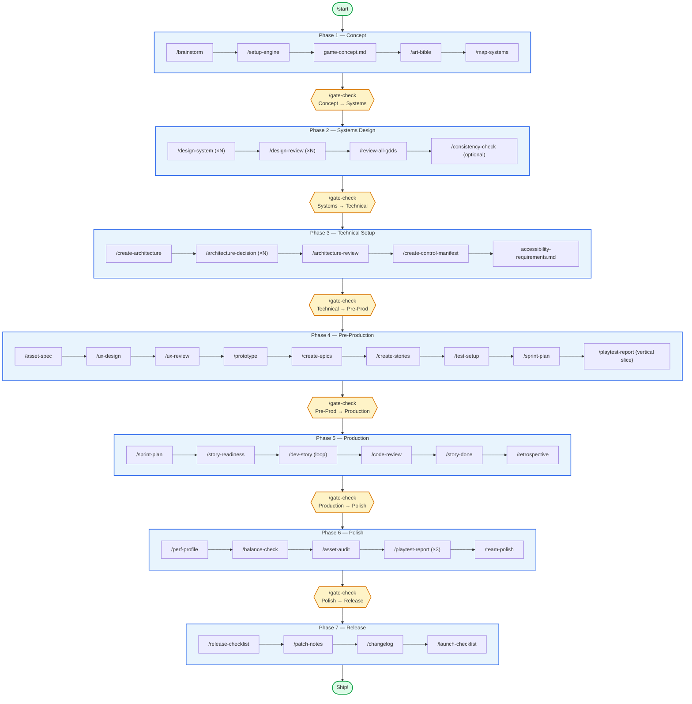

# Pipeline Map

The full game-development lifecycle in one diagram. Every phase has a `/gate-check` before the next.

> **Authoritative source:** `.claude/docs/workflow-catalog.yaml`. If this diagram and that file disagree, the YAML wins — please update this diagram.

---

## The full pipeline

---

## Reading the diagram

- **Blue boxes** are phases (groups of skills).
- **Yellow diamonds** are gate-checks — advisory verdicts (PASS / CONCERNS / FAIL) that recommend whether to advance.
- **Green pills** are the start and end points.
- Each `/skill` is a slash command in Claude Code. Click into the matching note for details.

---

## Phase shortcuts

| Phase | Note | What you produce |
|-------|------|------------------|
| 1 | [[03-Phases/Phase-1-Concept]] | game-concept.md, art-bible.md, systems-index.md |
| 2 | [[03-Phases/Phase-2-Systems-Design]] | One GDD per system |
| 3 | [[03-Phases/Phase-3-Technical-Setup]] | architecture.md, ADRs, control-manifest.md |
| 4 | [[03-Phases/Phase-4-Pre-Production]] | UX specs, prototype, epics, stories, sprint plan |
| 5 | [[03-Phases/Phase-5-Production]] | Implemented code, playtest reports |
| 6 | [[03-Phases/Phase-6-Polish]] | Optimized + balanced build |
| 7 | [[03-Phases/Phase-7-Release]] | Release artifacts, patch notes |

---

## Gate behavior

Gates are **advisory, not hard-blocking**. Every `/gate-check` returns a verdict:

- ✅ **PASS** — all required artifacts present, can advance
- ⚠️ **CONCERNS** — gaps exist, listed with suggestions
- ❌ **FAIL** — missing required artifacts; advancing is risky

The user always decides whether to proceed. See [[02-Core-Concepts/Gates-and-Reviews]] for details.

---

## See also

- [[_Maps/Studio-Map]] — full vault map
- [[_Maps/Agent-Org-Chart]] — who works in each phase
- [[08-Reference/Workflow-Catalog-Explained]] — the YAML behind this diagram
