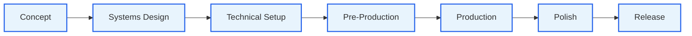

# Studio Map

This is the **home note** of the vault — every major area linked from one place. Pin it in Obsidian (right-click → Pin) so it's always one click away.

> **Tip:** open the [[#Graph view]] section and follow the picture, then come back here for the labels.

---

## Mental model first

Read [[02-Core-Concepts/The-7-Phase-Pipeline|the pipeline overview]] first if you've never seen this shape before.

---

## 1. Easy: orient yourself

- [[01-Start-Here/What-Is-This-Repo|What Is This Repo?]] — 5-min mental model
- [[01-Start-Here/First-Session-Walkthrough|First Session Walkthrough]] — what `/start` does
- [[01-Start-Here/Glossary|Glossary]] — every term in one place
- [[01-Start-Here/FAQ|FAQ]] — short answers to the obvious questions

## 2. Easy → Medium: how it works

- [[02-Core-Concepts/The-Studio-Metaphor|The Studio Metaphor]] — agents = departments
- [[02-Core-Concepts/Skills-vs-Agents-vs-Docs|Skills vs Agents vs Docs]] — the three layers
- [[02-Core-Concepts/The-7-Phase-Pipeline|The 7-Phase Pipeline]] — full lifecycle
- [[02-Core-Concepts/Gates-and-Reviews|Gates and Reviews]] — `/gate-check`, design reviews, lean/full/solo
- [[02-Core-Concepts/Collaboration-Protocol|Collaboration Protocol]] — Question → Options → Decision → Draft → Approval

## 3. Medium: the pipeline phase by phase

- [[03-Phases/Phase-1-Concept|Phase 1 — Concept]]
- [[03-Phases/Phase-2-Systems-Design|Phase 2 — Systems Design]]
- [[03-Phases/Phase-3-Technical-Setup|Phase 3 — Technical Setup]]
- [[03-Phases/Phase-4-Pre-Production|Phase 4 — Pre-Production]]
- [[03-Phases/Phase-5-Production|Phase 5 — Production]]
- [[03-Phases/Phase-6-Polish|Phase 6 — Polish]]
- [[03-Phases/Phase-7-Release|Phase 7 — Release]]

## 4. Medium: the agents

- [[04-Agents/Agents-Index|Agents Index]] — table of all 48
- [[04-Agents/Tier-1-Directors|Tier 1 — Directors & Producer]] (Opus)
- [[04-Agents/Tier-2-Department-Leads|Tier 2 — Department Leads]] (Sonnet)
- [[04-Agents/Tier-3-Specialists|Tier 3 — Specialists]] (Sonnet/Haiku)
- [[04-Agents/Engine-Specialists-Godot-Unity-Unreal|Engine Specialists]]

## 5. Medium: the skills

- [[05-Skills/Skills-Index|Skills Index]] — full ~70-skill table
- [[05-Skills/Skills-by-Phase|Skills by Phase]] — when to use what
- [[05-Skills/Onboarding-Skills|Onboarding Skills]]
- [[05-Skills/Design-Skills|Design Skills]]
- [[05-Skills/Architecture-Skills|Architecture Skills]]
- [[05-Skills/Production-Skills|Production Skills]]
- [[05-Skills/Team-Orchestration-Skills|Team Orchestration Skills]]

## 6. Medium: the documents

- [[06-Documents-Produced/Document-Map|Document Map]] — which skill makes which doc
- [[06-Documents-Produced/Game-Concept-Doc|Game Concept Doc]]
- [[06-Documents-Produced/GDD-Game-Design-Document|GDD]]
- [[06-Documents-Produced/Systems-Index|Systems Index]]
- [[06-Documents-Produced/ADR-Architecture-Decision-Record|ADR]]
- [[06-Documents-Produced/Control-Manifest|Control Manifest]]
- [[06-Documents-Produced/Epic-and-Story|Epic and Story]]
- [[06-Documents-Produced/Sprint-Plan|Sprint Plan]]
- [[06-Documents-Produced/UX-Spec|UX Spec]]

## 7. Advanced: project conventions

- [[07-Project-Conventions/Directory-Structure|Directory Structure]]
- [[07-Project-Conventions/Coding-Standards-Godot|Coding Standards (Godot)]]
- [[07-Project-Conventions/Testing-Standards|Testing Standards]]
- [[07-Project-Conventions/Naming-Conventions|Naming Conventions]]
- [[07-Project-Conventions/Context-Management|Context Management]]
- [[07-Project-Conventions/Collaboration-Protocol-In-Practice|Collaboration Protocol — In Practice]]

## 8. Advanced: reference

- [[08-Reference/Workflow-Catalog-Explained|Workflow Catalog Explained]]
- [[08-Reference/Hooks-Reference|Hooks Reference]]
- [[08-Reference/Engine-Reference-Index|Engine Reference Index]]
- [[08-Reference/Cheat-Sheet|Cheat Sheet]]

---

## Graph view

Open the graph view (Ctrl+G / Cmd+G) and you'll see:

- **A central cluster** for the 7 phases, each linking to its skills, agents, and documents
- **An agent cluster** with three concentric tiers (directors → leads → specialists)
- **A skills cluster** clustered by phase
- **A documents cluster** linked to the skills that produce them

Filter the graph by tag (`#phase`, `#agent`, `#skill`, `#doc`) to focus.

---

## See also

- [[_Maps/Pipeline-Map]] — the 7-phase flowchart with skills shown
- [[_Maps/Agent-Org-Chart]] — the studio org chart
- [[../README|Vault README]]
